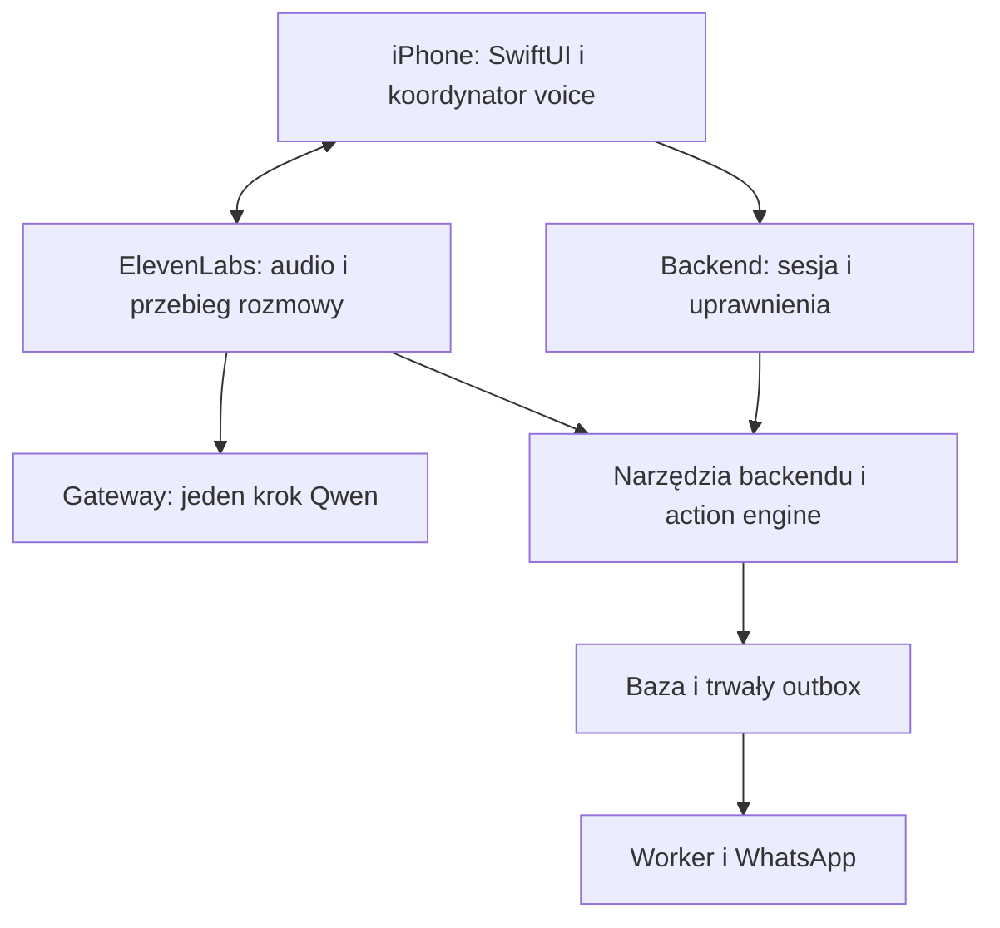

# Emma iOS: plan wdrożenia SwiftUI dla modelu programistycznego

Wersja 1.0 · 11 września 2026 · język instrukcji i interfejsu: polski

**Cel: zbudować natywną aplikację na iPhone, wierną zaakceptowanemu prototypowi, z kompletnymi punktami integracji voice, a następnie podłączyć backend kancelarii, Emmę i WhatsApp Business.** Pierwszy rezultat ma dać się uruchomić w Xcode bez kont ElevenLabs, Qwen ani Meta. Nie jest nim kolejny projekt strony internetowej.

## 0. Jak używać tego dokumentu

To główna instrukcja dla modelu wdrażającego. Czytaj razem z `reference/prototype/`, a wcześniejszy plan `reference/previous-plan/Emma-Legacy-Voice-Plan.md` traktuj jako dokumentację zakresu backendu. W razie konfliktu ten dokument rozstrzyga architekturę iOS, wygląd, kolejność prac i integrację voice. Aktualne polecenia właściciela oraz instrukcje bezpieczeństwa repozytorium pozostają nadrzędne.

### 0.1. Źródła i granice ustaleń

- Właściciel zaakceptował **bieżący prototyp po poprawkach kalendarza i rozmów**, a nie pierwotne v1 bez tych zmian. Jest to aktualna iteracja zachowująca kierunek wizualny v1.
- Referencja: [Emma · prototyp iPhone](https://emma-kancelaria-ios.pawrogozas.chatgpt.site).
- Zamrożone źródło referencji: commit `b97685b5e2c2cd3d6f78b172b9c0b5cee114270b`, opublikowana wersja 5. W paczce znajdują się dokładne `index.html`, `style.css`, `app.js`. Nie wymagaj dostępu do wewnętrznego repo Sites, aby z nich korzystać.
- Właściciel korzysta z **WhatsApp Business App**. To nie potwierdza jeszcze posiadania skonfigurowanej Business Platform, WABA, webhooków, tokenów czy koegzystencji na tym numerze.
- Stary plan wskazuje backend `Pawel-Rogoza/adwokat-app-project` i SHA `43f7f9bd854d448daf84cc8f609282f09f6ffa18`. Opisane w nim pliki i błędy są historycznymi ustaleniami autora załącznika. Podczas przygotowania obecnego dokumentu nie wykonano nowego audytu tego prywatnego repo. Model wdrażający musi zweryfikować bieżący kod.
- Prototyp używa danych fikcyjnych, pamięci sesji przeglądarki i symulacji. Nie przenoś tej logiki jako produkcyjnego backendu. Timer statusu dostarczenia, stała data i odpowiedzi Emmy z szablonu należą tylko do demo.
- Nie wykonano tutaj kompilacji iOS, testu fizycznego iPhone’a ani konfiguracji kont zewnętrznych. Dokument określa pracę do wykonania, nie poświadcza tych integracji.

### 0.2. Trzy rezultaty, których nie należy mieszać

| Rezultat | Co ma być gotowe | Czego jeszcze nie wolno deklarować |
| --- | --- | --- |
| M1: aplikacja do testowania w Xcode | Wierny SwiftUI, wszystkie obecne procesy demo, lokalne szkice, testowalne hooki voice, deterministyczny symulator zdarzeń | Prawdziwego voice, synchronizacji kancelarii ani WhatsApp |
| M2: pilot operacyjny | Logowanie dwóch osób, backend, prawdziwy inbound i outbound WhatsApp, voice z odczytem i potwierdzaniem, obsługa awarii | Pełnej analizy akt, gotowości App Store ani dowolnego działania w tle |
| M3: pełny zakres wcześniejszego planu | Dokumenty, OCR, analiza ze źródłami, projekty pism i rewizje, eksport, pilot jakości i utrzymanie | Automatycznej wysyłki sądowej, bezbłędności prawnej ani funkcji niezweryfikowanych u dostawcy |

Najpierw doprowadź M1 do działającego rezultatu. Brak tokenu Meta nie blokuje tworzenia natywnego interfejsu ani adapterów. M1 nie oznacza zakończenia M2/M3. Status każdego milestone ma być jawny.

## 1. Instrukcje bezwzględne dla modelu

1. Implementuj **Swift + SwiftUI**. Nie używaj WKWebView jako aplikacji, React Native, Flutter, Capacitor ani HTML renderowanego w głównych ekranach. UIKit dopuszczaj jako wąski most dla konkretnej funkcji systemowej.
2. Nie projektuj nowego wyglądu. Nie zmieniaj kolorów, układu zakładek, rytmu kart, stylu Emmy i gęstości ekranów według własnego gustu.
3. Nie odtwarzaj desktopowego CRM z bocznym menu ani trzech kolumn. Nie dodawaj landing page, onboardingu reklamowego, dashboardów technicznych czy nowej architektury nawigacji.
4. Nie kopiuj ramki telefonu, sztucznej wyspy, godziny 9:41 ani paska gestu z HTML do aplikacji. Zapewnia je urządzenie. Wzorzec obejmuje obszar aplikacji, nie dekorację podglądu.
5. Jedno źródło tokenów wyglądu i jeden zestaw komponentów. Integracja API ma wymieniać dane i stany, nie przebudowywać widoki.
6. Każdy etap kończ małym, działającym przyrostem. Stosuj małe commity/PR-y, jeśli repo ma taki workflow. Nie otwieraj fikcyjnych PR-ów bez dostępu do zdalnego repo.
7. Zachowaj istniejący backend i stronę. Nie przepisuj Astro/Node/SQLite tylko dlatego, że klient jest teraz w Swift.
8. Nie implementuj kluczy dostawców w aplikacji. iPhone komunikuje się z autoryzowanym backendem oraz dostawcą audio za pomocą poświadczenia krótkotrwałego.
9. Jedna sesja audio i jeden koordynator voice w procesie aplikacji. Widok nie tworzy własnej rozmowy ElevenLabs przy każdym `onAppear`.
10. Zmiana treści, odbiorcy, kontekstu lub przerwanie odczytu unieważniają wcześniejsze uzbrojenie potwierdzenia głosowego. UI i voice wykonują tę samą wersjonowaną akcję backendową.
11. Zachowaj dyktowanie jako wpisywanie tekstu. Wypowiedziane w polu wiadomości „wyślij” nie jest komendą wykonawczą.
12. Nigdy nie pokazuj „dostarczono” lub „odczytano” na podstawie czasu, optymizmu UI czy wypowiedzi LLM w trybie live.
13. Model bez macOS może przygotować projekt i testy logiki dostępne w swoim środowisku. Nie może deklarować, że skompilował SwiftUI lub sprawdził mikrofon na iOS, jeżeli nie uruchomił Xcode i urządzenia.
14. Nie zatrzymuj się na samym planowaniu w kolejnej sesji implementacyjnej. Wykonuj kolejne dostępne etapy, a brak środowiska/konta zapisuj jako konkretny gate z instrukcją odblokowania.

## 2. Kontrakt wizualny: design jest zamrożony

### 2.1. Reguła porównania

Porównuj natywny ekran z odpowiadającym mu stanem zatwierdzonego prototypu, z tymi samymi danymi, językiem, datą, filtrem i pozycją przewinięcia. Paczka zawiera źródło, nie gotowe screenshoty wszystkich stanów. W etapie 00 przygotuj referencyjne ujęcia, jeżeli środowisko udostępnia legalny sposób uruchomienia podglądu. Nie twórz zastępczych obrazków interfejsu przez generator obrazów.

CSS jest warstwowy: **obowiązuje wynik kaskady**, nie pierwszy znaleziony selektor. W szczególności stare reguły `.studio`, desktopowych paneli, `.timeline` i dawnych wiadomości nie określają aktualnego UI. Używaj DOM z ostatniego `app.js`, końcowych nadpisań i stanów generowanych przez ten kod.

### 2.2. Tokeny wyjściowe

Wartości poniżej pochodzą ze źródła prototypu. Rozmiary to baza do odtworzenia w punktach iOS przy domyślnej wielkości tekstu, nie instrukcja stałego skalowania całego ekranu.

| Token / komponent | Wzorzec |
| --- | --- |
| Tło głównych ekranów | `#F5F6F8` |
| Tekst podstawowy | `#152337` |
| Tekst drugorzędny | `#687688`, miejscowe metadane zgodnie z komponentem |
| Obramowanie ogólne | `#E2E7ED`, karta `#E8ECF0` |
| Akcent główny | `#3B61D9` |
| Licznik nieprzeczytanych | `#365FD0`, biały tekst |
| Karta Emmy | `#14263C`, promień 21, padding około 18 pion / 20 poziom |
| Karty | Białe, promień 17, delikatna krawędź, bez ciężkiego cienia |
| Główny przycisk | Granat `#1B314D`, promień około 12 |
| Margines ekranu | 20, dla wątku 16; małe urządzenia mają adaptację, nie skalowanie całości |
| Nagłówek główny | Manrope, około 25, mocna waga; nie domyślne ogromne Large Title |
| Tekst bazowy | DM Sans; treść wiadomości 16 z wygodną interlinią |
| Sekcje | Około 16 semibold; margines przed sekcją około 16 |
| Rozmowy: imię i podgląd | 16 / 14; nieprzeczytane mają mocniejszą wagę |
| Avatar listy rozmów | 48; nagłówek wątku około 39 |
| Tło otwartego czatu | `#EEF1F5` |
| Dymek przychodzący / wychodzący | `#FFFFFF` / `#DFE8F1` |
| Dymki | Promień 17, dolny narożnik po stronie nadawcy 5; maks. około 89% szerokości historii |
| Odczyt klienta | Podwójny znacznik w `#2674D8` |
| Pole wiadomości | Białe, krawędź `#DCE3EC`, promień 24 |
| Wybrany dzień | `#1C314B`, jasna cyfra i etykieta |
| Orb Emmy | Chłodny perłowy gradient, nie neon, nie nowy avatar postaci |

Nie przenoś automatycznie wszystkich drobnych napisów 9–11 px do produkcji. Dla metadanych przyjmij czytelne około 12 pt i sprawdź gęstość, dla istotnych opisów 14–16 pt. Zwiększenie dotykalnego obszaru nie musi powiększać ikony: projektuj około 44 × 44 pt hit target, bez nakładania się przycisków. To korekta użyteczności, nie redesign.

### 2.3. Fonty, symbole i orb

- Pobierz właściwe pliki DM Sans i Manrope z oficjalnego źródła fontów, dołącz licencje i lokalne zasoby. Sprawdź cyrylicę RU/UK oraz polskie znaki. Nie opieraj aplikacji na fontach pobieranych podczas startu.
- Ustal rzeczywiste nazwy PostScript i wagi. Nie zgaduj nazw `Font.custom`. Odpowiednik Manrope extraBold i DM Sans regular/medium/semibold ma być sprawdzony w buildzie, bez cichego fallbacku.
- Użyj skalowanych stylów tekstu i `@ScaledMetric` tam, gdzie potrzebne. Nie rozwiązuj długich nazw przez agresywne `minimumScaleFactor`.
- SF Symbols dobieraj do znaczenia istniejących ikon: dom, osoby, gwiazda Emmy, rozmowa, kalendarz, mikrofon, fala, powrót, przypięcie, dokument. Weryfikuj dostępność symbolu na minimalnym iOS.
- `EmmaOrb` jest jednym komponentem z rozmiarami: mały skrót, karta, większy stan rozmowy. Odtwórz istniejące kolory i miękkie światło natywnymi gradientami/maskami albo dedykowanym zasobem samego orbu.
- Animuj orb tylko w aktywnym stanie. Bez stałego pulsowania całej aplikacji. `Reduce Motion` zatrzymuje puls i pozostawia czytelną etykietę.
- Pierwszy release zachowuje jasny motyw również przy ciemnym ustawieniu systemu. Pełny dark mode wymaga osobnego dopracowania i nie może samoczynnie zmienić zaakceptowanych kolorów.

### 2.4. Struktura komponentów

Utwórz `EmmaTheme`, `EmmaTypography`, `EmmaSpacing`, `EmmaRadii` oraz poniższy katalog. Nazwy można dopasować do konwencji repo, odpowiedzialności mają zostać.

| Rodzina | Komponenty |
| --- | --- |
| Shell | `RootAppShell`, `EmmaTabBar`, `ScreenHeader`, `DetailHeader` |
| Wspólne | `SurfaceCard`, `PersonAvatar`, `StatusBadge`, `SegmentedFilter`, `SearchField`, `EmptyState`, `InlineError`, `LoadingState` |
| Kancelaria | `EmmaBriefingCard`, `ConsultationCard`, `TaskRow`, `CaseCard`, `ClientRow` |
| Rozmowy | `ConversationRow`, `UnreadBadge`, `MessageBubble`, `MessageReceipt`, `QuotedMessage`, `MessageComposer`, `TranslationDisclosure` |
| Voice | `EmmaOrb`, `VoiceControlBar`, `VoiceStatus`, `VoiceSessionStrip`, `TranscriptView`, `ActionProposalCard`, `DictationAccessory` |
| Formularze | `FormField`, `OwnerPicker`, `DateTimeField`, `PrimaryButton`, `SecondaryButton` |

Widoki nie duplikują literali kolorów i promieni. `MessageComposer` dla WhatsApp i pole komendy Emmy współdzielą elementy wizualne, ale mają różne znaczenie wysyłki.

### 2.5. Reguła odbioru wyglądu

- Bazowa szerokość referencyjna: około 390–398 pt obszaru aplikacji; źródłowa ramka desktop ma 412 px z obramowaniem po 7 px. Porównuj **wnętrze**, nie całą ramkę.
- Sprawdź minimum: 375 pt szerokości, urządzenie klasy 390/393 pt i duże 430/440 pt. Wybierz realne symulatory dostępne w zainstalowanym Xcode, zapisując model i wersję OS.
- Screenshoty dla domyślnego Dynamic Type: ten sam fixture, pusta klawiatura oraz otwarta klawiatura w czacie. Systemowe paski i różnice rasteryzacji fontów maskuj jawnie w porównaniu.
- Różnica rozmieszczenia głównych krawędzi/paddingów powyżej około 4 pt wymaga wyjaśnienia lub naprawy. To próg projektowy, nie uniwersalna miara jakości.
- Snapshoty nowych stanów są regresją przyszłych zmian, nie dowodem zgodności z HTML. Pierwszy baseline musi zostać zestawiony z referencją, a nie zaakceptowany tylko dlatego, że test zapisał plik.
- Nie aktualizuj golden screenshots automatycznie po nieudanym teście. Najpierw ustal, czy zmiana jest wymagana. Zapisuj odstępstwa w `DESIGN_DEVIATIONS.md` z powodem i porównaniem.
- Przy dużym Dynamic Type zachowaj treść i obsługę: karty mogą urosnąć, pola mogą się ułożyć pionowo. Nie wymagaj pikselowej zgodności z domyślną wielkością tekstu.

## 3. Ekrany i zachowanie docelowe

### 3.1. Nawigacja

Pięć zakładek w tej kolejności: **Dzisiaj / Klienci / Emma / Rozmowy / Kalendarz**. Klienci zawierają leady i sprawy; zadania są dostępne z Dzisiaj i z kontekstu sprawy. Nie dodawaj szóstej zakładki.

Każda zakładka zachowuje własny `NavigationStack`, filtry i pozycję. Router operuje typowanymi trasami i stabilnymi ID. Zmiana zakładki nie resetuje szkicu ani sesji voice. Natywny gest powrotu ma działać w szczegółach. Formularze używają systemowych sheets i klawiatury.

Wygląd dolnego paska odtwórz komponentem SwiftUI, jeśli systemowy `TabView` na docelowej wersji iOS zmienia sylwetkę względem wzorca. Nie przyjmuj automatycznie nowego pływającego stylu systemu. Własny pasek nie może oznaczać ręcznego, wadliwego stosu ekranów lub utraty dostępności.

Tap Emmy otwiera centrum asystenta. Start głosu jest jawną akcją mikrofonu. Przytrzymanie środkowego przycisku można dodać jako równoważny skrót po spełnieniu podstawowych testów; nie zastępuje tap ani nie uruchamia mikrofonu po samym wejściu do aplikacji.

### 3.2. Macierz ekranów

| Ekran | Wymagane elementy i działania | Kryterium ochrony designu |
| --- | --- | --- |
| Dzisiaj | Powitanie i profil, granatowy briefing Emmy, statystyki, najbliższa konsultacja, zadania i prowadzone sprawy | Ta sama kolejność i proporcje; bez dodatkowej siatki KPI |
| Klienci / Leady | Search, filtry etapów, lista, szczegół, dodanie kontaktu, zmiana opiekuna, konwersja do sprawy | Lekka lista; nie przenosić całego desktopowego formularza do karty |
| Sprawa | Numer, tytuł, opiekun, status; przegląd, zadania, notatki, terminy, historia | Progresywne przechodzenie do szczegółów; bez ogromnego akordeonu na Home |
| Zadania | Wykonanie/cofnięcie, filtrowanie, przypisanie, termin, relacja z klientem/sprawą | Zachować istniejące wiersze; priorytet może istnieć tutaj, nie na liście czatów |
| Kalendarz | Miesiąc, Obaj/Tomasz/Paweł, tydzień, powrót do dziś, karty dnia, nowy/edytowany termin | **Bez kolumny godzin po lewej**. Godzina i długość wyłącznie w karcie |
| Konsultacja | Edycja, potwierdzenie, prowadzący, zakończenie, notatka | Czytelny sheet; data i prowadzący przed zatwierdzeniem |
| Rozmowy | Search po osobie/treści, Wszystkie/Nieprzeczytane/Przypięte, ostatnia wiadomość, czas, licznik, szkic | Bez „Pilne”, „Do odpowiedzi”, scoringu leadów i badge AI |
| Otwarty czat | Stały nagłówek, karta klienta/sprawa, wiadomości, daty, separator nowych, tłumaczenie, cytat, composer i skrót Emmy | Pasek zakładek ukryty, pole wiadomości nad klawiaturą; dymki w dotychczasowej palecie |
| Emma | Kontekst kancelarii lub sprawy, orb, podpowiedzi, historia, propozycja działania, głos/tekst | Nie zastępować ekranem dostawcy ani demonstracyjnym „Hello Agent” |
| Profil | Aktualny użytkownik, ustawienia głosu/języka, połączenia i wylogowanie | Ustawienia techniczne w konfiguracji/developer menu, nie na Home |

### 3.3. Rozmowy: dokładna semantyka

1. `unread` jest stanem użytkownika w danym wątku. Otwarcie końca rozmowy oznacza jako przeczytane wiadomości do jawnie znanego sequence snapshotu, łącznie z wcześniejszą historią. Samo odświeżenie listy, pobranie w tle lub przeglądanie starszej strony nie przesuwa kursora do końca. Nie czyść wiadomości, które dotarły po zatwierdzonym kursorze.
2. Przechowuj serwerowy monotoniczny `messageSequence` i kursor użytkownika; sam timestamp Meta nie wystarczy przy opóźnionych webhookach. Obsłuż `manualUnread` jako oddzielny znacznik przypomnienia.
3. Tomasz i Paweł mają osobne kursory, przypięcia i szkice. Wiadomości należą do wspólnego wątku. Lokalna zmiana nie może oznaczać odczytu przez brata.
4. `needsReply` pozostaje ewentualnym stanem pracy backendu/briefingu Emmy, bez etykiety pilności na liście rozmów. Podsumowanie przez AI nie oznacza udzielonej odpowiedzi.
5. Odczyt w aplikacji, odsłuch treści przez Emmę, wysłanie read receipt do Meta i odczyt klienta to cztery różne zdarzenia. Ustal politykę read receipts u dostawcy w ustawieniach integracji.
6. Sortowanie: przypięte na górze, potem ostatnia wiadomość; deterministyczne rozstrzygnięcie remisów. Wpisywanie szkicu nie przestawia dowolnie całej skrzynki.
7. Nowa wiadomość przewija wątek tylko, gdy użytkownik jest przy końcu. Podczas czytania starszej historii pokaż przycisk „Nowe wiadomości”. Paginacja starszych zachowuje kotwicę scrolla.
8. Szkic zawiera tekst, język, odbiorcę/wątek, opcjonalny cytat i wersję. Zapis lokalny po zmianie z krótkim debounce; flush przy wyjściu. Wylogowanie czyści dane lub pozostawia je wyłącznie w odseparowanym, chronionym profilu zgodnie z przyjętą polityką.
9. Zniknięcie cytowanej wiadomości nie kieruje odpowiedzi do innego wątku. Pokaż niedostępną referencję i pozwól świadomie usunąć cytat.
10. Przycisk wysyłki ręcznej jest bezpośrednim potwierdzeniem dokładnej treści w composerze. Nie dodawaj mu kolejnego „Czy na pewno?” dla każdej zwykłej wiadomości. Backend nadal stosuje walidację, outbox i deduplikację.
11. Stany transportu: lokalny szkic → oczekuje → wysyłanie → przyjęta przez API → wysłana/dostarczona/odczytana według rzeczywistych zdarzeń. Błąd i wynik nieznany mają osobne komunikaty. `accepted` nie znaczy `delivered`.
12. Offline pozwala zachować szkic; nie uruchamia automatycznej wysyłki po powrocie sieci. Jeżeli request już wyszedł, odzyskaj jego status po ID, zamiast generować nowy.

## 4. Architektura natywna i granica backendu

### 4.1. Wybory wyjściowe

- iPhone-first, minimalny target **iOS 17** jako decyzja projektu do potwierdzenia z urządzeniami i wymaganiami wybranego SDK. Nie wybieraj wersji beta Xcode/iOS jako konieczności dla pierwszego uruchomienia.
- Swift Concurrency, SwiftUI, `@MainActor` dla store’ów UI, typowane modele `Codable`, `Sendable` dla danych przekazywanych między izolacjami. Nie zasypuj projektu `@unchecked Sendable` i `nonisolated(unsafe)`.
- `URLSession` dla API; repozytoria za protokołami; Observation lub spójny `ObservableObject`, bez mieszania kilku frameworków zarządzania stanem bez potrzeby.
- Prosty composition root `AppDependencies`. Nie wprowadzaj TCA, kontenera DI, bazy reaktywnej i dużego zestawu bibliotek tylko dla organizacji kilkunastu ekranów.
- Jedna lekka warstwa lokalnej trwałości dla cache i szkiców, np. SwiftData za `LocalStore`. To cache klienta, nie zamiennik backendowej bazy kancelarii. Sekrety w Keychain, nie w SwiftData/UserDefaults.
- Natywne formularze i date pickery; `safeAreaInset`, `FocusState`, `ScrollViewReader` lub API scroll zgodne z targetem. Nie używaj `UIScreen.main.bounds` jako stałej szerokości layoutu.
- `MockEnvironment` i `LiveEnvironment` są rozłączne. Brak backendu nie może powodować cichego przejścia live w fikcyjne dane.

### 4.2. Sugerowana struktura w istniejącym repo

Ścieżki są projektem do utworzenia, nie twierdzeniem, że już istnieją.

| Katalog | Zawartość |
| --- | --- |
| `ios/Emma/` | Target aplikacji, entrypoint, Assets, Info.plist i kompozycja zależności |
| `ios/Emma/DesignSystem/` | Tokeny, typografia, komponenty wspólne i orb |
| `ios/Emma/Features/Today/`, `Clients/`, `Cases/`, `Tasks/`, `Calendar/`, `Messages/`, `Assistant/`, `Settings/` | Widoki, store’y i routing funkcji |
| `ios/Emma/Core/Domain/` | Modele, identyfikatory, repozytoria i błędy domenowe |
| `ios/Emma/Core/Networking/` | APIClient, autoryzacja, event stream, retry i mapowanie DTO |
| `ios/Emma/Core/Persistence/` | Lokalny cache, szkice, migracje, czyszczenie profilu |
| `ios/Emma/Core/Voice/` | Koordynator, protokoły, stan, audio ownership, adaptery |
| `ios/Emma/PreviewSupport/` | Deterministyczne fixtures, zegar demo, mocki |
| `ios/EmmaTests/`, `ios/EmmaUITests/` | Testy reguł i krytycznych procesów, porównania UI |
| `ios/project.yml`, `ios/scripts/` | Reprodukowalny projekt Xcode i skrypty uruchomienia |
| `docs/ios/` | Status, kontrakt wyglądu, ADR, API, testy urządzenia i instrukcja dla właściciela |

Nazwy widoków nie muszą odzwierciedlać każdej tabeli DB. Nie przekazuj rekordów `better-sqlite3` bezpośrednio do Swift jako domyślnego kontraktu.

### 4.3. Model danych

Minimum: `User`, `Client`, `Case`, `Consultation`, `TaskItem`, `CaseNote`, `ActivityEvent`, `ConversationThread`, `Message`, `ThreadUserState`, `Draft`, `AssistantContext`, `AssistantTurn`, `ActionProposal`, `ActionExecution`, `VoiceSession`, `BackgroundJob`.

- ID produkcyjne traktuj jako opaque string. Nigdy nie mapuj `Tomasz=0`, `Paweł=1`, a cyrylicznego nazwiska na klucz rekordu.
- Daty bez godziny: osobny typ `LocalDate`. Spotkanie: instant UTC + strefa IANA, domyślnie `Europe/Warsaw`. Demo clock może wskazywać 11.09.2026; live nie korzysta z tej stałej.
- Klient może mieć wiele spraw i kanałów. `linkedCase(...).first` z prototypu jest uproszczeniem, nie regułą domenową.
- Mutowalne zasoby mają `version`. Zapis z `expectedVersion`; konflikt nie nadpisuje po cichu drugiej osoby.
- Wiadomość ma niezależne `direction`, `authorUserId` jeśli znany, identyfikator Meta, treść/typ, timestamp dostawcy, sequence ingestu, cytat i stan transportu.
- Wiadomość wysłana z Business App przy koegzystencji może nie mieć znanego autora wśród braci. Pokaż „WhatsApp Business”, nie przypisuj jej automatycznie zalogowanej osobie.
- Preferencja językowa adwokata nie jest językiem klienta. UI PL, język Emmy konfigurowalny RU/PL, klient PL/RU/UK. Kod języka ukraińskiego to `uk`, nie `ua`.

### 4.4. Uwierzytelnienie natywne

W etapie audytu sprawdź istniejące sesje, recent auth i MFA. Jeżeli backend ma OIDC/OAuth, użyj Authorization Code + PKCE przez `ASWebAuthenticationSession`. Jeżeli nie ma, zaprojektuj wąską wymianę uwierzytelnionej sesji na token mobilny z jednorazowym kodem, TTL i ochroną replay. Nie wprowadzaj równoległej bazy haseł tylko dla iPhone’a.

Access token w pamięci; odświeżanie przez odwoływalny credential w Keychain, rotacja i odseparowanie DEV/PROD. Refresh ma jednego właściciela, aby równoległe 401 nie wylogowywały się wzajemnie. 401 kończy lub odnawia sesję według kontraktu; 403 nie zamienia się w pustą listę.

Face ID może odblokować lokalny credential, ale `LAContext` zakończony sukcesem nie jest sam w sobie dowodem recent auth dla backendu. Do grantu zapisu użyj istniejącego serwerowo weryfikowanego step-up albo podpisanego challenge związanym kluczem urządzenia. Nie wysyłaj po prostu `faceIdPassed: true`.

Przeglądarkowe cookie/Origin/CSRF zachowaj dla starego web UI. Wydziel uwierzytelnione trasy mobilne, nie wymagając od natywnego klienta fałszowania Origin. Webhook Meta i request narzędzia ElevenLabs mają osobne mechanizmy weryfikacji.

## 5. Voice: trzy różne czynności, wspólne audio

### 5.1. Rozdział trybów

| Tryb | Cel | Co dzieje się z transkrypcją |
| --- | --- | --- |
| Rozmowa z Emmą | Speech-to-speech, pytania, polecenia, korekty, zatwierdzenia | Finalna wypowiedź trafia do sesji asystenta i mechanizmu polityk |
| Dyktowanie do pola | Speech-to-text wiadomości, notatki albo zadania | Tekst trafia do wskazanego szkicu; nigdy sam nie uruchamia toola |
| Odsłuch | Przeczytanie wiadomości, briefingu, szkicu lub wyniku | Odtwarzanie bez domyślnego otwierania mikrofonu i bez mutacji biznesowej |

Nie utożsamiaj wiadomości głosowej WhatsApp z poleceniem adwokata. Audio otrzymane od klienta jest załącznikiem/treścią źródłową. Jego ewentualna transkrypcja ma `source=clientMedia`, nigdy `authenticatedLawyerTurn`.

Domyślny język rozmowy z Emmą: **rosyjski zgodnie z załączonym wcześniejszym planem**, z prostą zmianą na PL i zapisem per użytkownik. Dyktowanie ma jawnie wybrany język; nie zakładaj RU tylko dlatego, że odbiorca jest rosyjskojęzyczny. Przykład: adwokat dyktuje po polsku, Emma przygotowuje propozycję po ukraińsku i przedstawia ją do zatwierdzenia. Zwykłe dyktowanie bez prośby o tłumaczenie zachowuje treść w języku wypowiedzi.

### 5.2. Miejsca wejścia do voice

| Miejsce | Intencja i kontekst |
| --- | --- |
| Dzisiaj: „Porozmawiaj z Emmą” | Sesja z kontekstem całej kancelarii |
| Zakładka Emma: mikrofon | Start/wznowienie istniejącej sesji, nie nowy agent przy każdym tap |
| Klient/sprawa: „Zapytaj Emmę” | Zweryfikowane ID klienta i opcjonalnie wybranej sprawy |
| Czat: „Przygotuj z Emmą” | Konkretny wątek, klient i wersja ostatnich wiadomości |
| Mikrofon composera | Dyktowanie wyłącznie do `DraftID` bieżącego wątku |
| Notatka po konsultacji | Dyktowanie do notatki powiązanej z wydarzeniem i sprawą |
| Odsłuch wiadomości/propozycji | Dokładny tekst albo wyraźnie nazwane streszczenie |

Podczas przechodzenia między ekranami w aktywnej rozmowie pokaż mały `VoiceSessionStrip` z bieżącym stanem i zakończeniem. Nie pokazuj go, gdy voice jest nieaktywny. Nawigacja nie zmienia automatycznie odbiorcy już przygotowanej wiadomości. Zmiana kontekstu jest oddzielną, wersjonowaną czynnością.

### 5.3. Kontrakty do wdrożenia już w M1

Poniższy kod jest **projektem wewnętrznego API Emmy**, nie cytatem ze Swift SDK ElevenLabs i nie gotowym plikiem do skompilowania. Typy pomocnicze należy zdefiniować w domenie. Nie wymyślaj metod dostawcy o tych samych nazwach.

```swift
@MainActor
protocol VoiceTransport: AnyObject {
    var capabilities: VoiceCapabilities { get }
    func connect(_ session: VoiceSessionConfiguration) async throws
    func events() -> AsyncStream<VoiceEvent>
    func setMicrophoneMuted(_ muted: Bool) async throws
    func interrupt(_ request: InterruptionRequest) async throws
    func updateContext(_ context: AssistantContext) async throws
    func sendTextTurn(_ input: AssistantTextInput) async throws
    func disconnect(reason: VoiceEndReason) async
}

@MainActor
protocol DictationService: AnyObject {
    func start(_ request: DictationRequest) async throws
    func events() -> AsyncStream<DictationEvent>
    func finish() async
    func cancel() async
}

@MainActor
protocol SpeechPlaybackService: AnyObject {
    func play(_ request: SpeechPlaybackRequest) async throws
    func events() -> AsyncStream<PlaybackEvent>
    func stop() async
}

protocol VoiceSessionRepository: Sendable {
    func create(_ request: CreateVoiceSession) async throws -> VoiceSessionConfiguration
    func updateContext(_ request: UpdateVoiceContext) async throws -> AssistantContext
    func fetchStatus(sessionID: String) async throws -> VoiceSessionStatus
    func end(sessionID: String) async throws
}

protocol AssistantActionRepository: Sendable {
    func prepare(_ request: PrepareAction) async throws -> ActionProposal
    func revise(_ request: ReviseAction) async throws -> ActionProposal
    func confirm(_ request: ConfirmAction) async throws -> ActionExecution
    func cancel(_ request: CancelAction) async throws -> ActionExecution
    func status(actionID: String) async throws -> ActionExecution
}
```

Właścicielem transportu i jego **jednego subskrybenta** jest `VoiceSessionCoordinator`. Rozsyła stan do store’ów; dwa widoki nie konkurują o ten sam `AsyncStream`. Wszystkie subskrypcje mają jawny czas życia i anulowanie. Przykładowe implementacje:

- `MockVoiceTransport`: deterministyczny scenariusz zdarzeń, bez mikrofonu i sieci.
- `ElevenLabsVoiceTransport`: jedyne miejsce importu i translacji SDK dostawcy.
- `MockDictationService` i `AppleSpeechDictationService`: rozdzielone; wariant chmurowy można podmienić po weryfikacji prywatności/języków.
- `MockSpeechPlaybackService` i docelowy adapter odsłuchu: bez równoległego odtwarzania, gdy aktywna sesja już obsługuje audio.
- `AudioSessionController`: jedyny właściciel zasad użycia urządzeń audio i ich współpracy z SDK. Nie drugi silnik audio obok silnika LiveKit.

`VoiceCapabilities` jawnie określa m.in. dostępność częściowych transkryptów, przerwania generacji, zatrzymania lokalnego playback, informacji o faktycznym odtwarzaniu, route selection i aktualizacji kontekstu. Nieobsługiwanej funkcji nie emuluj etykietą sukcesu.

### 5.4. Minimalny event envelope

Każde zdarzenie ma `eventId`, `sessionId`, `connectionGeneration`, opcjonalne `turnId`, `contextVersion`, kolejność źródłową jeśli dostępna, czas lokalnego odebrania i `source`.

| Zdarzenie aplikacyjne | Zastosowanie |
| --- | --- |
| `connectionChanged` | connecting / active / reconnecting / ended / failed |
| `microphoneChanged`, `audioRouteChanged` | Prawdziwy stan wejścia i wyjścia |
| `userSpeechStarted`, `userTranscriptPartial`, `userTranscriptFinal` | Oddzielenie hipotez STT od finalnej wypowiedzi |
| `agentTextDelta`, `agentTextFinal` | Tekst odpowiedzi, nie dowód odsłuchania |
| `playbackStarted`, `playbackStopped` | Odtwarzanie; reason: completed / interrupted / failed |
| `toolProgress` | Krótki stan oczekiwania, bez surowych argumentów |
| `proposalChanged`, `executionChanged` | Prawda z autoryzowanego backendu |
| `contextAccepted` | Potwierdzona wersja kontekstu |
| `interruption`, `recoverableError`, `fatalError` | Reakcja na utratę sesji, dźwięku lub uprawnień |

Częściowa transkrypcja zastępuje poprzednią hipotezę tej samej tury. Nie dopisuj każdej wersji jako nowego zdania. Final transcript ma jeden commit do historii. `agentTextFinal` nie oznacza końca TTS. Jeśli SDK nie daje dokładnego playback completion, oznacz informację jako przybliżoną i nie opieraj na niej autoryzacji wysyłki.

Spóźnione eventy odrzucaj po sesji/generacji/turze. Adapter przypisuje generację z konkretnego połączenia, nie z bieżącej globalnej zmiennej podczas odbioru. Callback starego połączenia nie może podszyć się pod aktualne przez odczyt „teraz aktywnego” ID.

### 5.5. Stan nie jest jednym przypadkowym booleanem

Utrzymuj oddzielnie:

- połączenie: idle / requestingPermission / connecting / connected / reconnecting / failed / ended;
- tura: waiting / listening / thinking / speaking / interrupted;
- mikrofon: unavailable / muted / capturing;
- akcja: none / draft / awaitingConfirmation / executing / completed / needsReview / failed;
- audio route i powód przerwania;
- aktywny tryb: conversation / dictation / playback.

UI wylicza spójny nagłówek z tych stanów. Wyciszony mikrofon nie oznacza rozłączenia. `thinking` może współistnieć z wyciszeniem. Barge-in podczas TTS musi być możliwy w rozmowie, ale dyktowanie do osobnego pola wymaga oddania zasobu audio przez tryb rozmowy.

### 5.6. Przerwania, restart i anulowanie

- Tap „Przerwij” zatrzymuje lokalne audio natychmiast, anuluje turę/generację zgodnie z możliwościami transportu i rozbraja prezentację akcji. Nie wycofuje requestu do Meta, który już wyszedł.
- Tap „Zakończ” odłącza transport, zwalnia mikrofon, zamyka strumienie i powiadamia backend. Przy offline lokalny koniec jest natychmiastowy, a backend wygasza sesję według lease/heartbeat; nie zależy wyłącznie od końcowego requestu telefonu.
- Reconnect pobiera stan istniejących akcji i odtwarza bezpieczny kontekst. Nie wysyła ponownie ostatniego polecenia. Szkic zostaje, zgoda głosowa wymaga nowej prezentacji.
- Odebranie uprawnienia, wylogowanie, zmiana konta i przejęcie sesji przez inne urządzenie kończą możliwość wykonania narzędzi.
- Samo opuszczenie widoku Emmy nie kończy sesji; wylogowanie zawsze ją kończy.
- Zakończenie analizy dokumentu z innej sprawy nie rozpoczyna nagle jej odczytywania. Dodaje powiadomienie w aplikacji, bez zmiany aktywnego kontekstu.

### 5.7. Audio na iPhonie

Projektuj pod `AVAudioSession`, z kategorią i trybem odpowiednimi dla dwukierunkowej rozmowy, np. `playAndRecord` / `voiceChat`, po sprawdzeniu współpracy z wybraną wersją ElevenLabs/LiveKit. Właściciel konfiguracji jest jeden; nie ścigaj `setCategory` i `setActive` w widokach oraz SDK. Nie hardkoduj sample rate 16/24/48 kHz bez kontraktu transportu i faktycznej trasy.

Systemowe przerwania, połączenia telefoniczne i reset media services wymagają zapisania stanu i odpowiedniego odtworzenia obiektów audio. Apple wskazuje również, że nie każde rozpoczęcie przerwania ma odpowiadające zakończenie, więc uwzględnij powrót aplikacji na pierwszy plan. [Apple: obsługa przerwań audio](https://developer.apple.com/library/archive/documentation/Audio/Conceptual/AudioSessionProgrammingGuide/HandlingAudioInterruptions/HandlingAudioInterruptions.html).

Po odłączeniu słuchawek wstrzymaj poufny odsłuch; nie przełączaj go bez ostrzeżenia na głośnik. Zmiana trasy może zmienić parametry audio. Sprawdź aktualne wejścia i wyjścia, a także wariant z mikrofonem Bluetooth. [Apple: zmiany trasy audio](https://developer.apple.com/library/archive/documentation/Audio/Conceptual/AudioSessionProgrammingGuide/HandlingAudioHardwareRouteChanges/HandlingAudioHardwareRouteChanges.html).

Wymagane scenariusze implementacyjne: wbudowany mikrofon, głośnik/słuchawka, AirPods lub inne Bluetooth, odłączenie podczas TTS, przychodzący telefon, odmowa uprawnienia, cofnięcie dostępu w Settings, reset audio i wielokrotny connect/disconnect. Systemowy pomarańczowy wskaźnik mikrofonu ma odpowiadać faktycznemu użyciu.

`NSMicrophoneUsageDescription` opisuje rozmowę z Emmą. `NSSpeechRecognitionUsageDescription` dodaj tylko, jeśli używasz Apple Speech. Uprawnienia pobieraj przy pierwszym użyciu odpowiedniej funkcji, nie wszystkie przy starcie. Odmowa pozostawia działający tekst i skrót do ustawień. Lokalny tryb rozpoznawania musi sprawdzić obsługę języka/urządzenia; nie reklamuj go jako zawsze offline.

### 5.8. Tło, ekran blokady i powrót

**M1:** symulacja i jawne stany lifecycle. **M2:** stabilny voice na pierwszym planie. **M2b:** oddzielny odbiór trwającej, uruchomionej przez użytkownika rozmowy po zablokowaniu ekranu i przy przejściu w tło.

Dla M2b sprawdź wymagane Background Modes, aktualne ograniczenia systemu i SDK oraz zachowanie uwierzytelnienia. `audio` nie daje nieograniczonego czasu pracy całej aplikacji. Nie używaj pustego audio, PushKit, fikcyjnego CallKit ani BGTaskScheduler do utrzymywania asystenta na siłę. BGTask nie zastępuje aktywnej sesji audio.

Domyślnie zablokowanie aplikacji unieważnia możliwość wykonywania zapisów głosem, zachowując szkic. Opcjonalny „tryb rozmowy w ruchu” może dopuścić konkretne akcje w ograniczonym grancie po uwierzytelnieniu przed startem, jeśli właściciel wybierze tę politykę. Jawnie rozdziel `screenLocked` od `appSessionRevoked`; nie konfiguruj wzajemnie sprzecznych reguł lokalnego lock i aktywnego grantu.

Odczyt/pliki w tle zależą też od ochrony plików i dostępności credentiala po blokadzie. Dobierz klasę Data Protection/Keychain do konkretnego, udokumentowanego scenariusza. Nie obniżaj ochrony całej bazy dla jednej funkcji. Bez zakończonego testu M2b pokaż „Rozmowa wstrzymana. Wróć do aplikacji”, nie obietnicę działania w tle.

## 6. ElevenLabs i Qwen: adapter, nie nowa aplikacja

### 6.1. Stan dokumentacji i decyzja

Oficjalny SDK Swift ElevenLabs korzysta z LiveKit/WebRTC. Podczas sprawdzania strona SDK i README repo podawały różne wersje/próg wsparcia. Dlatego **nie wpisuj „latest” i nie kopiuj wymagań z jednego przykładu**: wybierz konkretny release, sprawdź `Package.swift` i zależności, przypnij `Package.resolved`, wykonaj mały build. UI nie może zależeć od wersji SDK. [Repo SDK](https://github.com/elevenlabs/elevenlabs-swift-sdk), [dokumentacja Swift](https://elevenlabs.io/docs/eleven-agents/libraries/swift).

Dla połączenia WebRTC użyj właściwego conversation token pobieranego przez backend; signed URL jest osobnym mechanizmem WebSocket. Nie zamieniaj tych poświadczeń. SDK i endpoint startu sprawdź razem na przypiętej wersji. [Conversation token](https://elevenlabs.io/docs/api-reference/conversations/get-webrtc-token), [uwierzytelnienie agenta](https://elevenlabs.io/docs/eleven-agents/customization/authentication).

Qwen3.8-Flash pozostaje preferencją ze starego planu. Dokumentacja opisuje `enable_thinking=false`; traktuj tę opcję jako ustawienie adaptera profilu voice po sprawdzeniu możliwości konta. Model, endpoint, region i fallback są konfiguracją backendu, nie stałą aplikacji iOS. Nie zgaduj dostępności ani regionu przetwarzania. [Qwen: model i parametry](https://docs.qwencloud.com/developer-guides/getting-started/latest-model).

### 6.2. Docelowy przepływ



Domyślnie dla voice ElevenLabs prowadzi turę i wywołania narzędzi, gateway wykonuje pojedynczy krok inferencji. Czat tekstowy może mieć własną pętlę, współdzieląc registry, polityki i executor. **Nie uruchamiaj całego `runAssistantTurn()` w custom LLM i jednocześnie tych samych tools w ElevenLabs.**

Custom LLM wymaga właściwej translacji protokołu i streamingu; nie wystarczy URL istniejącego endpointu CRM. Kontrakt dostawcy należy przetestować syntetycznym tool call/result i anulowaniem. [ElevenLabs: custom LLM](https://elevenlabs.io/docs/eleven-agents/customization/llm/custom-llm).

Narzędzia klienckie iOS ogranicz do nawigacji i prezentacji, np. `open_case`, `show_proposal`, `focus_composer`. Wysyłka, zapis, ACL i grant należą do backendu. Client tool wykonujący HTTP nie może być skrótem omijającym action engine.

### 6.3. Spike przed danymi kancelarii

W oddzielnym, małym module DEV udowodnij:

1. Prywatną sesję z tokenem z backendu, bez API key na iPhonie.
2. Otrzymanie finalnej transkrypcji, tekstu odpowiedzi i audio, z prawdziwymi zdarzeniami połączenia.
3. Jedno wywołanie narzędzia i wynik bez podwójnej pętli.
4. Przeniesienie **weryfikowalnego powiązania użytkownik–sesja–zakres** do gatewaya i każdego tool requestu. `userId` przekazany do SDK może być identyfikatorem analitycznym, nie dowodem autoryzacji.
5. Powiązanie provider conversation ID z sesją backendową, także przy pierwszym wywołaniu i reconnect.
6. Przerwanie odpowiedzi i odrzucenie starego wyniku.
7. Granicę pomiaru tekst wygenerowany / audio odtworzone.
8. Zachowanie przy braku sieci, 401, wygaśnięciu tokenu i wylogowaniu.

Token użyty przy starcie iPhone’a nie dowodzi, że dostawca dołączy go do requestu custom LLM. Zachowaj zredagowany ślad faktycznego requestu jako test kontraktowy. Jeżeli bezpieczne związanie requestów albo pochodzenia potwierdzenia nie jest dostępne, pozostaw voice do odczytu i szkiców, a potwierdzenia w UI. Wybór backendu jako jedynego właściciela całej pętli wymaga ADR i wyłączenia alternatywnej pętli; nie buduj dwóch naraz.

### 6.4. Budżety początkowe, do zmierzenia

- 1 aktywna sesja per użytkownik, maks. 2 użytkowników kancelarii; limit techniczny 3 sesji uwzględnia test, nie wymusza takiego planu dostawcy.
- Idle 5 min, sesja 30 min, grant zapisu 15 min jako konfiguracja aplikacji. TTL credentiala dostawcy odczytuj z jego kontraktu, nie przyjmuj automatycznie tych samych wartości.
- Krótkie wypowiedzi Emmy: zwykle 1–3 zdania, kolejne szczegóły na prośbę.
- Docelowo p50 do 1,5 s / p95 do 3 s do użytecznego audio bez tool; z odczytem p95 do 5 s. Barge-in do zatrzymania lokalnego dźwięku p95 do 300 ms.
- To cele pilota na określonym telefonie i sieci, nie gwarancje SDK. „Sprawdzam” nie jest użyteczną odpowiedzią.
- Abort, limity rund/kontekstu, bounded buffers, backpressure i jedna polityka retry. Po częściowo wypowiedzianej odpowiedzi nie sklejaj jej z fallbackiem innego modelu.

## 7. Kontrakty API i synchronizacja

Nazwy tras poniżej są propozycją. Dopasuj je do bieżącego backendu po audycie, zachowując wersjonowanie i znaczenie. Dostarcz OpenAPI oraz przykładowe request/response bez sekretów. Różnice DTO mapuje warstwa Networking, nie każdy ekran osobno.

| Kontrakt | Wymaganie |
| --- | --- |
| `GET /api/mobile/v1/bootstrap` | Użytkownik, capabilities, wersja API, strefa, liczniki, server time, watermark |
| `GET /clients`, `/cases`, `/tasks`, `/agenda` | Filtry i paginacja; `asOf`; autoryzacja zasobów |
| Zapis klienta/sprawy/zadania/notatki/wydarzenia | Walidacja, `expectedVersion`, idempotency dla tworzenia, zgodność ze starym web UI |
| `GET /threads`, `GET /threads/{id}/messages` | Kursor, kolejność, wersja wątku, messageSequence, zakres dostępnej historii |
| `PUT /threads/{id}/read-state` | Jawny kursor użytkownika i manualUnread; brak czyszczenia późniejszych wiadomości |
| `PUT /threads/{id}/preferences` | Przypięcie i opcjonalne ustawienia per użytkownik |
| `POST /threads/{id}/messages` | Ręcznie zatwierdzona treść + idempotency key, odpowiedź z `actionId`/stanem, nie fikcyjne delivery |
| `POST /assistant/turns` | Tekst adwokata + kontekst; streaming lub job ID |
| `POST /voice/sessions` | Autoryzowana sesja, capabilities, kontekst, transport, token startu, expiresAt |
| `PATCH /voice/sessions/{id}/context` | `expectedContextVersion`, walidacja relacji, potwierdzona nowa wersja |
| `DELETE /voice/sessions/{id}` | Idempotentny koniec i revocation |
| `POST /actions`, `POST /actions/{id}/revisions` | Przygotowanie i rewizja zamrożonego payloadu |
| `POST /actions/{id}/confirm`, `/cancel`, `GET /actions/{id}` | Zgoda na konkretną wersję / stan istniejącego wykonania |
| `GET /events?cursor=…` | Autoryzowany stream zmian danych i akcji, deduplikacja i recovery |
| `PUT /devices/{installationId}/push-token` | Device token, środowisko APNs, powiązanie z zalogowanym kontem |
| Backendowe webhooki i gateway | Osobne trasy Meta/ElevenLabs, podpisy i kontekst; bez mobilnego bearer jako wspólnego sekretu |

Wspólne envelope eventu: `eventId`, `sequence`, `resourceType`, `resourceId`, `resourceVersion`, `occurredAt`. Dane poufne ogranicz do potrzebnego zakresu. Schema błędu: stabilny kod, bezpieczny komunikat, `retryable`, `correlationId`, opcjonalny stan akcji/konflikt.

Stream pierwszoplanowy przez SSE lub WebSocket: wybierz **jeden** wariant po audycie istniejącej infrastruktury. Dla SSE użyj parsera obsługującego granice ramek/Unicode i anulowanie; nie traktuj każdego fragmentu TCP jako pełnego JSON. Nie zakładaj wznowienia po numerze większym niż retencja serwera: przy luce pobierz snapshot i nowy watermark.

Start synchronizacji: snapshot z watermarkiem, potem eventy po tym punkcie albo buforowany stream przed snapshotem. Nie zostawiaj okna, w którym ginie wiadomość między listą a subskrypcją. Eventy stosuj idempotentnie po wersji zasobu. Zmiana uprawnień usuwa niedostępne dane z cache.

Push jest sygnałem do odświeżenia, nie źródłem prawdy i nie gwarancją dostarczenia w tle. Po powrocie do aplikacji zawsze uzgodnij dane. Payload powiadomienia domyślnie ogólny, np. „Nowa wiadomość w kancelarii”, bez nazwiska, treści i danych sprawy na ekranie blokady. Tap otwiera konkretny wątek po logowaniu i ACL. Wylogowanie odwiązuje device token.

## 8. Polecenia i bezpieczne wykonanie

### 8.1. Jeden silnik dla UI i głosu

Odczyty idą przez te same repozytoria/polityki; zapisy przez ten sam executor. UI nie zapisuje zadań do niezależnej lokalnej tabeli i nie informuje voice o fikcyjnym sukcesie.

Propozycja: `actionId`, `kind`, `version`, `actorUserId`, `sessionId`, `clientId`, `caseId`, `threadId`, dokładny payload i jego hash/HMAC, źródłowa wiadomość, `contextVersion`, `threadVersion`, `expiresAt`, polityka potwierdzenia. Backend kontroluje wszystkie relacje.

Stan zgody i wykonania są oddzielne: proposed / superseded / rejected / expired / confirmed oraz queued / claimed / dispatching / accepted / failed / unknown. Potwierdzenie i unikalny outbox dla akcji zapisuj atomowo. Claim porównuje oczekiwany stan/token; transakcja nie obejmuje połączenia HTTP z Meta.

### 8.2. UX potwierdzania

| Operacja | Ścieżka |
| --- | --- |
| Odczyt planu/sprawy | Bez dodatkowego potwierdzenia po autoryzacji |
| Szkic / tłumaczenie | Na polecenie; bez komunikacji z klientem |
| Dyktowanie do pola | Zapis szkicu, potem normalny przycisk formularza |
| Zadanie/notatka/zwykły termin przez Emmę | Podgląd albo odczyt i jednoznaczne potwierdzenie |
| Zwykła wiadomość organizacyjna przez voice | Dokładny adresat i tekst, następnie potwierdzenie w aktywnym grancie |
| Załącznik, masowa wysyłka, wrażliwe ustalenia | Przegląd w UI |
| Termin procesowy wyliczony z prawa | Źródła/założenia i zatwierdzenie przez adwokata w UI |
| Usuwanie danych, uprawnienia, wysłanie do sądu | Poza wykonawczymi tools voice |

Grant nie wymaga Face ID przed każdą krótką wiadomością, ale jest krótki, ograniczony i odwoływalny. Brak grantu pozostawia rozmowę i szkice. Nie rozszerzaj go samą aktywnością mikrofonu.

Potwierdzenie voice musi pochodzić z finalnej wypowiedzi uwierzytelnionego użytkownika i być związane z `presentationId`, akcją, wersją i kontekstem. Argument toola `confirmed=true` wygenerowany przez LLM nie spełnia tego warunku. Backend weryfikuje dostępny dowód pochodzenia zdarzenia z kanału sesji; jeśli tego nie da się udowodnić w spike, zastosuj przycisk UI.

Początkowo stosuj „Wyślij tę wiadomość” / „Отправь это сообщение”. Samo „tak/да” nie wystarcza bez pełnego, przetestowanego związania z prezentacją. „Tak, ale po piątej”, „nie wysyłaj” i cytat „tak” są korektą/negacją/danymi, nie zgodą. Przerwanie prezentacji, nowa wiadomość klienta, zmiana adresata i reconnect rozbrajają potwierdzenie.

### 8.3. Niepewna wysyłka

Timeout po możliwym przyjęciu przez Meta → `unknown/needsReview`. Nie automatyczny retry. Lokalna idempotencja nie gwarantuje exactly-once u zewnętrznego dostawcy. Przy ponownym tap klient pobiera ten sam action status. Jawny brak wykonania może umożliwić kontrolowaną ponowną próbę; niepewny wynik wymaga uzgodnienia.

UI mówi „Sprawdzamy status wysyłki”, a Emma nie ogłasza „Wysłałam”, dopóki nie zna rzeczywistego stanu. `accepted` opisz zgodnie z kontraktem przyjęcia; dostarczenie i odczyt pochodzą z późniejszych eventów. Cofnięcie widoku lub przerwanie dźwięku nie anulują już rozpoczętej komunikacji.

## 9. WhatsApp Business: plan dla istniejącego numeru

### 9.1. Przed podłączeniem

Użytkownik ma Business App. Preferowany wynik to zachowanie używanego numeru i, jeśli konto na to pozwala, współpraca Business App z Cloud API. **Nie wyrejestrowuj numeru, nie usuwaj Business App i nie migruj konta na próbę.**

W osobnym spike konta potwierdź WABA/business portfolio, role administratora, dostępność oficjalnego onboardingu/coexistence, scope historii, media, wiadomości wysyłane z telefonu i ich echa/statusy. Techniczna strona Meta o coexistence nie była dostępna w tej weryfikacji; nie traktuj obsługi Waszego numeru ani pełnej historii jako potwierdzonej. [Punkt weryfikacji Meta](https://developers.facebook.com/docs/whatsapp/embedded-signup/custom-flows/onboarding-business-app-users).

Jeżeli koegzystencja jest niedostępna, przygotuj konkretne opcje: osobny numer testowy/platformowy albo zaplanowana migracja z opisem skutków. Właściciel wybiera przed zmianą używanego numeru. To nie blokuje reszty implementacji.

Nie obiecuj dowolnych grup, całego backupu WhatsApp lub pełnego odwzorowania wszystkich funkcji Messengera. Funkcje niedostępne w API mają jawny typ/stan UI, a nie znikają bez śladu. Obecne powiadomienia o leadach w starym backendzie pozostają osobnym procesem.

### 9.2. Inbound i statusy

Webhook weryfikuje podpis surowego body zgodnie z przypiętą wersją Meta i dozwolony numer biznesowy, zapisuje trwały inbox, dopiero wtedy ACK. Weryfikacja GET challenge nie zastępuje podpisu POST. Nie czekaj na LLM/OCR przed ACK.

Deduplikacja po numerze i provider message ID; obsługa batchy, statusów poza kolejnością i eventu przed lokalnym zapisem wysyłki. Osobny event log pozwala odbudować status bez ponownego wysłania. Nieznany nadawca tworzy nieprzypisany wątek; łączenie z klientem wymaga jednoznacznego numeru, nie podobnego nazwiska.

Dla koegzystencji sprawdź wiadomości wysłane z Business App: wpis pojawia się raz, nie jako nowe incoming, nie generuje ponownej wysyłki i nie fałszuje autora. Jeżeli API nie udostępnia konkretnego zdarzenia, oznacz ograniczenie synchronizacji. Pokazuj datę początku dostępnej historii oraz postęp importu; brak importu nie jest „brakiem rozmów”.

Media pobiera backend, z uprawnieniami, limitami typu/rozmiaru i kontrolą adresów dostawcy. Do iPhone’a trafia autoryzowany zasób. Klient nie otrzymuje tokenu Graph API.

### 9.3. Wysyłka

Business Platform pozwala odpowiedzieć bez szablonu w ciągu 24 godzin od ostatniej wiadomości klienta; poza tym wymagane są zatwierdzone szablony. Polityka określa też zgodę na kontakt i respektowanie rezygnacji. Te warunki sprawdza backend ponownie przy wykonaniu, a nie tylko composer. [WhatsApp Business Messaging Policy](https://whatsappbusiness.com/policy/).

Dla zamkniętego okna pokaż wybór dostępnego szablonu lub zachowaj szkic. Nie wstawiaj dowolnej odpowiedzi w parametry szablonu, aby obejść ograniczenie. Jeśli potrzebna jest zmiana treści na szablon, wymaga nowego zatwierdzenia. Wersję Graph API, typy wiadomości i aktualne limity potwierdź testem konta.

Pierwszy test live odbywa się na numerze i odbiorcach testowych, za świadomą zgodą na ten test. Odbiór, wysyłka i rzeczywiste statusy muszą być udokumentowane osobno. Sukces makiety nie spełnia odbioru integracji.

## 10. Kolejność wdrożenia: etapy i konkretne bramki

Nie realizuj tych etapów jako jednego wielkiego PR. Każdy etap ma: pliki/kontrakty, działający przyrost, dowód odbioru, znane ograniczenia i następny krok w `docs/ios/IMPLEMENTATION_STATUS.md`. Odbiór techniczny nie wymaga ponownego pytania właściciela o zgodę na każdy padding czy nazwę pliku. Zmiana zaakceptowanego designu, produkcyjnego numeru lub zakresu dostępu wymaga odrębnej decyzji.

### Etap 00: baseline i audyt integracyjny

**Zrób:** przeczytaj instrukcje repo i ten plan, potwierdź aktualny SHA backendu, zakres istniejących API, auth, encje, kolejki i deploy. Porównaj historyczne uwagi załącznika z aktualnym kodem; naprawy już wykonane odnotuj, nie dubluj. Zapisz macOS/Xcode/Swift i urządzenia dostępne do testów lub ich brak. Skopiuj referencję do dokumentacji roboczej i sprawdź jej checksumy.

**Dostarcz:** `BASELINE.md`, `DESIGN_CONTRACT.md`, `API_GAP_ANALYSIS.md`, `IMPLEMENTATION_STATUS.md`; macierz: istnieje / do adaptacji / do utworzenia. Sprawdź szczególnie rozdział zadań legacy i `case_actions`, historyczny race w akcjach, paginację ostatniej historii, daty i dotychczasowy helper WhatsApp.

**Gate:** wskazany dokładny wzorzec UI; brak założenia, że prywatne repo jest identyczne z 10 września. Bez dostępu do backendu kontynuuj M1, API oznacz jako projektowane.

### Etap 01: projekt Xcode, zależności i środowiska

**Zrób:** utwórz `ios/` z app target, shared schemes `Emma-Demo`, `Emma-Staging`, `Emma-Production`, test target i UI test target. Przykładowo użyj XcodeGen jako jednego źródła konfiguracji. `project.yml` i skrypt generacji muszą być reprodukowalne; wygenerowany `.xcodeproj` dołącz, jeśli środowisko potrafi go poprawnie utworzyć. Nie twórz ręcznie przypadkowych UUID w `pbxproj`.

**Dostarcz:** uruchamialny shell, `AppDependencies`, flagę środowiska, pusty bezpieczny Login state, `README-XCODE.md`, przykładowe `.xcconfig` bez sekretów. Demo uruchamia się bez logowania, internetu i dostawców, z wyraźną informacją o fikcyjnych danych w ustawieniach.

**Gate:** na Macu projekt otwiera się, zależności rozwiązują i aplikacja startuje. Na Linuxie: źródła i konfiguracja gotowe, gate kompilacji jawnie `not_run`; nie wpisuj PASS.

### Etap 02: Design System i shell

**Zrób:** kolory, fonty z licencjami, spacing, karty, badge, avatar, orb, przyciski. Osobny `ComponentGallery` w debug pokazuje stany elementów; nie dodawaj go do produkcyjnej nawigacji. Zbuduj pięć zakładek, stosy nawigacji, sheet routing i safe areas.

**Dostarcz:** previews komponentów i bazowy snapshot UI, porównanie fontów PL/RU/UK, aktywny i nieaktywny tab bar. Utrzymuj niewielką liczbę zależności.

**Gate:** kształt dolnego paska, karta Emmy i typografia są zgodne z referencją. Brak sztucznego status baru i ramki. Nie przechodź do rozbudowy ekranów z generycznym szablonem wyglądu.

### Etap 03: Dzisiaj, Klienci, sprawy i zadania

**Zrób:** odtwórz istniejące ekrany na jednym `MockRepository`, a nie oddzielnych tablicach w każdym widoku. Wprowadź relacje klient–sprawa–zadanie–notatka–konsultacja. Implementuj dodanie kontaktu, konwersję, edycje, filtry, zamykanie sprawy i wykonanie/cofnięcie zadania.

**Dostarcz:** spójne fixtures i wstrzykiwany `Clock`, previews loading/empty/error, formularze z walidacją, zachowanie filtrów i nawigacji.

**Gate:** zmiana zadania aktualizuje Dzisiaj i sprawę; konwersja nie tworzy duplikatu; usunięcie/ukrycie rekordu nie zostawia rozbitego szczegółu. Screenshot Home porównany z referencją. Nie dodawaj nowych paneli operacyjnych.

### Etap 04: Kalendarz i konsultacje

**Zrób:** tydzień, miesiąc z daty wyboru, Obaj/Tomasz/Paweł, powrót do dziś, lista kart, formularz wydarzenia, zmiana statusu i notatka po konsultacji. Wydarzenia przechodzą przez wspólne repozytorium.

**Dostarcz:** test dat Europe/Warsaw, kolizji prowadzącego, sąsiadujących terminów, pustego dnia, przejścia miesiąca/roku i czasu letniego. W demo odtwórz karty Olena 10:30, Dmytro 12:00, Andrii 14:00.

**Gate:** brak powtórzonej godziny po lewej. Potwierdzenie bez prowadzącego nie przechodzi. Wybrany dzień i filtry pozostają po powrocie ze szczegółu. Długi tytuł nie wypycha godziny poza kartę.

### Etap 05: Rozmowy i pełny wątek

**Zrób:** wszystkie zachowania sekcji 3.3, stały header/composer, cytowanie, przypięcia, unread per user, szkice i search. Stany przykładowe: nieprzeczytana, przeczytana, wychodząca read, wychodząca delivered, pusty wątek, błąd, nieznany wynik.

**Dostarcz:** scenariusz 50–100 wiadomości z paginacją, długa wiadomość RU/UK, klawiatura, nowa wiadomość podczas przeglądania starszych, cytat i szkic po restarcie. Transport demo jest adapterem i jawnie symuluje zdarzenia; live nie zawiera timerów receipt.

**Gate:** lista zachowuje wygląd wzorca; brak „pilne”. Otwarcie przez Tomasza nie zeruje nieprzeczytanych Pawła. Podczas wysyłki lub zmiany receipt nie ginie aktualnie wpisywany kolejny szkic. Testy klawiatury na małym i dużym iPhonie.

### Etap 06: Emma i wszystkie hooki voice, jeszcze bez dostawców

**Zrób:** `VoiceSessionCoordinator`, trzy tryby audio, event envelope, state reducer, `MockVoiceTransport`, dyktowanie do docelowego `DraftID`, mock playback, wersjonowane propozycje. Podłącz kontekst ze wszystkich wymaganych ekranów.

**Dostarcz:** fixture scenariusza: start → listening → partial/final → thinking → speaking → barge-in → korekta → nowa propozycja → confirmation → execution. Osobne scenariusze permission denied, reconnect i stale event. Mały pasek aktywnej sesji poza Emmą.

**Gate M1:** wszystkie obecne procesy aplikacji działają lokalnie, wygląd przeszedł porównanie, hooki mają testy, nie tylko puste protokoły. Tekstowe „wyślij” w dyktowaniu niczego nie wykonuje. Dokumentacja uruchomienia Xcode jest kompletna. Bez kont API można testować ekran po ekranie.

### Etap 07: API mobilne, autoryzacja i cache

**Zrób:** wdroż brakujące kontrakty backendu, mobilną sesję, ACL, odwołanie urządzenia, wersjonowanie zapisów, repozytoria live, cache i migracje lokalne. Zachowaj zgodność starego web UI i publicznej strony. Rozstrzygnij kanoniczny model tasks/case actions bez tworzenia trzeciego systemu.

**Dostarcz:** OpenAPI, przykładowe payloady, test logowania/refresh/revoke, paginacji, 401/403, konfliktów i offline. Zwykłe zapisy nie mogą blokować głównego wątku UI. Zbiorcze odczyty pod briefing bez N+1.

**Gate:** dwa odrębne konta widzą dozwolone wspólne dane i własne preferencje. Demo nadal działa. Różnica mock/live wymaga tylko konfiguracji zależności, nie oddzielnego zestawu ekranów.

### Etap 08: realtime i push

**Zrób:** uzgadnianie snapshot/watermark, stream zmian, odnowienie po sieci/tle, APNs, routing po tap. Backend przechowuje powiązania installation/token/user i usuwa nieważne tokeny.

**Dostarcz:** test braku luki synchronizacji, zdublowanego eventu, starej wersji, przerwy dłuższej niż retencja streamu, logout/login innego konta na tym samym urządzeniu. DEV i PROD APNs rozdzielone.

**Gate:** zmiana zadania lub nowa wiadomość trafia do obu uprawnionych klientów; brak push nie powoduje trwałego braku danych. Odmowa notyfikacji nie blokuje aplikacji. Nie obiecuj push na fizycznym telefonie bez odpowiedniego podpisania/provisioningu i testu.

### Etap 09: prawdziwy voice na danych syntetycznych

**Zrób:** spike z sekcji 6.3, adapter SDK, native audio lifecycle, backend sessions, custom LLM, jeden krok Qwen i read-only synthetic tool. Przypnij zweryfikowane wersje; pokaż prawdziwe błędy.

**Dostarcz:** zredagowany ślad sesji/tool calla, tabela capabilities, test fizycznego iPhone’a i Bluetooth. Na tym etapie nie podłączaj automatycznie akt ani realnego numeru WhatsApp.

**Gate:** rzeczywisty speech-to-speech, barge-in, logout i brak stale playback. Brak konta kończy tylko test zewnętrzny jako `blocked_external`; pozostałe zadania można domknąć. Potwierdzenie pochodzenia sesji jest warunkiem narzędzi CRM.

### Etap 10: wspólne narzędzia, akcje i voice z CRM

**Zrób:** przenieś sprawdzone registry/policies do wspólnej warstwy. Dodaj `get_today_overview`, wyszukiwanie klientów/spraw, wybór kontekstu, plan i zadania, przygotowanie/rewizję/odrzucenie akcji, status akcji. Wdróż granty i outbox przed nową wysyłką.

**Dostarcz:** test dwóch równoczesnych confirm, claim przez dwa procesy, rewizji, expiry, złego odbiorcy, negacji, nowej wiadomości przed send i przerwania. Bezpieczny brief z aktualną datą i kontekstem.

**Gate:** UI i voice zapisują to samo zadanie/notatkę; nieznany kind jest odrzucony. Potwierdzenie przez model bez dowodu użytkownika nie działa. Głosowe zapisy pozostają wyłączone, jeśli binding sesji nie przeszedł spike.

### Etap 11: WhatsApp Business, inbound i koegzystencja

**Zrób:** weryfikację konta, konfigurację testowego numeru, webhook inbox, normalizację wątków, dedup i statusy. Sprawdź echa z Business App i zakres historii w wariancie coexistence. Zachowaj istniejące powiadomienia o leadach.

**Dostarcz:** test prawdziwej wiadomości z testowego telefonu widocznej w iOS; podpis, retry, batch, nieznany nadawca, status out of order. UI odróżnia niezsynchronizowaną historię od pustej.

**Gate:** wiadomość i unread pojawiają się raz. Odczyt jednego brata nie fałszuje stanu drugiego. Zmiana produkcyjnego numeru wymaga osobnej decyzji po opisaniu skutków, nie jest krokiem automatycznym.

### Etap 12: WhatsApp outbound z composera i voice

**Zrób:** ręczną wysyłkę przez wspólny executor i voice prepare → revise → present → confirm → outbox → provider events. Kontrola okna odpowiedzi przy dispatch, rzeczywiste receipts, stan unknown i recovery.

**Dostarcz:** scenariusz: wiadomość RU od klienta testowego → polecenie PL/RU → szkic UK/RU → korekta godziny → potwierdzenie → widoczny wynik u odbiorcy. Osobne testy timeoutu po dispatch, restartu workera i zamknięcia 24 h w kolejce.

**Gate M2:** realny pilot core. Brak podwójnej wysyłki w zestawie odbiorowym; uczciwe statusy. Nie włączaj samoczynnych odpowiedzi klientom tylko dlatego, że działa polecenie adwokata. Autonomiczny autoresponder jest inną polityką.

### Etap 13: niezawodność i odbiór M2b na urządzeniu

**Zrób:** pełną macierz audio/sieci z sekcji 12, wygaszanie ekranu, aktywną sesję w tle jeśli wspierana, grant expiry, restart aplikacji i cleanup. Zmierz użyteczną latencję, energię i koszty.

**Dostarcz:** raport urządzenie/OS/SDK/route/network, p50/p95, scenariusze nieobsługiwane, instrukcje powrotu. Wyraźnie odróżnij voice na pierwszym planie od voice po lock.

**Gate:** nie ma fałszywych obietnic tła, nie ma samoczynnego głośnika po odłączeniu słuchawek, nie ma nagrywania po końcu sesji. M2b może pozostać jawnie nieobsługiwany bez cofania gotowego M2; nie oznaczaj go jako PASS na podstawie flagi Background Modes.

### Etap 14: dokumenty, media i długie joby

**Zrób:** zakres sekcji 11: intake, autoryzowany download, podgląd, ekstrakcja/OCR w workerze, wersje, strony, wyszukiwanie, status joba i anulowanie. Najpierw dokument w karcie sprawy, później polecenie głosowe analizy.

**Dostarcz:** PDF tekstowy, skan PL/RU/UK, nieszkodliwy plik niepoprawny, limit rozmiaru, brak uprawnień, zmiana źródła podczas joba. Częściowa awaria nie zamraża rozmowy.

**Gate:** analiza wraca do właściwej wersji sprawy/dokumentu; brak cross-case retrieval. Nie oznaczaj istniejącego generatora PDF jako gotowego parsera/OCR.

### Etap 15: analiza prawna i projekty pism

**Zrób:** wyniki ze źródłami i brakami, projekty pism z sekcjami o stabilnych ID, rewizje, voice editing, porównanie, eksport DOCX/PDF. Terminy procesowe tylko z jawnie wspieranymi regułami i kontrolą adwokata.

**Dostarcz:** test cytat–strona–wersja, konfliktu rewizji, undo i renderu eksportu. Brak źródła lub daty doręczenia pozostaje brakiem, nie szacunkiem wpisanym do kalendarza.

**Gate:** pełna ścieżka od pliku do sprawdzalnego projektu; nie wysyła automatycznie do sądu. Nowe ekrany rozszerzają Design System, nie zmieniają pięciu głównych zakładek.

### Etap 16: przekazanie i pilot całości

**Zrób:** końcowy audyt designu, zakresu i awarii; test migracji, backup/restore, rollback bez ponownych wysyłek, dwie aktywne osoby, raport kosztu. Zaktualizuj instrukcję Xcode i status funkcji.

**Dostarcz:** spójny release tag/SHA, wyniki kompilacji i testów, raport urządzenia, konfigurację bez sekretów, instrukcję podłączenia kont, runbooki i listę realnych ograniczeń.

**Gate M3:** zakres wcześniejszego planu zakończony albo każde brakujące wymaganie ma jawny status i przyczynę. Nie kończ opisem „wszystko gotowe”, jeżeli voice/backend działa tylko w mocku. App Store/TestFlight są następną ścieżką dystrybucji, nie warunkiem lokalnego uruchomienia Xcode.

### Zależności etapów

M1 = 00–06. M2 = 07–12 wraz z warunkami jakości odpowiednich etapów. M2b = 13. M3 = 14–16. Etap 09 można przygotować wcześniej jako izolowany spike po 01/06, jeśli konta i Mac są dostępne; nie może wymusić zmian designu ani opóźniać dostępnego M1. Etap 10 musi poprzedzać 12. Inbound z 11 poprzedza odczyt prawdziwego WhatsApp przez Emmę. Zaawansowane joby nie należą do krytycznej ścieżki pierwszego voice.

## 11. Jak przenieść dalszy zakres starego planu

Nie usuwaj poniższych funkcji z roadmapy, ale nie wciskaj ich do pierwszego ekranu Emmy ani do pierwszego przyrostu iOS.

### 11.1. Dokumenty i analiza

- Backend pozostaje właścicielem storage, ACL, ekstrakcji i indeksu. iOS daje wybór pliku, postęp uploadu, podgląd PDF i rezultat. Operacja zwraca `jobId` i nie blokuje rozmowy.
- Przyjęcie → walidacja formatu/rozmiaru → izolowana ekstrakcja/OCR → tekst ze stronami → indeks → analiza. Limity początkowe starego planu 20 MB/100 stron wymagają sprawdzenia zasobów; większe pliki otrzymują czytelny komunikat lub podział.
- Parser bez sekretów i zbędnej sieci; limit CPU/RAM/czasu. Media URL nie jest dowolnym adresem do pobrania. Walidacja przekierowań i zakresu dostawcy.
- Zachowaj `documentId`, `sourceVersion`, `page`, `extractionVersion` i zakres uprawnień w każdym fragmencie. ACL filtruje dane przed retrieval, nie dopiero po wygenerowaniu odpowiedzi.
- Zmiana dokumentu unieważnia indeks/wyniki starej wersji. Stary raport może zostać w historii z oznaczeniem nieaktualności.
- Wynik oddziela fakty, cytaty, wnioski, braki i rekomendacje; źródła prawne mają datę sprawdzenia. Publiczne wyszukiwanie prawa nie zawiera nazwisk i danych prywatnej sprawy.

### 11.2. Terminy i pisma

- Nie wyliczaj prawnie istotnego terminu wyłącznie przez LLM. Ustal datę zdarzenia/doręczenia, podstawę i wspieraną wersję reguły. Brak danych to `missingInput`.
- Propozycja terminu pokazuje źródło i założenia. Adwokat zatwierdza ją w UI; zmiana podstawy tworzy nową propozycję, nie cichy update.
- Projekt pisma ma sekcje o stabilnych ID i numer rewizji. „Usuń drugi argument” jest rozstrzygane względem konkretnego porządku i wersji. Konflikt nie usuwa innej sekcji.
- Zapisuj rewizje, porównanie i undo. DOCX/PDF generuj w istniejącej warstwie backendu, z kontrolą fontów i układu PL/RU/UK. iOS pobiera/podgląda/udostępnia wynik świadomą akcją.
- Długi odsłuch jest porcjowany. Gotowy job nie przejmuje trwającej rozmowy. Nie buduj automatycznej integracji sądowej w ramach tego wdrożenia.

### 11.3. Elementy webowe, które zmieniają znaczenie

| W starym planie | W nowej aplikacji |
| --- | --- |
| `EmmaHub`, `AssistantView` React | `AssistantFeature` SwiftUI i współdzielony koordynator |
| JS SDK, lazy bundle | SDK Swift za adapterem, inicjalizacja przy intencji startu |
| Browser microphone, Permissions-Policy | Uprawnienia iOS, AVAudioSession i lifecycle |
| Cookie + Origin jako auth klienta | Autoryzacja mobilna; stare zabezpieczenia pozostają dla web |
| localStorage/service worker | Chroniony cache/szkice; brak automatycznej redelivery po online |
| SSE UI | Jeden stream zmian dla natywnego klienta, z resumable cursor |
| Wątpliwość o lock screen w PWA | Osobny test M2b natywnego audio, nie automatyczna obietnica |
| CSP/CDN/SSR | Nadal dotyczy serwera/web UI; nie zastępuje ustawień iOS |
| Gateway, tools, outbox, granty | Zachowane na backendzie, współdzielone przez kanały |
| OCR/RAG/worker | Pozostają poza iPhonem i poza hot path voice |

## 12. Testy, które mają chronić rezultat

### 12.1. UI i projekt

Testy snapshotów służą tu konkretnej obawie właściciela: utracie zaakceptowanego designu. Minimum porównań: Dzisiaj, leady, sprawa, kalendarz bez lewej osi, lista rozmów, wątek z klawiaturą/cytatem, Emma idle/listening/proposal. Dla pozostałych ekranów wystarczy funkcjonalny odbiór i screenshot tylko przy rozstrzyganiu różnicy.

Zamroź fixtures, datę, język, motion i rozmiar tekstu. Nie testuj literalnego koloru w każdym komponencie jako substytutu oceny całego ekranu. Regresję po integracji live sprawdzaj na tym samym zestawie UI, nie na losowych danych konta.

Accessibility: VoiceOver odczytuje nazwę i licznik rozmowy, stan mikrofonu i sens receipt. Nowa częściowa transkrypcja nie ogłasza co klatkę całego ekranu. Kontrast, Reduce Motion, duży tekst, długie nazwiska, polskie znaki i cyrylica. Brak obciętych przycisków po otwarciu klawiatury.

### 12.2. Testy reguł

| Sytuacja | Oczekiwany wynik |
| --- | --- |
| Otwarcie wątku i nowa wiadomość w tym samym czasie | Czyści się tylko właściwy kursor; nowa pozostaje widoczna jako nowa |
| Przeczytane przez Tomasza | Paweł zachowuje swój stan |
| Zmiana tab, powrót, restart aplikacji | Szkic i cytat w prawidłowym profilu/wątku |
| Receipt przychodzi podczas pisania | Zmienia status; nie resetuje composera ani klawiatury |
| Dyktowanie: „Wyślij to jutro” | To tekst szkicu, bez wykonania |
| Zmiana wątku podczas STT | Wynik nie trafia do nowego odbiorcy; docelowy DraftID jest zamrożony |
| Dwa confirm, UI i voice | Jedna akcja/outbox; to samo ID wyniku |
| Poprawka po prezentacji | Stara zgoda nie działa |
| Niepewny wynik Meta | Bez automatycznej ponownej wysyłki |
| Opóźniony event starej sesji | Brak aktualizacji UI, audio i zgody |
| Nowa wiadomość zawiera instrukcję dla AI | Dane klienta nie stają się poleceniem prawnika |
| Dwie osoby edytują termin | Jawny konflikt wersji, bez silent overwrite |
| Cache po odebraniu ACL/wylogowaniu | Brak dostępnej treści poprzedniego profilu |

### 12.3. Fizyczny iPhone: wymagany dla voice live

W raporcie zapisz faktyczny model, iOS, SDK, język, sieć i trasę audio. Simulator nie zalicza Bluetooth, przerwań telefonicznych ani działania po lock.

- Rozmowa RU z polskim nazwiskiem i sygnaturą; dyktowanie PL i klient UK.
- Cisza, umiarkowany hałas, głośnik i zestaw Bluetooth; test w aucie na postoju.
- Przerwanie TTS po kilku słowach, korekta nazwiska/godziny, „nie wysyłaj”, „tak, ale…”.
- Telefon/FaceTime, Siri, odłączenie słuchawek, zablokowanie/odblokowanie, tło i powrót.
- Zmiana Wi-Fi/LTE, tryb samolotowy, reconnect, koniec sesji podczas łączenia.
- Odmowa dostępu do mikrofonu, cofnięcie uprawnienia i 20 kolejnych start/stop bez pozostawionego audio.
- Wygaśnięcie grantu, logout drugiego urządzenia, zdublowane wyniki i późny rezultat joba.

Zachowaj korpus z wcześniejszego planu jako gate M2/M3: 100 syntetycznych komend w pięciu kategoriach oraz co najmniej 30 interaktywnych dialogów. Oceniaj krytyczne pola, poprawność odbiorcy, ukończenie zadania i latency; sam WER jest niewystarczający. Cel pilota: brak błędnego wykonania w tym zestawie i co najmniej 95% ukończonych wspieranych scenariuszy, z raportem próby. To nie gwarancja bezbłędności produkcyjnej.

Po rozstrzygnięciu konkretnego ryzyka i spełnieniu gate nie mnoż niepotrzebnych benchmarków.

## 13. Dane, logi i utrzymanie

Przenieś odpowiednie zabezpieczenia ze starego planu do backendu i dodaj warstwę urządzenia:

- Klucze Qwen/ElevenLabs/Meta tylko na serwerze; krótkie credentiale voice nie trafiają do logów, crash reports ani `UserDefaults`. Signed URL traktuj jak sekret również w diagnostyce.
- Tylko dane potrzebne do danego pytania trafiają do modelu. Audio, transkrypcje i treść spraw mogą przepływać przez ElevenLabs i LLM; własny gateway tego nie usuwa.
- Przed danymi klientów potwierdź region, retencję, ustawienia zapisu audio, dostęp dostawców i dozwolony fallback. Nie obiecuj prywatności samym napisem „EU” przy VPS. Domyślnie nie zapisuj surowych nagrań lokalnie.
- Loguj ID korelacji, czas, stan, kod błędu i wersję konfiguracji, bez nazwisk, telefonów, treści i tokenów. Ukryj poufny ekran w app switcher zgodnie z lifecycle; nie obiecuj blokady wszystkich screenshotów iOS.
- Ochrona lokalnych plików i Keychain uwzględnia świadomą politykę tła. Cache jest oddzielny per konto; wrażliwy cache nie trafia przypadkowo do backupu urządzenia.
- Jeden worker i jeden właściciel migracji/schedulera zgodnie z audytem istniejącego backendu. Nie dodawaj klastra, Redis/vector DB ani nowego języka backendu bez zmierzonej potrzeby.
- Długie OCR/analizy poza requestem web i hot path voice. Krótkie transakcje SQLite, brak migracji wywoływanych konkurencyjnie przez web i worker.
- Mierz czas do pierwszej użytecznej odpowiedzi jednym zegarem; timestamp z innego hosta wymaga korelacji, nie zwykłego odejmowania. Zliczaj tokeny wszystkich rund/retry/fallbacków, koszt audio i szablonów.
- Flagami steruje także backend/worker: voice, voice writes, WhatsApp ingest/send, jobs. Flaga UI nie zabezpiecza dispatchu.
- Rollback UI/provider nie cofa bazy do stanu sprzed wiadomości. Po restore outbox pozostaje zatrzymany do uzgodnienia potencjalnych wysyłek wykonanych po backupie.
- Runbooki: voice unavailable, webhook lag, delivery unknown, leaked key, SQLite busy, dysk pełny, utracony telefon, restore. Dla każdego: pierwsze działanie, zachowane dane, kryterium powrotu.

Nie wpisuj arbitralnie ceny za minutę ani kosztu całego wdrożenia. Budżety kosztów/retencji są konfiguracją do uzgodnienia na kontach, a nie warunkiem tworzenia UI i mocków.

## 14. Co model ma przekazać do uruchomienia w Xcode

### 14.1. Wymagany rezultat repo

Nie wystarczy folder luźnych plików `.swift`. Właściciel ma otrzymać projekt lub jednoznaczny, działający sposób jego wygenerowania:

1. `ios/Emma.xcodeproj` z poprawnym target membership, zasobami, shared schemes i testami, jeśli wygenerowany w dostępnej konfiguracji; zawsze `ios/project.yml` jako źródło, jeśli wybrano XcodeGen.
2. `ios/README-XCODE.md` po polsku: wymagany Xcode/macOS, minimalny iOS, otwarcie projektu, Demo/Staging, Signing Team i test telefonu.
3. Skrypt generowania projektu sprawdza narzędzia i podaje jasny komunikat braków. Nie instaluje automatycznie całego środowiska ani nie zmienia globalnej konfiguracji Xcode.
4. `Package.resolved` dla przypiętych zależności; brak zależności od absolutnych ścieżek komputera modelu. Jeśli repo wybiera inny generator, jeden generator i jedna instrukcja, bez dwóch konkurencyjnych konfiguracji.
5. Bundle ID konfigurowalny; Team ID uzupełnia właściciel. Nie wpisuj cudzych identyfikatorów podpisania, certyfikatów ani provisioning profiles.
6. Asset catalog, app icon do testów, fonty i licencje, opisy wymaganych uprawnień, konfiguracje DEV/PROD bez sekretów. Ikona używa istniejącego motywu, nie nowego brandingu.
7. Fixtures i launch arguments testów, np. `--demo --fixture=chat-unread --reduce-motion`. Nazwy są do wdrożenia, nie istniejącą funkcją Xcode.
8. Raport `BUILD_AND_DEVICE_STATUS.md`: co uruchomiono, na jakiej wersji, log kompilacji/testów, czego nie dało się sprawdzić.

### 14.2. Instrukcja dla właściciela, którą model ma sprawdzić

Model ma dopasować poniższe kroki do faktycznie dostarczonego repo i zweryfikować je przed handoffem:

1. Pobierz repo na MacBooka i otwórz dostarczony `ios/Emma.xcodeproj`. Jeżeli projektu nie wygenerowano, uruchom udokumentowany generator z `ios/`, potem otwórz wynik. Nie wymagaj ręcznego dodawania kilkudziesięciu plików do targetu.
2. Wybierz scheme `Emma-Demo` i zainstalowany iPhone Simulator. Uruchom Run. To ma działać bez produkcyjnego hosta i kluczy.
3. Do fizycznego telefonu wybierz odpowiedni Team w Signing & Capabilities, unikalny Bundle Identifier i podłącz urządzenie; wykonaj wymagane przez Xcode kroki parowania/Developer Mode. Podpisanie i niektóre capabilities zależą od konta Apple.
4. Sprawdź układ, formularze, klawiaturę i mock voice. System nie powinien pytać o mikrofon w samym mocku.
5. Dopiero dla Staging ustaw adres HTTPS backendu i zaloguj użytkownika testowego. Kluczy Qwen, ElevenLabs i WhatsApp nie wpisuj do Xcode.
6. Dla live voice zezwól na mikrofon po tap. Testuj fizyczny iPhone osobno od symulatora.
7. APNs/background i realne konto WhatsApp mają oddzielne gate; ich niedostępność nie blokuje przeglądu Design System ani uruchomienia Demo.

Przykładowa kontrola na Macu, po wygenerowaniu projektu i zgodnie z faktycznymi nazwami schemes:

```bash
xcodebuild -list -project ios/Emma.xcodeproj
xcodebuild -project ios/Emma.xcodeproj -scheme Emma-Demo -destination 'generic/platform=iOS Simulator' -derivedDataPath .build/DerivedData build CODE_SIGNING_ALLOWED=NO
xcrun simctl list devices available
```

Testy UI wymagają wybrania rzeczywistego simulator ID; nie hardkoduj nazwy najnowszego iPhone’a z internetu. Dołącz osobne polecenie `xcodebuild test` z destination dostępnym na danym Macu. Dla urządzenia nie używaj wyłączenia code signing jako sposobu obejścia podpisania.

Odwołania do Apple do sprawdzenia na zainstalowanym SDK: [NavigationStack](https://developer.apple.com/documentation/swiftui/navigationstack), [AVAudioSession](https://developer.apple.com/documentation/avfaudio/avaudiosession), [rozpoznawanie mowy](https://developer.apple.com/documentation/speech/recognizing-speech-in-live-audio), [uruchomienie na symulatorze i urządzeniu](https://developer.apple.com/documentation/xcode/running-your-app-on-simulated-or-physical-devices). Ich strony dynamiczne nie udostępniły pełnej treści w użytym odczycie; dokładne sygnatury i availability model ma potwierdzić w dokumentacji zainstalowanego Xcode. Powyższe zalecenia architektoniczne nie są kopią gotowego szablonu Apple.

## 15. Dokumentacja i aktualizacja statusu

W repo powstają stopniowo, wraz z odpowiednim etapem:

| Dokument | Co musi zawierać |
| --- | --- |
| `IMPLEMENTATION_STATUS.md` | Etap, stan, commit, dowód, blocker, następny krok |
| `DESIGN_CONTRACT.md` | Źródło i SHA referencji, tokeny, mapowanie ekranów |
| `DESIGN_DEVIATIONS.md` | Tylko rzeczywiste odstępstwa, powód, wpływ i porównanie |
| `API_GAP_ANALYSIS.md` i OpenAPI | Aktualne możliwości backendu, brakujące kontrakty i DTO |
| `VOICE_ARCHITECTURE.md` | Ownership audio, adaptery, events, stany, lifecycle i ograniczenia |
| `PROVIDER_CONTRACT_TESTS.md` | Przypięte SDK/API, wynik spike, zakres sprawdzony na koncie |
| `WHATSAPP_ONBOARDING.md` | Business App/coexistence, numer testowy, zakres historii, decyzje właściciela |
| `README-XCODE.md` | Uruchomienie Demo i Staging, podpisanie, kroki testowania |
| `BUILD_AND_DEVICE_STATUS.md` | Co naprawdę skompilowano/przetestowano, urządzenia i wyniki |
| Runbooki i ADR backendu | Migracje, outbox, restore, incidenty i konfiguracja bez sekretów |

Dozwolone statusy: `not_started`, `in_progress`, `implemented_unverified`, `verified_mock`, `verified_simulator`, `verified_device`, `verified_provider`, `blocked_external`. Statusy są wielowymiarowe: etap UI może być verified_simulator, a jego integracja nadal blocked_external.

Przykład uczciwego wpisu: „E06: mock voice verified_simulator, iPhone live not_started. E09: adapter implemented_unverified; brak tokenu konta DEV. Następny krok: test prywatnej sesji na fizycznym iPhonie”. Nie zamieniaj tego na „voice gotowy”.

### Lista końcowa M1

- [ ] Natywny SwiftUI, projekt możliwy do otwarcia/generacji w Xcode.
- [ ] Wszystkie pięć zakładek i procesy obecnego prototypu.
- [ ] Wzorzec pochodzi z zaakceptowanej wersji 5, nie odrzuconego v2.
- [ ] Kalendarz bez lewej kolumny godzin.
- [ ] Rozmowy bez etykiet pilności, ze szkicami, cytatami i poprawnym unread.
- [ ] Hooki trzech trybów audio i jeden koordynator, ze scenariuszami błędów.
- [ ] Dane testowe spójne pomiędzy ekranami, bez produkcyjnych sekretów.
- [ ] Wizualny baseline, wynik kompilacji albo jawnie niewykonany gate macOS.
- [ ] Instrukcja Xcode nie wymaga ręcznego składania aplikacji z fragmentów.

### Lista końcowa M2/M3

- [ ] Auth/ACL, synchronizacja i per-user unread działają dla dwóch kont.
- [ ] Prawdziwy speech-to-speech i dyktowanie sprawdzone na fizycznym iPhonie.
- [ ] Odczyt CRM i potwierdzenia dotyczą właściwej wersji oraz odbiorcy.
- [ ] WhatsApp naprawdę odbiera i wysyła testowe wiadomości; historia/coexistence opisane zgodnie z wynikiem konta.
- [ ] Timeout, duplicate, restart i unknown nie wywołują blind retry.
- [ ] Tło/Bluetooth mają osobne wyniki testu, nie domyślny PASS.
- [ ] Dokumenty, źródła, rewizje i eksport spełniają odpowiedni etap M3.
- [ ] UI po podłączeniu backendu nadal odpowiada referencji.
- [ ] Sekrety, retencja, backup/restore i koszty mają rzeczywistą konfigurację.
- [ ] Każdy niewykonany punkt jest opisany, a nie ukryty w ogólnym „gotowe”.

## 16. Gotowe polecenie startowe dla modelu AI

Skopiuj poniższy blok do modelu mającego dostęp do repozytorium. Dołącz cały pakiet referencyjny, nie tylko adres strony.

```text
Zaimplementuj natywną aplikację Emma na iPhone w Swift/SwiftUI zgodnie
z Emma-iOS-Implementation-Plan.md. Ten dokument opisuje etapy i kryteria odbioru.
Zaakceptowany design to reference/prototype z commita
b97685b5e2c2cd3d6f78b172b9c0b5cee114270b.

Nie projektuj nowego UI. Nie używaj WebView, React Native ani Flutter.
Zachowaj pięć zakładek, wygląd kart, orbu Emmy i komunikatora.
Nie przywracaj godzin po lewej stronie kalendarza ani etykiet pilności w rozmowach.
Nie kopiuj ramki telefonu i sztucznego systemowego paska z podglądu HTML.

Zacznij od etapu 00 i rzeczywistego audytu dostępnego repo/środowiska.
Historyczny opis backendu w poprzednim planie zweryfikuj na aktualnym SHA.
Następnie wykonaj etapy 01–06 do działającego M1: projekt Xcode, Design System,
wszystkie ekrany i procesy demo oraz konkretne, przetestowane hooki voice.
Użyj jednego VoiceSessionCoordinator i rozdziel rozmowę, dyktowanie oraz odsłuch.
Mocki mają działać bez kont API, z deterministycznymi zdarzeniami i błędami.

Po M1 realizuj dostępne etapy 07–16 według zależności. Brak konta dostawcy
nie jest powodem do porzucenia niezależnych prac. Nie pozoruj integracji:
nieudowodnione elementy oznacz jako niezweryfikowane lub blocked_external.

Dla prawdziwego voice zastosuj adapter oficjalnego Swift SDK ElevenLabs,
backendową sesję i zweryfikowany kontrakt Qwen. Nie umieszczaj kluczy w iOS.
UI i głos używają jednego backendowego action engine i trwałego outboxa.
Właściciel ma WhatsApp Business App: najpierw sprawdź oficjalną koegzystencję,
nie zmieniaj ani nie wyrejestrowuj używanego numeru podczas implementacji.

Pracuj małymi przyrostami. Po każdym zapisz status, wynik testów i następny krok.
Chroń design porównaniami z referencją; nie aktualizuj baseline tylko po to,
żeby ukryć regresję. Nie pytaj o zgodę na rutynowe szczegóły implementacyjne.

Dostarcz projekt do otwarcia w Xcode albo reprodukowalny generator i instrukcję,
shared schemes, fixtures, konfigurację bez sekretów i uczciwy raport weryfikacji.
Jeśli nie masz macOS/Xcode, nie deklaruj kompilacji SwiftUI lub testu iPhone'a.
Nie kończ na samym opisie planu: wykonuj kod i wszystkie dostępne kroki.
```

## 17. Uwagi do weryfikacji źródeł

Sprawdzenie dokumentacji: 11.09.2026. Linki przy decyzjach wskazują oficjalne źródła dostawców. Przed implementacją przypnij faktyczną wersję SDK/API i potwierdź możliwości konta. Szczegóły iOS wymienione jako decyzje projektu należy sprawdzić kompilacją oraz na urządzeniu. Archiwalne poradniki Apple wykorzystano do mechanizmów przerwań i zmian trasy, nie jako źródło aktualnych nazw każdego symbolu API.

Niepotwierdzone w tej pracy: kwalifikowalność numeru do coexistence, pełny scope importu historii, stan prywatnego repo, dostępność regionów/planów użytkownika, urządzenie i wersja Xcode na jego Macu. To konkretne zadania etapów 00, 01, 09 i 11. Nie blokują przygotowania wiernego M1.
