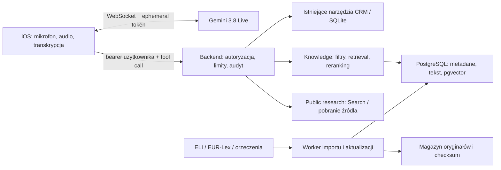

# Emma: Gemini Live, internet i wiedza prawna

Status: projekt architektury i pierwsze poprawki lokalne, 2026-09-22.
Nie jest to raport wdrożenia produkcyjnego ani zasilonej bazy RAG.

## 1. Decyzja

Gemini 3.8 Live pozostaje interfejsem rozmowy. Dane kancelarii czyta istniejący
backend; wiedzę prawną dostarcza nowy moduł `knowledge` za tym samym backendem.
Publiczne wyszukiwanie internetowe jest osobną zdolnością, z oznaczeniem źródeł.
Rozbudowana analiza prawna powinna korzystać z osobnego zadania badawczego,
którego wynik głos streszcza, a aplikacja pokazuje wraz z dowodami.

Bez migracji istniejącego CRM z SQLite. Moduł wiedzy startuje w repo backendu,
bez nowego publicznego serwisu i bez kluczy dostawców w iOS. Oddzielny worker
wykonuje import, OCR i embeddingi poza procesem obsługującym głos.

## 2. Co naprawdę jest w repozytoriach

| Obszar | Stan i znaczenie |
|---|---|
| `emma/ios/Emma/VoiceAdapters/GeminiLiveTransport.swift` | Bezpośredni WebSocket, PCM 16 kHz wejście / 24 kHz wyjście; półdupleks z powodu wcześniejszych problemów AEC na telefonie. |
| `emma/ios/Emma/Core/Voice/GeminiLiveProtocol.swift` | Kodek protokołu; dotychczas pomijał anulowanie tool calls i grounding metadata. |
| `emma/ios/Emma/Core/Voice/GeminiLiveTurnTracker.swift` | Składanie transkrypcji i stan tury. `turnComplete` nie jest lokalnym potwierdzeniem zakończenia audio. |
| `adwokat-app-project/src/lib/crm/voice/gemini.ts` | Instrukcja, narzędzia, model, VAD i kompresja są blokowane w ephemeral tokenie. Tu włącza się Search, nie w kliencie. |
| `adwokat-app-project/src/lib/crm/emma/tools.ts` | Osiem narzędzi czytających CRM; limity odpowiedzi. Nie ma retrieval aktów prawnych. |
| `adwokat-app-project/src/pages/api/mobile/v1/voice/tools/[tool].ts` | Autoryzacja użytkownika, wykonanie narzędzia i audyt czasu. |
| Publiczna „baza wiedzy” witryny | Artykuły marketingowo-informacyjne nie są automatycznie oficjalnym korpusem prawnym RAG. |

## 3. Możliwości Gemini: potwierdzone i ograniczenia

Gemini 3.8 Live obsługuje Search grounding i function calling. Nie obsługuje
natywnie URL Context, File Search ani structured outputs. Zwykły 3.8 Live nie
przyjmuje `thinkingLevel`; nie dokładamy tam ustawień z modelu Extended Thinking.
Źródło: [karta modelu Google](https://ai.google.dev/gemini-api/docs/models/gemini-3.8-live).

Google pokazuje wspólny setup `googleSearch` i `functionDeclarations`. Funkcje
mogą działać jako `NON_BLOCKING`; odpowiedź rozmowna nie musi czekać na HTTP,
ale nie może podawać wyniku, zanim on nadejdzie. Dokumentacja zawiera różne
zapisy scheduling między przewodnikami, więc na tym etapie nie wysyłamy nowego
pola scheduling w surowym protokole. Źródło: [Live tools](https://ai.google.dev/gemini-api/docs/live-api/tools).

Wpisanie do promptu „masz internet” nie włącza żadnego dostępu. Odczyt konkretnej
strony wymaga narzędzia backendowego lub oddzielnego modelu z URL Context.
Wyszukanie strony nie dowodzi, że pobrano cały tekst ani że przepis obowiązuje.

## 4. Szybkość i jakość rozmowy

### Wprowadzone poprawki

- Ogon blokady mikrofonu wynosi 250 ms po końcu kolejki, nie po każdym pakiecie.
  Czas liczony monotonicznie; nie zależy od przestawienia zegara urządzenia.
- Transkrypcja wejściowa zachowuje wszystkie fragmenty zamiast ostatniego.
- `toolCallCancellation` anuluje wskazane zadania. Rozłączenie i reconnect
  wycofują zadania, a wynik sprzed zmiany gniazda nie trafia do nowej rozmowy.
- Backend jawnie deklaruje `NON_BLOCKING` dla modeli 3.8, zachowując zgodność 3.1.
- Instrukcja mówi: odpowiedź najpierw, zwykle 1–3 zdania; fakty dopiero po
  wyniku narzędzia; brak zgadywania cytatów i danych kancelarii.

### Strojenie wymagające pomiaru na urządzeniu

Zostawiamy dotychczasowy VAD 700 ms jako punkt odniesienia. Porównać 700, 500 i
350 ms na identycznych nagraniach: krótkie pytania, nazwiska, sygnatury, pauzy
wewnątrz zdania, autokorekta i hałas. Mniejsza cisza VAD redukuje opóźnienie,
lecz może wcześniej zamykać wypowiedź. Mechanizm opisuje
[dokumentacja VAD](https://ai.google.dev/api/live).

Mierzyć osobno: koniec mowy → pierwsze audio słyszalne, koniec mowy → pierwsze
merytoryczne audio, czas toola, czas wznowienia, czas zwolnienia mikrofonu.
„Już sprawdzam” nie jest pierwszą merytoryczną odpowiedzią. Raportować p50/p95,
liczbę próbek, model, głos, sieć i trasę audio. Pomiar starego spike'u po tekście
nie zastępuje testu speech-to-speech na iPhonie.

Proponowane kryteria, a nie uzyskane wyniki: minimum 30 wypowiedzi na profil;
p95 do merytorycznego audio < 2 s bez toola i < 4 s z lokalnym retrieval;
zero utraconych nazwisk/liczb w zestawie krytycznym; brak wyników anulowanej
funkcji w następnej turze. Dla Search osobny budżet 8 s i jawny komunikat
niepowodzenia po deadline.

Półdupleks nadal uniemożliwia naturalne wejście głosem w słowo przez głośnik.
Powrót do AEC to osobny eksperyment na iPhonie; słuchawki i głośnik wymagają
oddzielnych profili oraz obsługi zmiany trasy. Nie reklamować pełnego dupleksu.
Pozostałe prace transportowe: dokładny callback końca playbacku, kontrola
kolejki audio przy wolnej sieci, handshake przed wysyłką mikrofonu, testy
wznowienia długiej sesji i poprawne unieważnienie uchwytu `resumable=false`.

## 5. Internet i Search

Dodano `GEMINI_LIVE_GOOGLE_SEARCH` (domyślnie `false`) do konfiguracji backendu.
`true` dodaje `{ googleSearch: {} }` do zablokowanego setupu sesji, obok CRM.
Zmiana obejmuje nowo wydawane tokeny. To przygotowana konfiguracja; nie została
włączona na produkcji ani sprawdzona nowym testem płatnego API.

Obecny iOS nie prezentuje `groundingMetadata`. Dlatego przed włączeniem Search:

1. Przenieść metadata przez kodek, zdarzenia, stan i historię odpowiedzi.
   Zachować źródła, powiązania fragmentów tekstu i sugestie wyszukiwania Google.
2. Pokazać linki i wymagane elementy Search suggestions zgodnie z
   [przewodnikiem grounding](https://ai.google.dev/gemini-api/docs/google-search).
   Zachować je także dla odpowiedzi głosowej i po opuszczeniu mini-panelu.
3. Sprawdzić na rzeczywistym koncie: wydanie tokenu, setup, wyszukiwanie,
   metadata, brak wyników, Search + CRM w jednej turze, anulowanie i reconnect.
4. Dla sesji z aktami preferować `search_public_sources` w backendzie. To osobne
   żądanie modelu z minimalnym publicznym pytaniem, bez historii CRM. Instrukcja
   w promptcie Live jest wskazówką dla modelu, nie twardą izolacją danych.

`fetch_public_source` przyjmuje identyfikator z rejestru źródeł lub wynik
poprzedniego wyszukiwania. Backend sprawdza HTTPS, host, DNS i każde przekierowanie,
blokuje adresy lokalne/prywatne, ustawia deadline, limit bajtów, typ dokumentu
oraz brak cookies i nagłówków użytkownika. Samo sprawdzenie tekstu URL nie
chroni przed SSRF. Nie budować otwartego proxy „pobierz dowolny URL”.

## 6. Korpus i źródła

Poniższa kolejność to propozycja importu. Publiczny dostęp nie oznacza
kompletności danych ani potwierdzonego API do masowego pobierania.

| Priorytet | Źródło | Integracja i zakres |
|---|---|---|
| 1 | [ELI / API Sejmu](https://api.sejm.gov.pl/eli_pl.html) | Udokumentowane API aktów DU i MP, metadane, teksty i relacje. Start od kodeksów właściwych dla spraw kancelarii. |
| 2 | [EUR-Lex](https://eur-lex.europa.eu/content/help/data-reuse/webservice.html?locale=en) | Wyszukiwanie webservice wymaga rejestracji; metadane i pobieranie tekstów to odrębne operacje. CELEX/ELI, język i wersja dokumentu w modelu danych. |
| 3 | [SN](https://www.sn.pl/orzecznictwo/SitePages/Baza_orzeczen.aspx) | Oficjalne orzeczenia; adapter dopiero po sprawdzeniu warunków i sposobu pobierania. Nie deklarujemy niezweryfikowanego REST API. |
| 3 | [CBOSA / NSA](https://orzeczenia.nsa.gov.pl/cbo/query) | Oficjalna baza sądów administracyjnych. Zachować sąd, datę, sygnaturę i oryginalny link; brak wyniku nie dowodzi braku orzeczenia. |
| 4 | [SAOS API](https://www.saos.org.pl/help/index.php/dokumentacja-api) | API jako kanał agregacji i odkrywania; zapisać również pierwotny organ i źródło. SAOS nie zastępuje weryfikacji pochodzenia orzeczenia. |

Proponowany start: KC, KPC, KK, KPK oraz akty dziedzinowe wynikające z realnych
pytań kancelarii. Zakres zaakceptować na zestawie pytań, zamiast importować
od razu wszystkie dokumenty. Kodeks jest dokumentem wielokrotnie zmienianym,
nie pojedynczym „aktualnym PDF-em”.

## 7. Model danych i import

[Projekt DDL](knowledge/schema.sql) obejmuje wyłącznie publiczną wiedzę.
Nie jest automatyczną migracją CRM. PostgreSQL + pgvector daje jeden magazyn
metadanych i wyszukiwania tekstowego/wektorowego; profil embeddingów jest
wersjonowany. Indeksy przybliżone i parametry filtrowania dobiera się do pomiaru,
nie przed wyborem modelu. Por. [pgvector](https://github.com/pgvector/pgvector).

- Źródło: wydawca, typ integracji, URL dokumentacji, warunki użycia, rytm importu.
- Dokument: trwały ELI/CELEX/ID źródła, tytuł, jurysdykcja, rodzaj i język.
- Rewizja: oryginał, checksum, data pobrania/publikacji, wersja parsera,
  status weryfikacji i relacje do zmian; kolejne importy nie nadpisują cytowanych wersji.
- Fragment: artykuł/paragraf/ustęp lub sekcja orzeczenia, dokładna treść,
  strona/zakres, daty obowiązywania i informacja, czy daty zweryfikowano.
- Embedding: rewizja fragmentu + profil modelu/preprocessingu + liczba wymiarów.

Pipeline: discovery → pobranie oryginału → checksum/deduplikacja → parser/OCR →
struktura prawna i relacje → weryfikacja dat → fragmenty → embedding → walidacja
→ atomowa publikacja rewizji. Uszkodzony lub pusty PDF trafia do kwarantanny.
OCR z niską pewnością cyfr i numeracji nie trafia do odpowiedzi jako cytat.

Przedział obowiązywania jest półotwarty `[valid_from, valid_to)`. Publikacja,
wejście w życie, stosowanie i data pobrania to różne pojęcia. Sam tekst jednolity
nie rozstrzyga późniejszych zmian ani przepisów przejściowych. Daty mogą być
różne dla poszczególnych artykułów. Nieznanych dat nie interpretować jako
„zawsze aktualne”. Dla orzeczenia przechowujemy datę rozstrzygnięcia; nie
modelujemy jej jako daty wejścia ustawy w życie.

Na start proponuję import zmian ELI co 6 h, orzeczeń raz dziennie, tygodniowy
przegląd kompletności. To nasza polityka, nie gwarancje wydawców. Respektować
limity źródła, Retry-After, ETag/Last-Modified, checkpointy i idempotencję.
Awaria nie kasuje poprzedniej wersji; świeżość wyniku jest jawna.

## 8. Retrieval i kontrakt narzędzia

[Kontrakt JSON Schema](knowledge/retrieval.schema.json) rozdziela status wyniku,
fragmenty dowodowe i dane do cytowań. To projekt do wspólnego wdrożenia po
stronie backendu i iOS; nie ogłasza nowego działającego endpointu.

Proponowane narzędzia: `search_legal_knowledge`, `get_legal_passage`,
`search_public_sources`, `fetch_public_source`. Zarejestrować je w istniejącym
rejestrze backendu i allowliście głosu dopiero, gdy mają prawdziwy executor.
Wykorzystać bieżącą trasę `/api/mobile/v1/voice/tools/{tool}` i jej envelope
`{ tool, result }`; nie tworzyć niezależnego endpointu bez autoryzacji.

Przebieg zapytania:

1. Walidacja, język, jurysdykcja, data stanu prawnego, zakres i intencja.
   Tożsamość użytkownika i uprawnienia pochodzą z serwera, nigdy z argumentu modelu.
2. Rozpoznanie dokładnych identyfikatorów artykułu/sygnatury przed embeddingiem.
3. Filtry opublikowanych rewizji, jurysdykcji, rodzaju i stanu na datę; potem
   wyszukiwanie tekstowe oraz semantyczne, po 30 kandydatów jako punkt startowy.
4. Połączenie rankingu (RRF), deduplikacja, reranking do 6–8 fragmentów;
   dołączenie definicji i przepisów przejściowych, jeśli są potrzebne.
5. Weryfikacja cytowanych fragmentów, świeżości, sprzeczności i budżetu wyniku.
   Maksymalnie 8 fragmentów i 24 KiB UTF-8, bez bezmyślnego obcinania artykułu
   do istniejącego w narzędziach CRM limitu 400 znaków.
6. Live streszcza wynik po polsku. Cytaty i linki są wybierane z rekordu źródła,
   nie generowane z pamięci modelu. Brak podstaw = informacja o luce.

Statusy: `ok`, `no_results`, `needs_clarification`, `unavailable`. Oddzielne
ostrzeżenia: nieaktualny import, nieustalony stan prawny, sprzeczne źródła,
niepełny korpus. Wynik similarity jest rankingiem, nie prawdopodobieństwem
poprawnej porady. Cache zależy od zapytania, daty, jurysdykcji, filtrów, profilu
retrieval i wersji korpusu; zmiana rewizji unieważnia zależne wpisy.

Polski: na początek wyszukiwanie dokładne i PostgreSQL `simple` dla leksykalnego
baseline, osobno normalizacja skrótów KC/KPC i numeracji. Nie zakładać, że
angielski stemming rozwiązuje polską fleksję. Model multilingual embeddings
wybrać na naszym zestawie pytań i zamrozić jego wymiar oraz preprocessing.

Dokumenty prywatne kancelarii to późniejszy, oddzielny korpus i magazyn.
Wymagają ACL przed pobraniem tekstu i przed rerankingiem, rozdzielenia cache,
usuwania także embeddingów/kopii/cache i testów między użytkownikami. Publiczny
DDL nie jest gotowym modelem uprawnień do akt. Logi nie przechowują domyślnie
pełnych zapytań ani tekstów akt; mierzą request ID, profil, czasy i ID dowodów.

## 9. Etapy z warunkami odbioru

| Etap | Rezultat | Dowód odbioru |
|---|---|---|
| A: obecna zmiana | Poprawki audio, transkrypcji, anulowania; backend Search opt-in; ten projekt | Testy jednostkowe i kompilacja iOS/backendu; bez deklaracji wdrożenia |
| B: Search | Źródła i sugestie w historii iOS, polityka zapytań publicznych, adapter pobierania | Test na koncie Google, pytania aktualne, błędy, anulowanie, SSRF i brak danych CRM w izolowanym research |
| C: publiczny RAG | Baza, worker ELI, wybrane kodeksy, dwa narzędzia retrieval | Idempotentny import, cytat do oryginału, zapytania na dwie daty, błędny PDF, awaria źródła |
| D: orzeczenia | EUR-Lex, SN/NSA/SAOS według źródeł i warunków | Sygnatury, duplikaty, relacje, aktualność i niepełność; ocena adwokata |
| E: jakość produkcyjna | Benchmark głosu i retrieval, alerty, rollback | Minimum 100 pytań z oczekiwanymi źródłami, 100% poprawnych odnośników w teście, brak wycieku między zakresami |

W benchmarku obowiązkowo: uchylony przepis, wejście w życie w przyszłości,
częściowa nowelizacja, przepis przejściowy, brak źródła, nieistniejąca sygnatura,
sprzeczne orzeczenia, prompt injection w dokumencie i anulowanie podczas retrieval.
Recall@8 docelowo ≥ 90% na oznaczonym zestawie; ocenę prawną i poprawność
cytowań rozliczać osobno od recall i latencji. Są to kryteria proponowane,
nie wyniki osiągnięte przez obecną aplikację.

## 10. Weryfikacja tej zmiany

Wykonano lokalnie 2026-09-22:

- `swift test --package-path ios`: 335 testów, 0 błędów.
- Xcode 26.6, iPhone 17 Pro / iOS 26.5 Simulator: 29 testów protokołu,
  audio i modelu czasowego, 0 błędów; aplikacja skompilowana.
- Dwa testy przez rzeczywisty lokalny WebSocket do atrapy: anulowanie z
  opóźnionym wynikiem i normalny tool round-trip, oba przeszły bez pominięć.
- Backend: `gemini.test.ts`, `gemini.authTokens.http.test.ts`,
  `mobile/voiceTools.test.ts`: 24 testy, 0 błędów.
- `npm run check` w backendzie: 0 errors, 0 warnings, 47 hints.
- `knowledge/validate_contract.py`: poprawny JSON Schema Draft 2020-12,
  negatywne przypadki dat/limitów/statusu, parser PostgreSQL: 17 instrukcji.
  To walidacja projektu, nie wykonanie DDL na instancji PostgreSQL.

Odtworzenie integracji: uruchomić w repo backendu
`node scripts/fake-live-api.mjs --port 8791`, a w wygenerowanym schemacie Xcode
`Emma-Demo` ustawić zmienną **Test Action** `EMMA_FAKE_LIVE_BASE_URL` na
`http://127.0.0.1:8791` i `shouldUseLaunchSchemeArgsEnv="NO"`. W tym środowisku
samo `SIMCTL_CHILD_...` w procesie xcodebuild nie przekazało zmiennej testom;
pierwsze próby były pomijane. Ostateczne dwa testy uruchomiono z jawną zmienną
schematu, po czym przywrócono wygenerowany schemat.

Nie wykonano wdrożenia, płatnego testu nowej konfiguracji Google, benchmarku
mikrofonu na fizycznym iPhonie, importu źródeł ani uruchomienia serwera RAG.
Zmiany backendowe są lokalnie w `~/projects/adwokat-app-project`; do wydania
potrzebna jest koordynacja obu repozytoriów. Search pozostaje domyślnie wyłączony.
