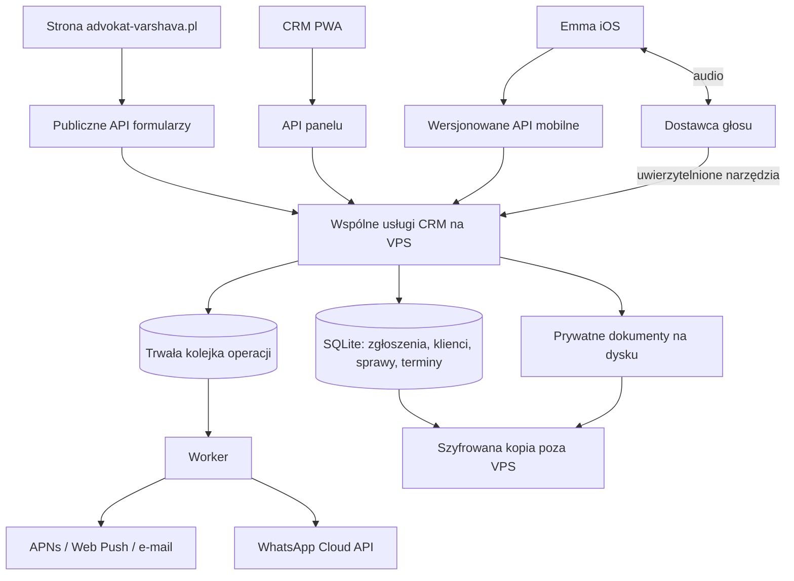

# Emma iOS + advokat-varshava.pl + CRM — plan wspólnego backendu

Data: 13 września 2026. Status: **plan, bez implementacji i bez zmian na VPS**.

## 1. Rekomendacja

Rozbudować istniejący backend strony/CRM w repozytorium **`Pawel-Rogoza/adwokat-app-project`**, podłączyć do niego Emmę jako kolejny interfejs i zachować PWA. Wszystkie trzy wejścia mają używać tych samych danych i reguł biznesowych. Nie budować osobnego CRM dla iOS ani mechanizmu kopiowania klientów między dwoma niezależnymi systemami.

Na pierwszy etap proponuję: obecny VPS AlmaLinux + nginx, obecny backend Astro/Node/TypeScript, istniejący SQLite na lokalnym trwałym dysku, prywatne pliki poza katalogiem strony oraz szyfrowana kopia poza VPS. Dodać mobilne API, rzeczywiste logowanie, synchronizację, APNs i trwałe zadania w tle. Najpierw uruchomić pełny przepływ zgłoszenia ze strony do iOS, później działania głosowe i WhatsApp.

Najważniejsza informacja: **backend, baza i obsługa plików już istnieją w kodzie**. Trzeba je ujednolicić i udostępnić aplikacji, a nie kupować wszystkie te elementy od nowa. Stan GitHuba nie dowodzi jednak, że dokładnie ta wersja i wszystkie usługi działają dziś na VPS.

## 2. Co sprawdzono

Przez plugin GitHub odczytano prywatne repo `adwokat-app-project`, gałąź `main`, commit **`029444a1d960a0c0c0d218908ec1083faa3467d6`**, z 10 września 2026: „emma(05): odczyty CRM i wersjonowany kontekst przez voice (#171)”. Nazwy `advokat` nie znaleziono na koncie; właściwe repo zostało rozpoznane po nazwie projektu, domenie, CRM i wcześniejszych odnośnikach.

Sprawdzono też lokalne repo `emma` na bazie `f1e1d34`, propozycję OpenAPI, auth i adapter głosu. Publiczna strona opisuje wybór **preferowanego** terminu i ręczne potwierdzenie przez adwokata — tę semantykę zachować. [Strona kancelarii](https://advokat-varshava.pl/).

Nie logowano się na VPS, nie przeglądano danych klientów, nie wysyłano formularzy ani wiadomości. Nie potwierdzono wielkości RAM/dysku, aktywnej wersji aplikacji, konfiguracji nginx/Cloudflare, działania kopii zewnętrznych ani dostępności kont dostawców. Dokumentacja wdrożenia zawiera zarówno instrukcje AlmaLinux, jak i starsze polecenia Debian/Ubuntu; nie wykonywać jej bez sprawdzenia środowiska.

| Element | Potwierdzenie w repozytorium | Co to oznacza |
| --- | --- | --- |
| Backend | Astro z Node, TypeScript, React, `better-sqlite3` w `package.json` | Istniejąca aplikacja serwerowa, nie sama statyczna strona. |
| Baza CRM | `src/lib/crm/db.ts`: `crm.sqlite3`, WAL, FK, migracje, `busy_timeout` | Można wykorzystać dane i logikę istniejącego CRM. W drzewie są migracje do `040_voice_sessions.sql`. |
| Zgłoszenia | `contact.ts`, `booking/request.ts`, `leadIntake.ts`, `leads.ts` | Formularze już przekazują leady wraz z atrybucją; obsługiwane źródła: booking/contact/kb_question/manual. |
| Rezerwacje | `src/lib/booking.ts` | Osobny magazyn JSON w `BOOKING_DATA_DIR/requests` i załączniki w `uploads`. |
| Konwersja | `leads/[id]/convert.ts`, `bookingSync.ts` | Potwierdzenie może utworzyć klienta i wydarzenie, zsynchronizować rezerwację i skopiować pliki. |
| Dokumenty CRM | `src/lib/crm/files.ts` | Prywatny dysk, kwarantanna, rozpoznanie typu, skan AV, metadane w SQLite; pobieranie z sesją. |
| Dostęp | `authz.ts`, `sessions.ts`, WebAuthn, TOTP | Istnieją użytkownicy, role i sesje przeglądarkowe. API sprawdza cookies, nie mobilny Bearer. |
| Hosty | `hostGuard.ts`, `docs/DEPLOYMENT.md` | W repo CRM jest związany z `CRM_HOST`, opisywanym jako `majkuny.pl`; publiczna domena blokuje trasy CRM. |
| Push | `web-push`, `push_subscriptions` | To powiadomienia webowe PWA. Natywna aplikacja wymaga osobnego kanału APNs. |
| Głos | `src/lib/crm/voice/*`, endpointy `assistant/voice/*` | Istnieje gateway, sesje i narzędzia odczytowe. Executor odmawia narzędzi write/generate. |
| WhatsApp | `leadIntake.ts` wywołuje `sendWhatsAppLeadNotification` | Powiadomienie adwokata o leadzie nie stanowi pełnej skrzynki rozmów z klientami. |
| iOS | `AppDependencies`, `AuthStore`, OpenAPI draft | Repozytorium danych i logowanie są demonstracyjne; adres serwera sam nie wystarczy. |

W `docs/emma/IMPLEMENTATION_STATUS.md` tabela postępu pozostaje za kodem: PR 03–05 mają puste statusy, ale ich pliki istnieją na wskazanym SHA. Przy dalszej pracy porównywać dokumenty z kodem; nie kopiować dawnych opisów „backend niedostępny” z repo iOS jako obecnego faktu.

Źródła przypięte do sprawdzonej wersji: [baza CRM](https://github.com/Pawel-Rogoza/adwokat-app-project/blob/029444a1d960a0c0c0d218908ec1083faa3467d6/src/lib/crm/db.ts), [przyjęcie leada](https://github.com/Pawel-Rogoza/adwokat-app-project/blob/029444a1d960a0c0c0d218908ec1083faa3467d6/src/lib/crm/leadIntake.ts), [rezerwacje](https://github.com/Pawel-Rogoza/adwokat-app-project/blob/029444a1d960a0c0c0d218908ec1083faa3467d6/src/lib/booking.ts), [pliki](https://github.com/Pawel-Rogoza/adwokat-app-project/blob/029444a1d960a0c0c0d218908ec1083faa3467d6/src/lib/crm/files.ts), [wdrożenie](https://github.com/Pawel-Rogoza/adwokat-app-project/blob/029444a1d960a0c0c0d218908ec1083faa3467d6/docs/DEPLOYMENT.md).

## 3. Jak elementy mają ze sobą współpracować

Backend to program wykonujący reguły i sprawdzający dostęp. Baza przechowuje rekordy i relacje. Magazyn plików przechowuje PDF-y, zdjęcia i pisma. iPhone pobiera przez HTTPS wyłącznie informacje, do których użytkownik ma dostęp; nie otwiera zdalnego pliku SQLite ani katalogu serwera.

Na początku wspólne usługi CRM nadal działają w obecnej aplikacji Node. Nie dodawać drugiego serwera tylko po to, żeby iPhone mógł wysyłać HTTP. Worker jest osobnym procesem tego samego kodu, odpowiedzialnym za ponowienia i cięższe prace. Przed jego uruchomieniem oddzielić migracje oraz właściciela schedulerów od startu każdego procesu.

To wariant oszczędny, z jawną wadą: strona i CRM współdzielą proces oraz host, więc awaria lub naruszenie jednej części może objąć całość. Rozdzielenie samych domen nie daje izolacji procesu. Osobny prywatny backend i ograniczony publiczny serwis przyjmujący zgłoszenia są kolejnym etapem, gdy wynika to z wymagań izolacji, dostępności albo pomiarów.

## 4. Baza: dlaczego na początek SQLite

| Wariant | Korzyść | Koszt i ograniczenie | Decyzja |
| --- | --- | --- | --- |
| Istniejący SQLite | Wykorzystanie danych, migracji i zapytań; najkrótsza droga do działającego iOS | Jeden zapis naraz, lokalny dysk; dyscyplina transakcji i kopii | **Wariant rekomendowany dla pilota kancelarii na jednym VPS.** |
| PostgreSQL na VPS | Większa swoboda równoległych zapisów i rozdzielania procesów | Migracja SQL, danych, wdrożenia, testów i backupu; dodatkowa usługa | Gdy pomiary lub plan wielu hostów uzasadnią migrację. |
| Zarządzany PostgreSQL + zewnętrzny storage | Część obowiązków operacyjnych przejmuje dostawca | Stałe koszty, zależność sieciowa, wybór regionu/usługi i migracja | Opcja przy potrzebie odciążenia administracyjnego, nie warunek podłączenia iPhone'a. |

SQLite może obsługiwać serwer aplikacyjny udostępniający własne API. Istotne ograniczenia to równoległe zapisy i współdzielenie pliku przez sieć; liczba ekranów lub telefonów sama nie wymusza PostgreSQL. [SQLite — appropriate uses](https://sqlite.org/whentouse.html).

Warunki pozostania: lokalny trwały filesystem, krótkie transakcje, brak wywołań modeli/AV/HTTP wewnątrz transakcji, mała współbieżność zapisów, brak wymagania HA. Mierzyć kolejkę zapisów, `SQLITE_BUSY`, opóźnienia i czas backupu. Wybrać PostgreSQL wcześniej, jeśli potrzebne są niezależne hosty zapisujące, wysoka dostępność albo utrzymujące się problemy współbieżności. Nie uruchamiać replik Node na kilku maszynach ze wspólnym SQLite przez NFS.

Nie ma obecnie danych pozwalających uczciwie stwierdzić, że trzeba kupić mocniejszy VPS. Najpierw pomiar. LLM, rozpoznawanie i generowanie mowy pozostawić u dostawców; ten plan nie zakłada uruchamiania dużego modelu na obecnym serwerze WWW.

## 5. Najpilniejsza zmiana: niezawodne przyjęcie zgłoszenia

Obecny `recordPublicLead()` wywołuje zapis fire-and-forget, a `recordPublicLeadNow()` przechwytuje błędy SQLite. Endpoint może zwrócić klientowi sukces pomimo braku rekordu CRM. Rezerwacja ma dodatkowy ślad JSON, ale formularz kontaktowy nie ma równoważnej gwarancji trwałego wpisu w CRM. Samo odpytywanie bazy przez Emmę nie naprawi utraconego zgłoszenia.

Docelowo potwierdzenie formularza musi oznaczać trwałe przyjęcie przez backend. E-mail, push i WhatsApp są skutkami ubocznymi obsługiwanymi z kolejki, a nie miejscem przechowywania zgłoszenia.

### Pierwsza poprawka, jeszcze przed migracją rezerwacji

Publiczne endpointy mają oczekiwać na zapis leada albo trwałego rekordu przyjęcia; błąd tego zapisu oznacza brak sukcesu i możliwość bezpiecznego ponowienia. W tej samej transakcji powstaje outbox powiadomień. Dla istniejącego JSON booking dodać trwałe identyfikowanie/przywracanie niedokończonego przekazania po `booking_ref`; proces restartu nie może zgubić przyjętej rezerwacji.

Idempotencja formularza: losowy `submission_id` utworzony dla jednej próby przez stronę; ponowienie po zerwanej odpowiedzi korzysta z tego samego ID. Serwer wiąże ID z hashem istotnych danych, zwraca istniejący wynik dla identycznej próby, a odrzuca inne dane pod tym samym ID. Nowe świadome zgłoszenie dostaje nowe ID. Nie deduplikować wyłącznie po telefonie — ta sama osoba może mieć kilka spraw i terminów.

### Docelowe ujednolicenie

Rezerwacje przenieść z JSON do tej samej bazy co CRM. Jedna transakcja utrwala zgłoszenie konsultacji, powiązany lead, rezerwację zasobu/czasu i outbox. Załączniki przygotować i przeskanować przed transakcją, a rekordy powiązań zapisać razem; usuwanie osieroconych plików obsłużyć osobno. Nie utrzymywać na stałe dwóch równorzędnych źródeł stanu konsultacji.

Zachować aktualną regułę: żądanie terminu jest `pending`, adwokat je potwierdza. Obecnie `pending` i `confirmed` blokują slot na stronie. W pierwszym wdrożeniu nie zmieniać tego zachowania po cichu. Ewentualny czas wygaśnięcia oczekującej rezerwacji wymaga jawnej polityki i komunikatu. Kontrola konfliktu musi obejmować całe przedziały czasu, także 60-minutowe konsultacje i istniejące wydarzenia, a nie tylko identyczną godzinę startu. Sprawdzenie i zajęcie zasobu muszą być atomowe; blokada w pamięci jednego procesu nie wystarczy po dodaniu procesów.

Przebieg końcowy: formularz → trwałe zgłoszenie → pozycja w PWA i iOS → decyzja adwokata → jeden termin w kalendarzu → powiadomienie klienta → po rozpoczęciu współpracy powiązana sprawa. Utworzenie karty kontaktowej przy konsultacji nie powinno samo oznaczać formalnego rozpoczęcia prowadzenia sprawy.

## 6. Dane i pliki: rozwijać istniejący model

| Obszar | Zachować / rozszerzyć | Ważne reguły |
| --- | --- | --- |
| Leady | Istniejące `leads`, źródło, język, UTM/gclid, `booking_ref` | Zachować istniejące ID i statusy lejka; dodać trwałe `submission_id`. |
| Konsultacje | Nowa tabela rezerwacji odwzorowująca dotychczasowy `BookingRecord` | Utrzymać legacy booking ID i hash/wygaśnięcie tokenu dla starych linków; powiązać lead i jedno wydarzenie. |
| Klienci i sprawy | Istniejące `clients`, `cases` | Jedna osoba może mieć wiele spraw; nie wybierać przypadkowej po nazwisku. |
| Zadania / terminy | Istniejące `tasks`, `events`, `case_actions` | Audyt mapowania jest obowiązkowy: migracja 037 kopiowała część danych. Nie pokazywać zduplikowanych zdarzeń i nie tworzyć trzeciej niezależnej listy zadań. |
| Pliki | Istniejące metadane i prywatne pliki, potem wspólne powiązania dokumentów | Stabilny file ID, rozmiar, MIME, hash, wersja, rodzic, skan, autor. |
| Integracje | Outbox/inbox, wykonania akcji, sesje i urządzenia | Unikalne identyfikatory operacji i dostawców, trwały wynik oraz historia. |
| Synchronizacja | Monotoniczny dziennik zmian i wersja rekordu | Każdy zapis PWA/iOS/głosu emituje zmianę w tej samej transakcji. Usunięcie emituje tombstone. |

iOS może traktować ID serwera jako nieprzezroczysty string; nie wymaga to przepisywania wszystkich kluczy SQLite na UUID. Trzeba natomiast odróżnić typ zasobu: lead nie jest klientem, a działanie asystenta nie jest rekordem zadania.

Na start trzymać bajty dokumentów na istniejącym prywatnym dysku VPS, metadane w bazie. Rozszerzyć obecny `storeFile`, zamiast dopisywać drugi uploader i omijać ClamAV. Udostępnianie pliku przez uwierzytelnione API sprawdza dostęp do konkretnego klienta/sprawy. `public/`, publiczny bucket i GitHub nie służą do przechowywania akt.

W obecnym kopiowaniu booking → klient deduplikacja opiera się na nazwie i rozmiarze. Docelowo identyfikować po oryginalnym file ID i hashu, aby dwa różne dokumenty o tej samej nazwie i wielkości nie były uznane za ten sam. Konwersja powinna utrwalić powiązanie dokumentu z aktami, niezależne od późniejszego czyszczenia starego zgłoszenia. Nie usuwać danych źródłowych, zanim wszystkie załączniki zostaną sprawdzone i rozliczone.

Stan uploadu w iOS: wysyłanie → skanowanie → dostępny / odrzucony / ponów. Przy większych plikach uwzględnić streaming/wznowienie i limity; nie buforować dowolnie dużych załączników w RAM procesu strony. OCR i indeksowanie uruchamiać jako zadania workera dopiero po zatwierdzeniu pliku. Zewnętrzny prywatny magazyn obiektowy można wprowadzić później przez `storage_key`, gdy rozmiar akt lub backup uzasadni zmianę.

## 7. API mobilne i logowanie

Rekomendowany początkowy adres: **`https://<CRM_HOST>/api/crm/mobile/v1`**. Jeśli aktualny `CRM_HOST` rzeczywiście wynosi `majkuny.pl`, daje to `https://majkuny.pl/api/crm/mobile/v1`. To propozycja nowego API, nie działający endpoint. Umieszczenie pod `/api/crm/` wykorzystuje istniejący podział hostów. Nie wystawiać całego CRM na domenie publicznej ani nie wyłączać host guardu. Osobna domena `api.*` jest opcjonalną późniejszą zmianą routingu, nie osobnym backendem.

Warstwa API mobilnego jest adapterem do wspólnych serwisów domenowych. Nie powinna wykonywać wewnętrznych requestów do HTML PWA ani kopiować logiki z endpointów. Serwisy wspólne zwracają jeden format domenowy; web i iOS mają własne DTO oraz sposób uwierzytelnienia.

Istniejący `docs/ios/api/emma-mobile-api.yaml` ma status draft, nie jest kontraktem istniejącego serwera. Brakuje w nim istotnej obsługi leadów, decyzji konsultacji i dokumentów. Uzgodnić nowy kontrakt na bazie realnego CRM, przechowywać wersję kanoniczną w repo backendu; kopię w repo iOS aktualizować z podaniem wersji/hash. Poprawić składanie adresu w `BackendConversationTokenProvider`, aby nie doklejać drugiego `/v1`.

Minimalny kontrakt v1, ścieżki względne wobec powyższego prefiksu:

| Grupa | Operacje |
| --- | --- |
| Tożsamość | mobilna autoryzacja, wymiana kodu, refresh, revoke, `GET /me`, stan uprawnień i możliwości |
| Leady | lista i szczegóły, status, przypisanie do istniejącego kontaktu, konwersja |
| Konsultacje | lista oczekujących, confirm/reject/reschedule, dostępność i konflikt |
| Praca | klienci, sprawy, zadania, wydarzenia, notatki, briefing na wskazaną datę/zakres |
| Dokumenty | lista, upload, stan skanu, pobranie, powiązanie z aktami |
| Synchronizacja | `GET /sync/changes?cursor=...`, paginacja, wersje, tombstones |
| Urządzenia | rejestracja/usunięcie tokenu APNs i preferencji |
| Później | propozycje działań, wykonania, voice sessions, wątki i wiadomości WhatsApp |

Logowanie rekomendowane: systemowa sesja przeglądarkowa iOS otwiera obecny host CRM i wykorzystuje istniejące konto/passkey lub aktualną metodę dodatkowego uwierzytelnienia. Po zalogowaniu backend wydaje krótko ważny jednorazowy kod, aplikacja wymienia go z PKCE na mobilną sesję. Wdrożyć przez sprawdzoną bibliotekę/przepływ, z allowlistą redirect URI, `state`, jednorazowością i związaniem kodu z użytkownikiem oraz próbą. Tokeny dostępu nie trafiają do adresu callback. [Apple — ASWebAuthenticationSession](https://developer.apple.com/documentation/authenticationservices/aswebauthenticationsession).

Access token krótkotrwały; refresh token rotowany i zapisany w Keychain, na serwerze tylko jego hash. Unieważnienie urządzenia, konta lub roli musi działać dla mobilnej sesji. Sesja PWA pozostaje cookie-based z CSRF; iOS używa dedykowanego Bearer i tych samych polityk uprawnień. Nie wyłączać autoryzacji, aby ominąć różnicę między cookies i tokenem.

Face ID w iOS odblokowuje lokalny dostęp; samo pozytywne `LAContext` ani wartość w `UserDefaults` nie dowodzą tożsamości backendowi. Obecny `AuthStore.signIn` sprawdza tylko kształt danych, więc przed produkcją musi zostać zastąpiony. Zachować backendowy step-up dla wrażliwych operacji. Można używać jednego konta adwokata na start, ale nie usuwać istniejących ról i tożsamości użytkowników CRM.

## 8. Synchronizacja i powiadomienia

Serwer jest źródłem prawdy, iPhone ma ograniczoną lokalną kopię potrzebną do wygodnej pracy. Pierwsze otwarcie pobiera dane stronicowane, potem zmiany od kursora. Zapis kursora i zastosowanie strony zmian są atomowe lokalnie. Pełna synchronizacja i cursor muszą mieć uzgodnioną granicę snapshotu, aby zmiana podczas pierwszego pobrania nie zniknęła. Po wygaśnięciu kursora serwer wymusza ponowne pobranie.

Wszystkie źródła zapisów — stare endpointy PWA, nowe API, formularze i narzędzia głosowe — muszą aktualizować wersję i dziennik. Samo dodanie `/sync/changes` nad istniejącymi zapisami bez ich instrumentacji nie wystarczy. Zmiana uprawnienia powinna usuwać z cache dane, do których dostęp cofnięto; filtrować dziennik również po uprawnieniach.

Edycja wysyła oczekiwaną wersję; konflikt 409 pokazuje bieżący rekord i zachowuje szkic użytkownika. W MVP offline dostępne są odczyt zapamiętanych danych i szkice. Wysyłka WhatsApp, potwierdzanie konsultacji oraz inne operacje o skutkach zewnętrznych wymagają połączenia i odpowiedzi serwera. Przywrócenie sieci nie wysyła samoczynnie starej wiadomości.

Worker wysyła natywny push przez APNs, oddzielnie od Web Push PWA. Preferować neutralne powiadomienie „Nowe zgłoszenie konsultacji” bez opisu sprawy na ekranie blokady. Tap otwiera właściwego leada po zalogowaniu. Błąd APNs nie cofa zapisu leada. Push jest sygnałem do sprawdzenia danych, nie jedynym kanałem synchronizacji: pobranie także przy aktywacji aplikacji i ręcznym odświeżeniu. Aktualizacje w tle iOS mogą być opóźniane. [Apple — serwer powiadomień](https://developer.apple.com/documentation/usernotifications/setting-up-a-remote-notification-server), [aktualizacje w tle](https://developer.apple.com/documentation/usernotifications/pushing-background-updates-to-your-app).

## 9. Głos i WhatsApp na tym samym fundamencie

Najpierw mobilny odczyt rzeczywistych leadów, terminów i spraw. Dopiero potem podłączyć go do mowy. Repo web ma narzędzia odczytowe i wersjonowany kontekst; wykorzystać istniejący rejestr. Nie budować osobnej logiki „co mam dziś” w PWA, Swift i webhooku.

Wykryta konkretna niezgodność: backend zwraca `elevenlabs.signedUrl` w `/api/crm/assistant/voice/session`; iOS oczekuje pola `token` i uruchamia `startConversation(conversationToken:)`. To nie jest ta sama umowa. Backendowa ścieżka dostawcy również wymaga ponownej weryfikacji na koncie. Uzgodnić wariant WebRTC i właściwy token dla przypiętej wersji Swift SDK; nie przemianowywać signed URL na token. [ElevenLabs — token WebRTC](https://elevenlabs.io/docs/eleven-agents/api-reference/conversations/get-webrtc-token), [Swift SDK](https://elevenlabs.io/docs/eleven-agents/libraries/swift).

Audio może płynąć bezpośrednio między iPhonem a dostawcą, a autoryzowane narzędzia przez backend. Żadne pola `user_id`, `client_id` czy `confirmed=true` wygenerowane przez model nie są dowodem uprawnień lub zgody. Sesja głosowa jest związana z uwierzytelnioną sesją adwokata. Dokumenty/wiadomości klientów traktować jako dane, nie instrukcje uprawniające model do działań.

Wspólny silnik działań: prepare → revise → confirm → durable outbox → execution. Zgoda dotyczy odbiorcy, pełnej treści, kanału, wersji i kontekstu. Potwierdzenie UI lub mową przechodzi tę samą walidację. Wysłanie ma trwały identyfikator i odróżnia queued/sent/delivered/failed/unknown; stan unknown wymaga sprawdzenia, nie automatycznej redelivery.

WhatsApp: zachować powiadomienia o leadach jako istniejącą funkcję; osobno wdrożyć wiadomości przychodzące, podpisy webhooków, deduplikację, powiązanie kontaktu i wątku, wysyłkę oraz statusy dostawcy. Zachować obecny numer i sprawdzić warunki jego integracji przed rejestracją. Nie zakładać dostępu do prywatnej aplikacji WhatsApp z poziomu iOS ani zmiany/wyrejestrowania numeru. Reguły dopuszczalnej wysyłki i szablonów odczytuje backend; UI pokazuje możliwości przed zatwierdzeniem.

OCR, analiza dokumentów i generowanie pism są kolejnym przyrostem. Przechowywanie pliku na VPS nie oznacza konieczności automatycznego wysyłania go do modelu. Rejestrować, jakie fragmenty danych trafiają do którego dostawcy i z jaką retencją; nie utożsamiać prywatnego VPS z lokalnym przetwarzaniem całej rozmowy.

## 10. Plan konfiguracji i utrzymania VPS

Najpierw odczytowy inwentarz serwera: wersja AlmaLinux, CPU/RAM/dysk, Node i architektura/glibc, aktualny SHA release, `systemd`, listen ports, hosty nginx, rzeczywiste `CRM_DATA_DIR` i `BOOKING_DATA_DIR`, liczba/rozmiar danych, stan ClamAV, backupów i SELinux. Bez drukowania sekretów i danych klientów. Repo opisuje użytkownika usługi `tomek`; stwierdzenie „mam root” nie oznacza, że aplikacja powinna pracować jako root.

Docelowo zachować istniejący układ usług, korygując rozpoznane różnice:

- nginx kończy TLS i kieruje publiczny host do formularzy, prywatny do PWA/API. Node słucha na loopback, nie na publicznym porcie.
- Kod wydania jest oddzielony od danych i sekretów. Ustalić bezwzględne ścieżki poza katalogiem kasowanym podczas deployu; nie przenosić ich na ślepo ze starych przykładów.
- Osobny nieuprzywilejowany użytkownik lub istniejący użytkownik usługi; root tylko dla administracji. Zachować działający SELinux i nadać potrzebne uprawnienia zamiast go wyłączać.
- Jeden proces web i jeden kontrolowany worker na początek; migracje uruchamia wdrożenie raz. Schedulery reminders/retention mają jednego właściciela, nie startują podwójnie przy pierwszym requestcie każdego procesu.
- Worker ma limity CPU/RAM i współbieżności. Skan/OCR nie blokuje przyjmowania leadów; kolejki i dysk mają monitoring.
- Endpointy danych i dokumentów bez cache. Przy SSE wyłączyć buforowanie wyłącznie dla odpowiednich tras; nie zmieniać globalnie buforowania strony. [nginx — proxy buffering](https://nginx.org/en/docs/http/ngx_http_proxy_module.html#proxy_buffering).
- Zachować nagłówki i analitykę publicznej strony; panel i dokumenty bez analityki reklamowej. Nowa trasa mobilna musi przejść istniejący host guard i polityki nagłówków.

**Build i deploy:** obecny workflow reaguje na push do `main`, buduje na runnerze i aktywuje release na VPS. Job deploy zależy od sprawdzenia sekretów, a nie od pełnych testów tego samego SHA. Przed zmianami produkcyjnymi dodać bramkę check/test/build/contract-test dla dokładnego wdrażanego artefaktu. Zgodność natywnego `better-sqlite3` obejmuje Node ABI, architekturę i libc; samo ustawienie tej samej nazwy systemu nie wystarcza.

Staging ma własną bazę i katalog plików, bez możliwości wysłania do realnych klientów. Nie uruchamiać eksperymentalnych migracji na produkcji. Rollback kodu po migracji jest bezpieczny tylko przy zgodnym schemacie. Przed migracją konsultacji przygotować przećwiczoną procedurę, nie tylko symlink do starego release.

### Backup

Istnieje `scripts/crm-backup.sh`: robi SQLite `.backup`, archiwizuje pliki CRM i katalog booking; szyfruje po konfiguracji age. Wysyłka poza VPS jest opisana jako osobny krok, nie potwierdzona implementacja tej kopii. Nie traktować `/var/backups` na tym samym dysku jako zabezpieczenia przed utratą serwera.

Rozbudować obecny mechanizm: szyfrowanie obowiązkowe w produkcji, kopia na niezależne konto/nośnik poza VPS, alert po braku kopii i cykliczny restore. SQLite kopiować przez mechanizm spójnego backupu, nie sam aktywny plik z pominięciem WAL. [SQLite Backup API](https://sqlite.org/backup.html).

Sam snapshot bazy i późniejsze archiwum plików nie tworzą jednej transakcji: dokument może zniknąć pomiędzy krokami. Potrzebny krótki kontrolowany punkt spójności albo niezmienne wersje plików, manifest hashy i opóźnione fizyczne kasowanie. Test odtwarzania sprawdza integralność DB, powiązania i zawartość dokumentów oraz to, że stare joby wysyłek nie wykonują się ponownie.

Proponowany cel do zatwierdzenia operacyjnego: RPO do 15 minut dla danych i dokumentów, RTO do 4 godzin. To nie obecna gwarancja. Częstotliwość i mechanizm dobrać po pomiarze wielkości danych; nocna kopia sama nie spełnia RPO 15 minut. Klucz odzyskiwania przechowywać również poza traconym serwerem. Retencję zgłoszeń, akt i kopii ustalić osobno; 60 dni ze starej konfiguracji booking nie może usuwać dokumentów przejętych do sprawy.

## 11. Migracja bez utraty istniejących zgłoszeń

1. Na kopii danych policzyć leady, JSON-y, klientów, wydarzenia i pliki; wykryć brakujące powiązania i osierocone dokumenty. Zanotować wersję schematu oraz hash plików.
2. Dodać tabelę rezerwacji i mapowanie `legacy_booking_ref`, bez zmiany istniejących identyfikatorów klientów/spraw. Migrator jest idempotentny i ma tryb dry-run.
3. Zaimportować JSON-y z zachowaniem statusów, dat, token hash/expiry, oryginalnych file IDs i metadanych. Respektować tombstones usuniętych zgłoszeń — import nie może ich odtworzyć.
4. Uruchomić porównanie odczytów starego i nowego modelu na staging. Stare linki z e-maila, dostępność, konwersja i terminy mają dawać równoważny wynik. Import sam nie wysyła e-maili i powiadomień.
5. Produkcyjny cutover w krótkim oknie: ograniczyć mutacje rezerwacji po wszystkich ścieżkach, także panel i linki; końcowy import przyrostu, kontrola liczników/hashy, przełączenie jednej usługi odczytu/zapisu, test syntetyczny, wznowienie ruchu. Strona informacyjna może pozostać dostępna; formularz w tym oknie pokazuje czasową niedostępność zamiast gubić wpisy.
6. JSON-y pozostają czasowo tylko do odczytu i odtworzenia; nie działają dwa niezależne źródła zapisów. Pozostałe dane `.booking-data`, np. outbox, przenosić dopiero po ich rozliczeniu.
7. Rollback przed nowymi zapisami może wrócić do snapshotu. Po nowych zapisach nie wolno odtworzyć starej bazy bez przeniesienia przyrostu: preferować forward-fix lub zgodny adapter starego UI nad nowym storage. Zapisać granicę bezpiecznego rollbacku.

## 12. Kolejność wdrożenia i podział repozytoriów

| Etap | Repo / zakres | Warunek odbioru |
| --- | --- | --- |
| 0. Baseline | `adwokat-app-project`: read-only VPS, aktualny SHA, mapa tabel i storage, staging, restore, bramka deploy | Wiadomo, gdzie są dane i jak je odzyskać; brak założeń o stanie VPS z samego README. |
| 1. Pewny intake | Backend: trwały zapis formularzy, idempotencja, outbox, pojedynczy worker i migrator | Restart/awaria maila/APNs nie gubi zaakceptowanego zgłoszenia; ponowienie daje jedno zgłoszenie. |
| 2. Wspólne konsultacje | Backend: repozytorium rezerwacji w SQLite i kontrolowana migracja JSON | Formularz, panel, link z e-maila, dostępność i potwierdzenie korzystają ze spójnego stanu. |
| 3. API i auth | Backend: kontrakt v1, login mobilny, uprawnienia, odczyt leadów/klientów/spraw/terminów/plików | Zalogowany klient API widzi właściwe dane; obce ID i cofnięta sesja są odrzucane. |
| 4. Emma online | `emma`: `RemoteRepository`, rzeczywisty `AuthStore`, DTO, stany błędów, listy/dokumenty | Prawdziwe zgłoszenie testowe pojawia się na iPhonie bez wpisywania go ręcznie. Demo nadal działa osobno. |
| 5. Wspólne zapisy i sync | Oba repo: decyzje konsultacji, zadania/notatki, wersje, dziennik zmian, cache, APNs | Zmiana w PWA/iOS widoczna po drugiej stronie; brak dubli terminów i cichego nadpisania. |
| 6. Głos odczytowy | Oba repo: zgodny token/transport, sesja, historia, istniejące narzędzia | „Co mam dziś?” odczytuje rzeczywisty kalendarz i nazywa błąd pobrania. |
| 7. Głos wykonujący | Backend action engine + UI z poprzedniego audytu | Zadanie/notatka/potwierdzenie wykonane raz po zgodzie; korekta unieważnia poprzednią zgodę. |
| 8. WhatsApp | Backend inbox/outbox/webhook + iOS skrzynka | Wiadomość testowa faktycznie odebrana, statusy potwierdzone przez dostawcę, aktualny numer zachowany. |
| 9. Dokumenty AI | Backend worker OCR/retrieval i iOS obsługa | Jawna autoryzacja dokumentów, źródła odpowiedzi, brak ciężkiego OCR w procesie formularzy. |

Kontrakt i logika serwera pozostają w `adwokat-app-project`; SwiftUI, lokalny cache i adaptery w `emma`. Nie przenosić backendu do repo iOS. PWA zachować jako pełnoprawny interfejs kancelarii i drogę dostępu, gdy iPhone jest niedostępny. Docelowo oba interfejsy wywołują te same serwisy; kompatybilność starych endpointów utrzymać w okresie migracji.

Powiązanie z `UX_VOICE_AUDIT_2026-09-13.md`: poprawki czytelności i nawigacji można wykonać niezależnie. Jego etap „prawdziwe usługi” powinien korzystać z niniejszej architektury, nie tworzyć nowego backendu obok istniejącego. Najpierw przekazać modelowi oba dokumenty i aktualny kontrakt.

### Testy bramkujące

- Formularz z plikiem → jeden lead → powiadomienie → otwarcie właściwego rekordu na iPhonie.
- Restart tuż po commicie, zerwane połączenie klienta, timeout SMTP/APNs: trwałe dane i brak duplikatów po retry.
- Równoczesne rezerwacje nachodzących przedziałów oraz jednoczesna edycja z PWA/iOS: kontrolowany konflikt.
- Odrzucenie, przełożenie i potwierdzenie z iOS wpływają na dostępność strony oraz PWA bez duplikowania wydarzenia.
- Dokument po konwersji leada pozostaje w aktach; czyszczenie booking nie kasuje dokumentu klienta; pobranie obcego file ID odrzucone.
- Zmiana roli, revoke sesji/urządzenia, zgubiony push, wygaśnięcie kursora: bezpieczny dostęp i pełne odtworzenie synchronizacji.
- Realne urządzenie iOS: otwarcie pliku, cache offline, wznowienie, Keychain, Face ID i APNs.
- Restore na odizolowanym środowisku: zgodność danych i plików, bez wznowienia dawnych wysyłek do klientów.

Nie trzeba wykonywać całego dużego planu Emmy, aby osiągnąć pierwszy użyteczny rezultat. **Pierwszy kamień milowy to etapy 0–4: zgłoszenie ze strony wraz z dokumentami trafia niezawodnie do aplikacji iOS.** Kolejny to obsługa tych danych z telefonu, potem rozmowa głosowa.

## 13. Koszty, niewiadome i instrukcja startowa

Nowy koszt nie wynika automatycznie z potrzeby „jakiejś bazy”: SQLite i backend już są. Budżet obejmie niezależny backup, ewentualne zasoby dyskowe/VPS, kanały e-mail/WhatsApp, usługi głosu/modelu i dystrybucję iOS. Koszty dostawców ustalić po wyborze regionu, limitów i spodziewanego użycia; nie zakładać cennika z dawnych planów.

Do uzupełnienia przy wdrożeniu: RAM/vCPU/dysk i liczba użytkowników, rzeczywiste hosty, aktywny release, ilość dokumentów, kanał kopii poza VPS, Apple/APNs, status konta głosu i numeru WhatsApp. Nie blokuje to zaprojektowania wspólnego backendu; blokuje uczciwą deklarację gotowości produkcyjnej i konkretny dobór zasobów.

> Przeczytaj ten plan oraz audyt UX w repo `emma`. W repo `Pawel-Rogoza/adwokat-app-project` porównaj bieżący kod z SHA `029444a1d960a0c0c0d218908ec1083faa3467d6`. Zacznij od etapu 0, następnie niezawodnego przyjęcia zgłoszeń. Zachowaj działającą stronę, CRM PWA, dane, stare linki oraz numer WhatsApp. Użyj istniejącego backendu i SQLite; nie twórz drugiego CRM. Nie usuwaj starego magazynu bez zweryfikowanej migracji, restore i planu rollbacku. Uzgodnij jeden kontrakt mobilny, prawdziwe auth i wersjonowanie. Pierwszy cel: lead z załącznikiem widoczny na rzeczywistym iPhonie. Commituj i pushuj ukończone zmiany na gałęzi roboczej; nie traktuj push do `main` backendu jako niewinnego zapisu dokumentu, ponieważ może uruchomić produkcyjny deploy.
