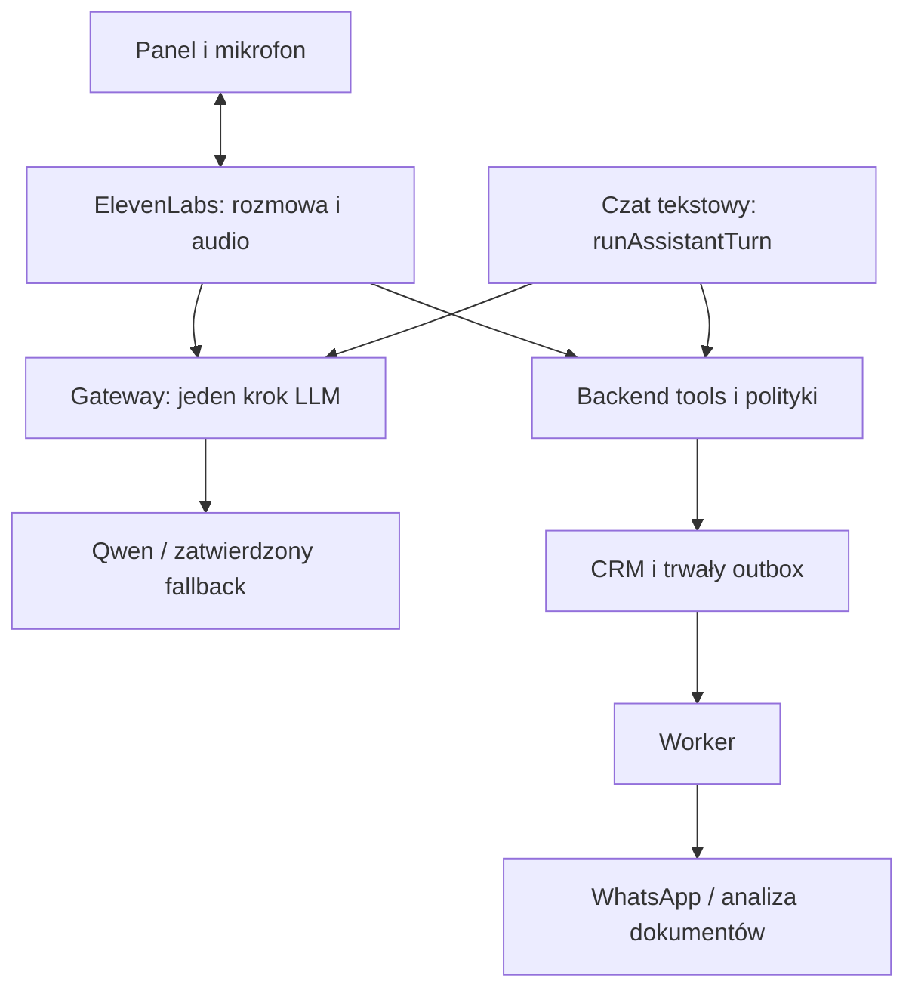
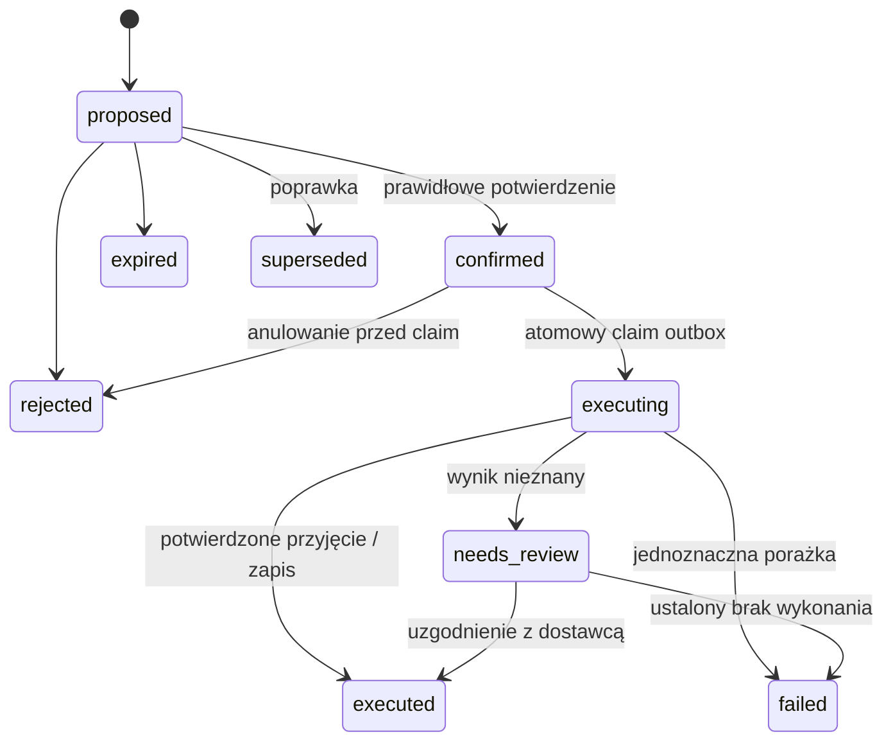

# Emma 2.0: kompletny plan wdrożenia dla modelu programistycznego

Wersja 1.0, 10 września 2026 r. Język planu: polski. Domyślny język rozmowy głosowej: rosyjski. Repozytorium: `Pawel-Rogoza/adwokat-app-project`. Przegląd wykonano na `main`, commit `43f7f9bd854d448daf84cc8f609282f09f6ffa18`.

Dokument jest instrukcją wdrożenia, a nie deklaracją, że opisane funkcje już działają. Wskazane wartości timeoutów, limitów i SLO są proponowaną konfiguracją początkową, którą trzeba zweryfikować pomiarami. Parametry dostawców należy sprawdzić ponownie na koncie używanym do wdrożenia.

## 1. Cel i rezultat końcowy

Rozbuduj istniejącą Emmę w CRM Majkuny o rozmowę głosową przez ElevenLabs Agents i model Qwen3.8-Flash, zachowując działający czat tekstowy oraz istniejące dane. Adwokat ma móc naturalnie rozmawiać po rosyjsku, słuchać planu dnia i wiadomości, wyszukiwać sprawy, dyktować odpowiedzi, poprawiać je i zlecać wysyłkę WhatsApp. Rozbuduj również obsługę zadań, kalendarza, dokumentów, terminów i projektów pism.

Przykładowy scenariusz odbioru:

1. Adwokat otwiera panel, uwierzytelnia się i uruchamia rozmowę.
2. „Эмма, что у меня сегодня и какие сообщения требуют ответа?”
3. Emma podaje najbliższe wydarzenia, zaległe zadania i krótkie podsumowanie nowych wiadomości.
4. „Открой сообщение Коваленко”. Przy kilku pasujących osobach Emma doprecyzowuje wybór.
5. „Ответь, что завтра позвоню после четырёх”. Powstaje propozycja powiązana z konkretnym odbiorcą i wątkiem.
6. Emma odczytuje adresata i dokładną treść. „Нет, после пяти” tworzy nową wersję.
7. Po jednoznacznym potwierdzeniu backend wykonuje wysyłkę i przekazuje rzeczywisty status.
8. „Проанализируй документ, который он прислал”. Analiza działa w tle; rozmowa pozostaje dostępna.
9. Wynik z odwołaniami do stron dokumentu pojawia się w CRM; Emma przedstawia krótkie podsumowanie.

Pierwszy milestone produkcyjny to voice + odczyt CRM + prawdziwa skrzynka WhatsApp + bezpieczna wysyłka po potwierdzeniu. Wszystkie dalsze etapy tego dokumentu również należą do zakresu docelowego. Nie oznaczaj całego zadania jako ukończonego po samym MVP.

## 2. Instrukcja nadrzędna dla modelu wdrażającego

1. Zacznij od bieżącego `AGENTS.md`, dokumentacji i diffu względem powyższego SHA. Nie zakładaj, że `main` nadal wygląda identycznie.
2. Prowadź pracę małymi PR-ami według sekcji 20. Każdy PR ma mieć działający przyrost, kryteria odbioru, migracje i możliwość wyłączenia nowej funkcji.
3. Wykorzystuj istniejące moduły i wzorce. Nie przepisuj CRM, autoryzacji, edytora dokumentów ani schedulera bez konkretnej przyczyny.
4. Nie utożsamiaj zgodności z OpenAI z identycznością protokołów. Obecny backend korzysta z Responses API; adapter Qwen i gateway Eleven wymagają świadomej translacji.
5. Zanim podłączysz dane kancelarii, udowodnij na syntetycznych danych przepływ sesji, uprawnień, streamingu, tool calli i anulowania.
6. Nie oznaczaj mocków jako integracji produkcyjnej. Brak dostępu do konta dostawcy oznacza osobno opisany test zewnętrzny do wykonania, a nie domyślny sukces.
7. Nie zmieniaj produkcyjnego numeru WhatsApp ani nie wysyłaj wiadomości do klientów podczas testów. Staging używa testowego numeru i jawnej listy odbiorców testowych.
8. Nie usuwaj istniejącego step-up auth. Dodaj ograniczoną delegację dla voice opisaną poniżej.
9. Nie kopiuj istniejących fallbacków i logowania błędów do nowej wysyłki bez sprawdzenia skutków. Nieznany status wysłania to osobny stan.
10. Wszystkie nowe operacje biznesowe mają przechodzić przez wspólną warstwę polityk, autoryzacji i audytu.
11. Prowadź `docs/emma/IMPLEMENTATION_STATUS.md`: wykonane PR-y, migracje, wyniki testów, konfiguracja bez sekretów, znane ograniczenia i następny konkretny krok.
12. Przed zakończeniem wykonaj dwa przeglądy: zgodności funkcjonalnej z tym planem oraz awarii, uprawnień, prywatności i kosztów. Zapisz ustalenia i naprawy.

## 3. Stan repozytorium i konsekwencje

| ObszarStan potwierdzony w kodzie lub dokumentacji repoDecyzja wdrożeniowa |                                                                                                           |                                                                                                              |
| ------------------------------------------------------------------------- | --------------------------------------------------------------------------------------------------------- | ------------------------------------------------------------------------------------------------------------ |
| Runtime                                                                   | Astro z adapterem Node standalone, React, TypeScript, `better-sqlite3`                                    | Zachować stos i pojedynczy proces web na pierwsze wdrożenie                                                  |
| Emma                                                                      | `src/lib/crm/assistant.ts`: `runAssistantTurn`, Responses API, maks. 5 rund, historia, szyfrowanie treści | Wyodrębnić provider, pojedynczy krok inferencji i narzędzia; zostawić kompatybilny interfejs tekstowy        |
| Akcje asystenta                                                           | `AssistantActionKind` obejmuje `create_task` i `create_note`; potwierdzenie wymaga recent auth            | Rozszerzyć istniejący mechanizm o wersje, stan wykonania i outbox                                            |
| Akcje spraw                                                               | Oddzielne `actions.ts`, `actionDb.ts`, `assistantActions.ts`, `case_actions`                              | Nie tworzyć trzeciego systemu zadań. Ustalić mapowanie legacy tasks do case\_actions                         |
| WhatsApp                                                                  | `src/lib/whatsapp.ts` wysyła powiadomienia o leadach na `WHATSAPP_NOTIFY_TO`                              | To nie jest pełna skrzynka klientowska. Potrzebne webhooki, wątki, wiadomości, statusy i przypisanie klienta |
| Szkice odpowiedzi                                                         | `assistantDrafts.ts` buduje odpowiedzi z lokalnych szablonów                                              | Zachować użyteczne szablony, dodać trwałe wersjonowane propozycje i edycję przez LLM                         |
| PDF                                                                       | `assistantPdf.ts` generuje PDF z tekstu                                                                   | Generowanie PDF nie oznacza gotowego OCR, parsowania wejściowego ani RAG                                     |
| Baza                                                                      | WAL, `foreign_keys=ON`, `busy_timeout=5000`; migracje przy otwarciu bazy                                  | Krótkie transakcje; worker nie może przypadkowo uruchamiać konkurencyjnych migracji                          |
| Scheduler                                                                 | Uruchamiany w middleware przy pierwszym SSR; dokumentacja zakłada jeden proces                            | Wydzielić odpowiedzialność za joby i zapewnić pojedynczego właściciela przed skalowaniem                     |
| Hosting                                                                   | Publiczna strona i CRM w jednym procesie; nginx i host guard ograniczają trasy CRM                        | Nowe webhooki umieścić pod dozwolonym prefiksem i przetestować oba hosty                                     |
| Deploy                                                                    | Build w GitHub Actions, aktywacja release na VPS                                                          | Zachować build poza VPS; dołożyć worker do artefaktu i procedury aktywacji                                   |
| Node                                                                      | CI używa 24; deploy domyślnie 22                                                                          | Ujednolicić z faktycznym runtime VPS, uwzględnić ABI `better-sqlite3`                                        |

Konkretne zadania wynikające z przeglądu:

- `resolveAssistantAction` odczytuje stan przed transakcją, a końcowy UPDATE nie zawiera warunku oczekiwanego statusu. Obecna synchroniczna obsługa w jednym procesie ogranicza wyścigi, ale nie jest wystarczającą gwarancją po dodaniu workera. Wprowadź atomowe przejścia stanu i idempotencję.
- W tej samej funkcji `else` oznacza obecnie „utwórz notatkę”. Po dodaniu nowych rodzajów akcji musi powstać wyczerpujący `switch`; nieznany rodzaj ma zostać odrzucony.
- `runAssistantTurn` raportuje tokeny ostatniej odpowiedzi, nie sumę wszystkich rund. Zliczaj wszystkie wywołania, retry i fallbacki.
- `getAssistantConversation` pobiera do 200 wiadomości rosnąco, a potem wybierana jest końcówka tej listy. Długie rozmowy mogą utracić najnowszy kontekst. Oddziel paginację UI od pobierania ostatnich wiadomości dla modelu.
- `assistantDeadlines.ts` używa UTC do wyznaczania dzisiejszej daty i odwraca argumenty różnicy dat w ścieżce zaległych terminów. Ujednolić znak `daysLeft`, datę lokalną i znaczenie statusów; dodać testy granic dnia i DST.
- `getCaseTimeline` i monitor terminów wykonują dodatkowe zapytania dla kolejnych rekordów. Zastąpić je JOIN-ami lub pobieraniem zbiorczym w miejscach używanych przez voice.
- Obecne powiadomienia WhatsApp zwracają boolean, nie zapisują `wamid`, nie mają jawnego timeoutu i logują fragment surowego błędu. Nowa wysyłka klientowska wymaga struktury wyniku, timeoutu i redakcji logów.
- Deploy na `push main` nie pokazuje zależności od ukończenia joba CI dla tego samego SHA. Wprowadź jednoznaczną bramkę jakości przed aktywacją artefaktu.
- Workflow dopuszcza TOFU przez `ssh-keyscan` i domyślnego użytkownika root. Produkcja ma wymagać zweryfikowanego `known_hosts` i jawnego konta deploy.
- Nie nadawaj sudo do skryptu aktywacji, którego treść użytkownik deploy może dowolnie podmienić. Uprzywilejowany helper musi być własnością root, nieedytowalny dla deploy, z wąską walidacją argumentów.

Źródła repo: [assistant.ts](https://github.com/Pawel-Rogoza/adwokat-app-project/blob/43f7f9bd854d448daf84cc8f609282f09f6ffa18/src/lib/crm/assistant.ts), [WhatsApp](https://github.com/Pawel-Rogoza/adwokat-app-project/blob/43f7f9bd854d448daf84cc8f609282f09f6ffa18/src/lib/whatsapp.ts), [terminy](https://github.com/Pawel-Rogoza/adwokat-app-project/blob/43f7f9bd854d448daf84cc8f609282f09f6ffa18/src/lib/crm/assistantDeadlines.ts), [deploy](https://github.com/Pawel-Rogoza/adwokat-app-project/blob/43f7f9bd854d448daf84cc8f609282f09f6ffa18/.github/workflows/deploy.yml), [CI](https://github.com/Pawel-Rogoza/adwokat-app-project/blob/43f7f9bd854d448daf84cc8f609282f09f6ffa18/.github/workflows/ci.yml), [dokumentacja hostingu](https://github.com/Pawel-Rogoza/adwokat-app-project/blob/43f7f9bd854d448daf84cc8f609282f09f6ffa18/docs/DEPLOYMENT.md).

## 4. Decyzje architektoniczne

### 4.1. Jeden właściciel pętli narzędzi w każdym kanale

Wybór bazowy dla voice: ElevenLabs prowadzi turę rozmowy i protokół wywołania narzędzi; gateway Emmy wykonuje pojedynczy krok LLM. ElevenLabs kieruje narzędzia do autoryzowanych endpointów backendu. Backend zachowuje pełną kontrolę nad uprawnieniami i skutkami biznesowymi.

Nie wywołuj całego `runAssistantTurn()` wewnątrz gatewaya, jednocześnie zwracając te same narzędzia ElevenLabs. Powstałyby dwie konkurencyjne pętle. Czat tekstowy nadal może używać własnej pętli, ale współdzieli provider, registry, polityki i executor.



Strzałka tekstowego czatu do gatewaya oznacza współdzielenie funkcji wewnętrznej, nie HTTP do własnego publicznego endpointu.

ElevenLabs dokumentuje custom endpoint Chat Completions lub Responses z SSE. W MVP implementuj tylko kontrakt Chat Completions potrzebny tej integracji: fragmenty `data: {json}` i zakończenie `[DONE]`. Narzędzia voice wracają jako `tool_calls`, a wykonuje je webhook backendu. Nie kopiuj demonstracyjnego serwera dostawcy jako gotowego zabezpieczenia produkcyjnego. [Custom LLM](https://elevenlabs.io/docs/eleven-agents/customization/llm/custom-llm).

### 4.2. Rozdzielenie odpowiedzialności

| ElementOdpowiada zaNie jest źródłem prawdy dla |                                                                           |                                                     |
| ---------------------------------------------- | ------------------------------------------------------------------------- | --------------------------------------------------- |
| ElevenLabs                                     | Audio, rozpoznawanie wypowiedzi, turn-taking, TTS, przerwania             | Uprawnień użytkownika, potwierdzenia skutku wysyłki |
| Gateway                                        | Normalizacja protokołu, model, budżet, streaming, zapis obserwowanych tur | Dowolnego SQL, wyboru odbiorcy bez sprawdzenia      |
| Tool service                                   | Autoryzacja zasobu, walidacja, wersje kontekstu, propozycje               | Samodzielnego decydowania o zgodzie użytkownika     |
| Action engine                                  | Potwierdzenie związane z konkretną wersją, outbox, stan wykonania         | Doręczenia wiadomości bez statusu dostawcy          |
| Worker                                         | Wysyłka, OCR, indeksowanie, długie analizy, retry zgodne z polityką       | Ponownego uzyskiwania zgody przez LLM               |
| SQLite                                         | Trwały stan i dziennik operacji                                           | Gwarancji exactly-once po stronie zewnętrznego API  |

ElevenLabs otrzyma audio oraz treści niezbędne do prowadzenia rozmowy. Własny gateway nie usuwa tego przepływu danych. Polityki retencji muszą obejmować wszystkich rzeczywistych procesorów danych.

### 4.3. Infrastruktura początkowa

- Pozostaw nginx + jeden proces web Node + lokalny SQLite na trwałym dysku.
- Dodaj jeden osobny proces worker zarządzany przez systemd. OCR uruchamiaj dodatkowo w ograniczonym procesie lub kontenerze.
- Nie dodawaj Kubernetes, osobnego vector DB ani klastra Redis na starcie. Redis już występuje w zależnościach; przed użyciem sprawdź rzeczywistą konfigurację. Nie traktuj cache jako źródła stanu wysyłki.
- Kolejka w SQLite wystarczy do pilota pod warunkiem lease, atomowego claim i limitu pracy. Migrację do PostgreSQL uzasadnia dopiero potrzeba wielu hostów, HA lub zmierzona kontencja zapisów.
- Worker nie importuje middleware i nie uruchamia webowego schedulera. Migracje wykonuje jeden jawny krok release, zanim web i worker zaczną obsługiwać nowy schemat.
- Podczas wydzielania schedulera ustal właściciela osobno dla każdej istniejącej kolejki: przypomnienia, lead analysis, retencja i pozostałe integracje. Web i worker nie mogą wykonywać tej samej pracy jednocześnie. Przełączenie roli ma zatrzymać stare timery, a wygaśnięty lease joba bez zewnętrznego skutku można odzyskać z fencing tokenem. Dla zewnętrznego skutku stosuj reguły outboxa, nie zwykłą redelivery.
- Nie uruchamiaj kilku replik web na tym samym pliku DB przez NFS. WAL wymaga współdzielenia mechanizmów pamięci i zakłada procesy na tym samym hoście. [SQLite WAL](https://sqlite.org/wal.html).

## 5. Model Qwen, adaptery i profile pracy

Oficjalna dokumentacja QwenCloud wskazuje `qwen3.8-flash`, function calling, structured output, tekst, obrazy i wideo. Dla rozmowy ustaw jawnie `enable_thinking=false`. Samo opisowe `thinking=off` nie jest kontraktem API. Dokumentacja pokazuje endpoint `https://dashscope-intl.aliyuncs.com/compatible-mode/v1`; wybór regionu i dostępność na konkretnym koncie wymagają testu. Nie utożsamiaj tego adresu z gwarancją przetwarzania w UE. [Model i parametry](https://docs.qwencloud.com/developer-guides/getting-started/latest-model).

Interfejs aplikacji powinien rozdzielać pojedynczą inferencję, streaming i zadanie strukturalne:

```ts
interface AssistantProvider {
  capabilities: ProviderCapabilities;
  streamStep(request: ModelStepRequest, signal: AbortSignal): AsyncIterable<ModelEvent>;
  generateStructured(request: StructuredRequest, signal: AbortSignal): Promise<StructuredResult>;
}

type ModelEvent =
  | { type: 'text_delta'; text: string }
  | { type: 'tool_call_delta'; index: number; id?: string; name?: string; arguments?: string }
  | { type: 'usage'; usage: NormalizedUsage }
  | { type: 'completed'; reason: string };

```

To pseudokontrakt wewnętrzny. Typy SDK i nazwy pól zewnętrznych dopasuj do wersji z lockfile. Adapter ma walidować możliwości, a nie ignorować nieobsługiwane parametry.

| ProfilUstawienia początkoweSposób wykonania |                                                                                     |                                           |
| ------------------------------------------- | ----------------------------------------------------------------------------------- | ----------------------------------------- |
| `voice_conversation`                        | thinking wyłączone; do 400 tokenów wypowiedzi; budżet kontekstu ok. 8 tys. tokenów  | Streaming; krótkie odpowiedzi i narzędzia |
| `text_conversation`                         | Limit zgodny z UX; rozsądny budżet historii                                         | Istniejący czat, stopniowo streaming      |
| `triage`                                    | Structured output, mały kontekst                                                    | Worker; podsumowania nowych wiadomości    |
| `legal_analysis`                            | Thinking włączone, początkowo `reasoning_effort=medium`; jawny limit kosztu i czasu | Worker; źródła i wersja dokumentów        |
| `document_draft`                            | Thinking i większy budżet zależnie od zadania                                       | Worker; struktura dokumentu i rewizje     |

Dodatkowe reguły:

- Zachowaj OpenAI jako fallback tylko dla zatwierdzonych klas danych i przetestowanych możliwości. Nie przekierowuj automatycznie poufnych dokumentów do kolejnego dostawcy bez odpowiedniej konfiguracji przetwarzania.
- Nie wysyłaj do TTS wewnętrznego reasoning ani argumentów narzędzi. Jeśli provider wymaga zachowania reasoning dla kolejnego kroku, obsłuż je prywatnie w adapterze i zminimalizuj retencję.
- Dla każdego providera wykonaj test: RU, streaming, Unicode, structured output, rozbite na fragmenty arguments, tool-result round trip, abort, usage, 429 i błąd połowy streamu.
- Jeden klient HTTP na provider/konfigurację w procesie, z pulą połączeń. Nie twórz go od nowa w każdej turze.
- Fallback tylko przed pierwszym ujawnionym fragmentem odpowiedzi lub tool calla. Po częściowej wypowiedzi zakończ turę kontrolowanym błędem. Nie sklejaj dwóch odpowiedzi różnych modeli.
- SDK retry i retry aplikacji nie mogą się mnożyć. Dla voice domyślnie wyłącz automatyczne retry SDK i stosuj jeden jawny budżet.
- Nie używaj maksymalnego kontekstu modelu jako domyślnego rozmiaru wejścia. Retrieval ma pobierać potrzebne dane, a nie całe archiwum kancelarii.

## 6. ElevenLabs: spike integracyjny przed podłączeniem CRM

Utwórz konfigurację `Emma Voice DEV`: RU, wybrany głos, przerwania aktywne, naturalne kończenie tur. Scribe i Flash v2.5 traktuj jako preferencję z wcześniejszych ustaleń, ale faktyczne pola/model IDs i możliwość wyboru STT potwierdź w bieżącym Agents API. Nie buduj osobnego STT i TTS obok Agents bez powodu.

Spike musi wykazać:

1. Uwierzytelniony start rozmowy przez SDK, prawidłowy transport i otrzymanie identyfikatora rozmowy.
2. Otrzymanie strumienia SSE przez ElevenLabs bez buforowania przez nginx i middleware.
3. Poprawną wymianę pojedynczego tool calla, wyniku i odpowiedzi.
4. Przeniesienie niepodrabialnego kontekstu sesji do gatewaya oraz każdego webhooka narzędzia.
5. Powiązanie identyfikatora ElevenLabs z lokalną sesją bez wyścigu pierwszego requestu.
6. Rozpoznanie nowej tury po przerwaniu i odrzucenie spóźnionych wyników poprzedniej tury.
7. Callbacki/zdarzenia umożliwiające rozróżnienie tekstu wygenerowanego od wypowiedzianego; opis granic dostępnego pomiaru.

Najważniejsza bramka: nie zakładaj, że samo zwrócenie `session_token` do przeglądarki sprawi, że ElevenLabs dołączy go do Custom LLM. Sprawdź obsługiwany mechanizm nagłówków/parametrów i zapisz zredagowany przykład rzeczywistego requestu. Dynamic variables z `secret__` są dokumentowane jako przeznaczone do nagłówków i niewysyłane do LLM w prompcie, lecz to nie dowodzi dowolnego miejsca ich interpolacji. [Dynamic variables](https://elevenlabs.io/docs/eleven-agents/customization/personalization/dynamic-variables).

Jeżeli provider nie umożliwia bezpiecznego powiązania sesji w wybranym wariancie, nie opieraj autoryzacji na polu `user_id` wygenerowanym przez model. Zatrzymaj rozszerzanie tego wariantu o CRM, opisz wynik spike i wybierz udokumentowany transport/metodę powiązania. Alternatywą jest backend jako jedyny właściciel pętli, ale wymaga osobnego ADR i wyłączenia wykonywania tych samych narzędzi przez ElevenLabs.

Dla WebRTC pobieraj poświadczenie właściwe temu transportowi; dla WebSocket signed URL. Nie mieszaj `conversationToken` z `signedUrl`. SDK i uwierzytelnienie opisują te mechanizmy oddzielnie. [SDK](https://elevenlabs.io/docs/eleven-agents/libraries/java-script), [uwierzytelnienie](https://elevenlabs.io/docs/eleven-agents/customization/authentication).

## 7. Sesje, uprawnienia i kontrakty endpointów

### 7.1. Sesja głosowa

`POST /api/crm/assistant/voice/session`:

- Wymaga sesji CRM, kontroli Origin i limitu per user; dodatkowo recent auth, jeśli użytkownik chce aktywować możliwość zatwierdzania zapisów głosem.
- Tworzy prywatną rozmowę voice domyślnie. Nie kopiuj bezrefleksyjnie obecnego domyślnego scope `team`.
- Backend wyznacza `user_id`, role, zakres dostępu i grant. `client_id` z UI jest tylko kandydatem do sprawdzenia.
- Pobiera od ElevenLabs poświadczenie startowe; odpowiedź ma `Cache-Control: no-store`.
- Aplikacyjny token ma audiencję, losowy identyfikator, termin ważności, powiązanie z sesją CRM i możliwość odwołania. Przechowuj hash tokenu, nie token w plaintext.
- Token w przeglądarce wyłącznie w pamięci. Nigdy localStorage, query string, log ani prompt.
- Jeden aktywny voice per user w MVP; druga karta otrzymuje czytelny konflikt i możliwość świadomego zakończenia poprzedniej sesji.

Początkowo: poświadczenie startu aplikacji 60 s; idle timeout 5 min; maksymalna rozmowa 30 min. To limity Emmy, niezależne od TTL poświadczeń ElevenLabs. Read-only może działać dalej tylko według jawnej polityki. Koniec sesji, wylogowanie lub odwołanie sesji CRM odbiera dostęp do narzędzi.

### 7.2. Ograniczona delegacja potwierdzeń głosowych

Przed rozpoczęciem podróży użytkownik aktywuje tryb rozmowy z recent auth. Backend tworzy `voice_write_grant` związany z użytkownikiem, konkretną sesją, dozwolonymi rodzajami operacji i terminem ważności, początkowo 15 min. Nie odświeżaj go automatycznie przez mówienie do mikrofonu.

Grant pozwala zatwierdzać wybrane czynności głosem bez ponownego Face ID przy każdej wiadomości. Głos nie uwierzytelnia tożsamości. Po wygaśnięciu Emma może dalej przygotowywać szkice, ale wykonanie wymaga ponownego uwierzytelnienia w dogodnym momencie. Istniejące endpointy wrażliwe nadal wymagają dotychczasowych zabezpieczeń.

### 7.3. API do zbudowania lub rozszerzenia

| EndpointWywołujący i autoryzacjaOdpowiedzialność  |                                                                |                                                 |
| ------------------------------------------------- | -------------------------------------------------------------- | ----------------------------------------------- |
| `POST /api/crm/assistant/voice/session`           | UI, cookie CRM, Origin, opcjonalny step-up                     | Start i grant                                   |
| `POST /api/crm/assistant/voice/end`               | UI, cookie, własna sesja                                       | Idempotentne zamknięcie i revocation            |
| `POST /api/crm/assistant/voice/llm`               | ElevenLabs, credential usługi + zweryfikowane powiązanie sesji | Jeden krok Chat Completions SSE                 |
| `POST /api/crm/assistant/voice/tools/[tool]`      | ElevenLabs, credential usługi + grant sesji                    | Tylko narzędzia z allowlisty                    |
| `POST /api/crm/assistant/actions/[id]`            | UI lub wewnętrzny service korzystający z poprawnego grant      | Wspólne rozstrzygnięcie wersji propozycji       |
| `GET /api/crm/assistant/actions/[id]`             | UI, auth zasobu                                                | Aktualny stan akcji                             |
| `GET /api/crm/assistant/voice/events`             | UI, cookie, własna sesja                                       | UI statusy, zmiany propozycji i jobów przez SSE |
| `GET/POST /api/crm/integrations/whatsapp/webhook` | Meta: challenge GET; podpis surowego body POST                 | Odbiór i trwałe zapisanie eventów               |
| `POST /api/crm/integrations/elevenlabs/webhook`   | Podpis dostawcy i ochrona replay zgodna z API                  | Zakończenie rozmowy i uzgodnienie metadanych    |
| `GET /api/crm/whatsapp/threads`                   | CRM auth i zakres zasobów                                      | Paginowana skrzynka                             |
| `GET /api/crm/whatsapp/threads/[id]`              | CRM auth i zakres zasobów                                      | Paginowane wiadomości                           |
| `POST /api/crm/assistant/jobs`                    | CRM auth, walidacja źródeł i budżetu                           | Utworzenie długiej analizy                      |
| `GET /api/crm/assistant/jobs/[id]`                | CRM auth i właściciel/ACL sprawy                               | Status i wynik                                  |
| `POST /api/crm/assistant/jobs/[id]/cancel`        | CRM auth i uprawnienie do zadania                              | Anulowanie z kontrolą etapu                     |

Nazwy są projektowane. Dopasuj istniejący routing, ale zachowaj podział odpowiedzialności. Nie przepuszczaj webhooków przez cookie auth/CSRF przeznaczone dla przeglądarki; nie usuwaj tych zabezpieczeń globalnie. Odrębny credential usługi nie zastępuje sprawdzenia zakresu użytkownika.

SSE gatewaya nie opakowuj w `jsonOk`. Odmowy autoryzacji przed streamem zwracają prawidłowe HTTP 401/403. Po rozpoczęciu streamu stosuj przetestowany kontrakt błędu i zamknięcia. Pozostałe endpointy używają dotychczasowego formatu CRM i stabilnych kodów, np. `ambiguous_recipient`, `proposal_stale`, `grant_expired`, `window_closed`, `execution_unknown`, `provider_unavailable`.

## 8. Kontekst i wspólne narzędzia

Stan kontekstu: `active_client_id`, `active_case_id`, `active_thread_id`, `context_version`, `selected_at`, `selected_by_turn_id`. Zmiana klienta unieważnia niepasującą sprawę, wątek i propozycję. Zmiana aktywnej sprawy w UI podczas rozmowy wymaga zsynchronizowania wersji, a nie cichego przełączenia adresata.

Nie zakładaj, że klient ma tylko jedną sprawę. Rozpoznanie osoby nie oznacza automatycznego wyboru sprawy. Nazwiska z cyrylicą, odmianą i transliteracją służą wyszukiwaniu kandydatów; wysyłka używa potwierdzonego `client_id` i zweryfikowanego powiązania kanału.

| NarzędzieWynik i istotna reguła                          |                                                                                     |
| -------------------------------------------------------- | ----------------------------------------------------------------------------------- |
| `get_today_overview`                                     | Zbiorcze zapytanie: plan, zadania, nieprzeczytane; `as_of` i informacja o świeżości |
| `search_clients`                                         | Maks. 5 kandydatów, minimalne dane do rozróżnienia                                  |
| `select_context`                                         | Walidacja relacji klient/sprawa/wątek i aktualizacja wersji                         |
| `get_client`, `search_cases`, `get_case`                 | ACL przed pobraniem szczegółów; limit pól i liczby rekordów                         |
| `list_agenda`, `list_tasks`                              | Europe/Warsaw, data-only oddzielona od timestamp                                    |
| `get_whatsapp_messages`, `get_whatsapp_thread`           | Dane lokalnej skrzynki, zakres synchronizacji, paginacja                            |
| `prepare_whatsapp`                                       | Zamrożony odbiorca, dokładny tekst, język, wersja wątku, propozycja                 |
| `revise_action`, `reject_action`                         | Nowa wersja albo odrzucenie; stara zgoda nie przechodzi dalej                       |
| `confirm_action`                                         | Tylko żądanie weryfikacji przez backend; model nie może dostarczyć sobie zgody      |
| `get_action_status`                                      | Stan z bazy; nie ponawia wysyłki                                                    |
| `propose_task`, `propose_note`, `propose_calendar_event` | Ten sam action engine                                                               |
| `analyze_legal_document`, `draft_legal_document`         | `job_id`, źródła, wersja danych; rezultat asynchroniczny                            |
| `get_job_status`                                         | Krótki status lub streszczenie; pełny wynik otwierany w CRM                         |

Registry zawiera schemat, klasę ryzyka, uprawnienia, timeout i limit rozmiaru wyniku. Nie wystawiaj arbitralnego `fetch_url`, shell, SQL ani dowolnych narzędzi z requestu ElevenLabs. Gateway porównuje otrzymane nazwy i schematy z własną dozwoloną konfiguracją.

Najpierw grupuj dane w narzędziu zbiorczym, dopiero później dodawaj równoległość. Niezależne odczyty mogą działać równolegle z limitem np. 3; zależne wybory kontekstu i wszystkie mutacje muszą być szeregowane. Limit rund i wywołań obowiązuje na poziomie całej tury voice, mimo że gateway obsługuje pojedyncze kroki.

## 9. Action engine: zgoda, wykonanie, idempotencja

### 9.1. Macierz ryzyka

| OperacjaZasada                                                          |                                                                              |
| ----------------------------------------------------------------------- | ---------------------------------------------------------------------------- |
| Odczyt dozwolonych danych                                               | Automatycznie po autoryzacji                                                 |
| Stworzenie szkicu lub joba analizy                                      | Na polecenie; limit kosztu; bez komunikacji z klientem                       |
| Zadanie, notatka, zwykłe wydarzenie                                     | Propozycja i potwierdzenie w aktywnym grant lub UI                           |
| Krótka wiadomość organizacyjna WhatsApp                                 | Dokładna treść i adresat, potem jednoznaczne potwierdzenie                   |
| Wysyłka załącznika, masowa wysyłka, wrażliwe ustalenia prawne/finansowe | Przegląd i zatwierdzenie w UI                                                |
| Zatwierdzenie wyliczonego terminu procesowego                           | UI ze źródłem, założeniami i datą doręczenia                                 |
| Usunięcie danych, zmiana uprawnień, wysłanie pisma do sądu              | Poza narzędziami wykonawczymi voice; dotychczasowy zabezpieczony workflow UI |

To doprecyzowanie wcześniejszej idei „wszystkie zapisy po głosowym tak”. Dodanie przypomnienia głosem jest czym innym niż zatwierdzenie terminu wyliczonego z prawa. Prompt nie jest jedynym mechanizmem klasyfikacji ryzyka; niepewna kwalifikacja kieruje do UI.

### 9.2. Wersjonowana propozycja

Propozycja zawiera: rodzaj, autora, rozmowę/sesję, wersję, kanoniczny payload, HMAC payloadu, odbiorcę i kanał, referencję źródłowej wiadomości, wersję kontekstu, czas wygaśnięcia, politykę i wymagany poziom potwierdzenia. Treść szyfruj istniejącym mechanizmem.

`confirmed` oznacza zgodę, nie wykonanie. Stany wykonania:



`superseded` tworzy następną propozycję lub rewizję. Nie zmieniaj zatwierdzonego payloadu w miejscu. Dla WhatsApp `executed` oznacza przyjęcie przez API; doręczenie i odczyt mają osobne pola.

### 9.3. Potwierdzenie głosowe

1. Backend tworzy niezmienny tekst do odczytania wraz z adresatem. TTS może normalizować wymowę, ale nie zmieniać treści wiadomości. Nie pozwalaj modelowi parafrazować zatwierdzanego tekstu.
2. Zapisz `presentation_id`, wersję propozycji i turę, w której przedstawiono propozycję.
3. Przyjmij jedynie finalną wypowiedź użytkownika z uwierzytelnionego kanału sesji, zaobserwowaną przez gateway/transport. Pole `confirmation_text` dostarczone jako argument przez LLM nie jest dowodem zgody.
4. Jedna sesja ma najwyżej jedną aktywną propozycję oczekującą na potwierdzenie. Zgoda wskazuje dokładny `action_id`, wersję i prezentację.
5. MVP preferuje „Отправь сообщение Ивану” / „Wyślij tę wiadomość”. Samo „да” dopuszczaj dopiero po potwierdzeniu w spike wiarygodnego powiązania z ostatnią pełną prezentacją, bez przerwania i zmiany tematu.
6. „Да, но после пяти”, „не отправляй”, cytat wiadomości klienta zawierający „да” oraz niepewna transkrypcja nie potwierdzają wysyłki. Korekta tworzy nową wersję.
7. Przerwanie odczytu propozycji, reconnect, nowy temat, zmiana adresata lub wątku unieważniają uzbrojenie potwierdzenia. Można zachować szkic i przedstawić go ponownie.
8. Przed potwierdzeniem sprawdź uprawnienia, grant, TTL, wersję wątku i kontekstu. Po nowej wiadomości klienta oznacz szkic jako wymagający ponownego przeglądu.

Zdarzenie zakończenia odtwarzania jest wskazówką techniczną, nie dowodem, że człowiek usłyszał treść. Testuj także echo głośnika i dźwięk radia. Nie deklaruj voice biometrics jako zabezpieczenia.

### 9.4. Trwały outbox

Potwierdzenie i utworzenie outbox zapisz w jednej krótkiej transakcji. Użyj unikalności `outbox.action_id`. Dwa requesty, np. kliknięcie i komenda głosowa, mogą wygrać tylko raz.

Worker atomowo przejmuje wpis przez warunkowy UPDATE oczekiwanego stanu i zapisuje próbę, token claim oraz czas. Kończy transakcję przed HTTP. Dopiero potem wywołuje dostawcę. Wynik zapisuje pod warunkiem zgodności tokenu claim. Dane do wysyłki pochodzą z zamrożonej propozycji, nie z nowej generacji modelu.

Bezpośrednio przed przejściem do `dispatching` ponownie sprawdź flagę wysyłki, aktywność użytkownika, ACL, brak odwołania/wygaśnięcia grant, niezmienność odbiorcy i wersję wątku. W MVP zgoda głosowa nie może czekać na wysyłkę po wygaśnięciu grant: wróć do przeglądu bez komunikacji z klientem. Kontrolę i zapis fazy wykonaj w krótkiej transakcji. Odwołanie uprawnień po rozpoczęciu zewnętrznego requestu nie daje gwarancji cofnięcia jego skutku; pokaż tę granicę w runbooku.

Rozróżnij fazy: `queued`, `claimed`, `dispatching`, `accepted`, `unknown`. Utrata workera w `dispatching` wymaga uzgodnienia, nie automatycznej redelivery. Sam lease nie zabezpiecza zewnętrznej wysyłki przed spóźnionym workerem.

Jeżeli API mogło przyjąć wiadomość, a odpowiedź zaginęła, ustaw `needs_review`. Bez udokumentowanego klucza idempotencji po stronie dostawcy nie da się uczciwie zagwarantować end-to-end exactly-once. Lokalny UUID nie zmienia tej własności. Nigdy nie przedstawiaj celu „0 duplikatów” jako matematycznej gwarancji zewnętrznego API.

Anulowanie po `dispatching` nie oznacza cofnięcia wiadomości. UI informuje o aktualnym etapie. Reconnect klienta pobiera istniejący status, nie wywołuje ponownie wysyłki.

## 10. WhatsApp jako pełny kanał CRM

### 10.1. Przygotowanie konta

Sprawdź WABA, firmowy numer, uprawnienia tokenu systemowego, subskrypcję webhooków i dostępne szablony. Zachowaj obecne powiadomienia o leadach jako odrębny use case.

Nie zakładaj dostępu do całej historii prywatnego WhatsApp adwokata ani do dowolnych grup. Integracja obejmuje wiadomości faktycznie udostępniane dla podłączonego numeru biznesowego. Jeśli potrzebna jest koegzystencja Business App i Cloud API, sprawdź aktualną kwalifikowalność, zakres synchronizacji oraz ograniczenia przed zmianą numeru. Bez potwierdzonego importu pokazuj w UI datę początku dostępnej historii.

### 10.2. Inbound

1. Dla GET sprawdź verify token i zwróć challenge zgodnie z kontraktem Meta.
2. Dla POST sprawdź podpis HMAC raw body zgodnie z bieżącą dokumentacją, zwykle `X-Hub-Signature-256`. Parsuj JSON dopiero po weryfikacji; ogranicz rozmiar body.
3. Zweryfikuj identyfikator aplikacji/zasobu i dozwolony `phone_number_id`. Podpis webhooka nie oznacza, że treść klienta jest zaufaną instrukcją.
4. Zapisz zdarzenia do trwałego inboxa i potwierdź HTTP 200 po udanym zapisie. Nie czekaj na LLM ani pobieranie mediów. Awaria DB przed zapisem powinna skutkować odpowiedzią umożliwiającą retry dostawcy.
5. Deduplikuj wiadomości po numerze biznesowym i `wamid`; webhook może zawierać wiele elementów. Statusy zapisuj oddzielnie od wiadomości.
6. Worker normalizuje wątki, ustala dopasowanie klienta, pobiera media i generuje ograniczone podsumowania.
7. Nowy numer bez pewnego przypisania tworzy nieprzypisany kontakt/wątek. Nie łącz go automatycznie z podobnym nazwiskiem.

Obsłuż ponowienia, zdarzenia poza kolejnością, status przed lokalnym zapisem odpowiedzi z wysyłki, nieznany typ, edycję/usunięcie tam, gdzie API je udostępnia. Zachowaj event log pozwalający odtworzyć wynik bez kolejnej komunikacji z klientem.

### 10.3. Outbound i okno odpowiedzi

Odpowiedź swobodnym tekstem jest dozwolona w oknie 24 h od ostatniej wiadomości użytkownika; poza nim wymagany jest zatwierdzony szablon. Zgoda na kontakt i rezygnacja z niego również muszą być respektowane. Sprawdź te warunki ponownie przy wykonaniu, bo okno może zamknąć się między dyktowaniem a wysyłką. [WhatsApp Business Messaging Policy](https://whatsappbusiness.com/policy/).

- `last_customer_message_at` licz z czasu wiadomości dostawcy, nie z czasu retry webhooka ani odczytu przez adwokata.
- Przy braku okna przygotuj do zatwierdzenia właściwy szablon z parametrami albo pozostaw szkic. Nie zastępuj swobodnego tekstu innym komunikatem bez nowej akceptacji.
- Nie umieszczaj dowolnej odpowiedzi prawnej w parametrach szablonu w celu obchodzenia ograniczeń.
- Zapisuj `provider_message_id`, odpowiedź API, kod błędu w zredagowanej postaci i późniejsze statusy.
- Pokazuj „Oczekuje”, „Przyjęta przez WhatsApp”, „Doręczona”, „Odczytana”, „Błąd” lub „Niepewny wynik”. Nie cofaj `read` do `sent` przez spóźniony webhook.
- „Przeczytane w CRM”, „odczytane na głos”, „oznaczone jako przeczytane u dostawcy” i „wymaga odpowiedzi” to osobne pojęcia. Samo podsumowanie przez Emmę nie zamyka sprawy.

Techniczne endpointy Meta nie były dostępne podczas przygotowania tego planu. Szczegóły podpisów, wersji Graph API, media API, callback correlation i koegzystencji są obowiązkową bramką testu kontraktowego przed implementacją produkcyjną; nie są tutaj deklarowane jako zweryfikowane na koncie użytkownika.

## 11. Model danych i migracje

Poniższe encje są projektem zmian. Najpierw porównaj istniejące tabele i dopiero wtedy wybierz nazwy i kolejne numery migracji. Przy przeglądanym SHA ostatnia migracja to `038_document_templates.sql`; nie rezerwuj sztywno kolejnych numerów w długotrwałej pracy.

| EncjaMinimalne pola / ograniczenia |                                                                                                                                                                                     |
| ---------------------------------- | ----------------------------------------------------------------------------------------------------------------------------------------------------------------------------------- |
| `voice_sessions`                   | UUID, user\_id, crm\_session\_id, assistant\_conversation\_id, provider\_conversation\_id UNIQUE jeśli obecny, stan, timestamps, context\_version, wersja konfiguracji, token\_hash |
| `voice_write_grants`               | sesja, użytkownik, allowed\_actions, auth\_at, expires\_at, revoked\_at                                                                                                             |
| `assistant_turns`                  | session\_id, turn\_id, revision, status, input\_source, czasy, dedup key UNIQUE; final/cancelled oddzielnie                                                                         |
| `assistant_actions` rozszerzenie   | kind, version, encrypted payload, payload\_hmac, actor, session, source\_turn, context\_version, expires\_at, policy\_version, confirmation metadata, execution state               |
| `assistant_action_presentations`   | action\_id/version, session, turn, presentation\_id, interrupted\_at, presented\_at, consumed\_at                                                                                   |
| `assistant_outbox`                 | action\_id UNIQUE, stan, claim\_token, próba, next\_attempt\_at, dispatch\_at, provider\_message\_id, error\_class                                                                  |
| `assistant_action_attempts`        | action\_id, attempt\_no UNIQUE w obrębie akcji, request correlation, transport\_phase, wynik                                                                                        |
| `whatsapp_threads`                 | phone\_number\_id + wa\_id UNIQUE, client\_id opcjonalny, przypisanie/ACL, last\_customer\_message\_at, thread\_version, sync\_started\_at                                          |
| `whatsapp_messages`                | phone\_number\_id + wamid UNIQUE, thread\_id, direction, body szyfrowane, media reference, provider timestamp, received\_at                                                         |
| `whatsapp_status_events`           | wamid, typ, timestamp, dedup fingerprint; surowy minimalny event szyfrowany                                                                                                         |
| `whatsapp_thread_reads`            | user\_id + thread\_id UNIQUE, lokalny kursor odczytu                                                                                                                                |
| `integration_inbox`                | provider, event dedup key, encrypted payload, received\_at, processed\_at, attempts                                                                                                 |
| `assistant_jobs`                   | kind, owner, case/source IDs i wersje, status, lease, fencing token, progress, result ref, usage, cancellation, next\_attempt\_at                                                   |
| `document_extractions`             | document\_id + source\_version + extractor\_version UNIQUE, tekst/strony, jakość, status                                                                                            |
| `document_chunks`                  | dokument i wersja, ACL scope, strony, indeks/embedding version, content reference                                                                                                   |
| `legal_draft_versions`             | istniejący dokument/projekt, numer rewizji, źródła, zmiany, autor, artifact ref                                                                                                     |

Indeksy: kolejka `(status, next_attempt_at)`, wątki `(assigned_user_id, updated_at)`, wiadomości `(thread_id, provider_timestamp, id)`, jobs `(status, lease_until)`, historia `(conversation_id, id DESC)`. Query plan sprawdzaj na reprezentatywnej liczbie rekordów. Indeks nie zastępuje ograniczenia wyników.

Każda migracja musi przejść na kopii starego schematu z realnym kształtem danych. Zachowaj stare rekordy `confirmed` i zmapuj ich znaczenie jawnie, bez ponownego wykonania. Nowe CHECK constraints i enumy mogą wymagać przebudowy tabeli SQLite; sprawdź FK i liczbę rekordów po migracji.

Stosuj expand/contract: najpierw dodatkowe kolumny i kompatybilny odczyt, później migracja danych, a usunięcie starego formatu w osobnym release. Rollback binarki nie może uruchomić starego executora na nowych rodzajach akcji.

## 12. Kalendarz, zadania i terminy

- CRM jest źródłem prawdy dla terminów i zadań. Zewnętrzny kalendarz dodawaj przez adapter dopiero po ustaleniu dostawcy i potrzebnego kierunku synchronizacji.
- Wykorzystaj istniejące wykrywanie konfliktów i `case_actions`; legacy `tasks` utrzymuj przez jawny adapter aż do zakończenia migracji.
- „Jutro po szesnastej” rozwiązuje backend na podstawie czasu sesji i `Europe/Warsaw`. W potwierdzeniu podaj jednoznaczną datę i godzinę.
- Date-only przechowuj jako datę kalendarzową. Wydarzenie o godzinie: UTC instant + strefa IANA. Nie zamieniaj wszystkiego na północ UTC.
- Współbieżna edycja wydarzenia wymaga `expected_version`; konflikt pokazuje porównanie zamiast cichego nadpisania.
- Przypomnienia mają trwały klucz deduplikacji. Scheduler po przerwie nadrabia zaległości według jawnej polityki.

Terminy procesowe:

1. Model identyfikuje zdarzenie i cytat źródłowy: dokument, wersję, stronę, datę widoczną w dokumencie.
2. Oddziel datę sporządzenia, nadania, odbioru i doręczenia. Brak informacji o doręczeniu oznacza `missing_input`, nie domyślne przyjęcie daty dokumentu.
3. LLM może zasugerować podstawę i rodzaj terminu; nie tworzy wiążącego rekordu wyłącznie na podstawie własnego wyniku lub liczby confidence.
4. Dla wspieranych reguł stosuj wersjonowany kalkulator z podstawą prawną i zestawem przypadków zatwierdzonym przez adwokata. Niewspierana reguła kieruje do ręcznej weryfikacji.
5. UI prezentuje źródło, założenia, obliczenie i ostrzeżenie o brakach. Zatwierdzona data zapisuje się wraz z autorem oraz wersją reguły.
6. Zmiana daty doręczenia lub podstawy reguły unieważnia obliczenie i tworzy propozycję aktualizacji, nie nadpisuje cicho kalendarza.

Plan nie ustala konkretnej liczby dni dla żadnego środka procesowego. Źródła prawne i aktualność reguł trzeba zweryfikować podczas budowania kalkulatora.

## 13. Dokumenty, OCR, RAG i analiza prawna

Pipeline: przyjęcie pliku → kwarantanna/walidacja → bezpieczna ekstrakcja → tekst i strony → indeks → analiza → wynik z referencjami.

1. Wykorzystaj istniejący storage i API plików. Waliduj magic bytes, MIME, rozmiar, liczbę stron i uprawnienia, nie tylko rozszerzenie.
2. Na start przyjmij limit 20 MB i 100 stron na pojedyncze zadanie. Większe materiały dziel na kontrolowane partie po ocenie zasobów.
3. Preferuj ekstrakcję tekstu z PDF. OCR/vision stosuj do skanów, słabej warstwy tekstowej, pieczęci, tabel i problematycznych stron.
4. Render/OCR uruchamiaj bez dostępu do sekretów, z limitem CPU/RAM/czasu i bez niepotrzebnego wyjścia sieciowego. Nie wykonuj makr, JS w PDF ani poleceń znalezionych w treści.
5. Pobieranie mediów WhatsApp wykonuj przez API/allowlistę dostawcy. Zabezpiecz SSRF, przekierowania na prywatne adresy, DNS rebinding i nadmierne rozmiary. Tokeny nie trafiają do URL ani logów.
6. Deduplikuj ekstrakcję po hashu treści i wersji pipeline w dozwolonym zakresie. Nie ujawniaj istnienia pliku innej sprawy przez globalny cache.
7. Zachowuj numerację stron źródłowych i wersję pliku. Chunk nie może utracić identyfikatora sprawy i źródła.
8. Najpierw filtrowanie uprawnień, potem retrieval. Sprawdź też ACL przed zwróceniem pełnego dokumentu. Embeddingi, indeks FTS i wyciągi to również poufne dane.
9. MVP może zacząć od wyszukiwania tekstowego i metadanych. Embeddingi dodaj, jeśli testy PL/RU/UK wykażą poprawę; wybór modelu embeddingów wymaga osobnego benchmarku.
10. Zmiana/usunięcie pliku unieważnia cache i indeks; wynik analizy starszej wersji pokazuje oznaczenie nieaktualności.

Wynik analizy zawiera: ustalone fakty, brakujące informacje, argumenty, kontrargumenty, ryzyka, referencje do materiału, źródła prawa i datę ich sprawdzenia. Oddziel cytat, wniosek i rekomendację. Nie wymyślaj sygnatur ani orzeczeń.

Publiczne źródła prawa wyszukuj neutralnymi zapytaniami bez nazwisk klientów i danych sprawy. Akta prywatne nie mogą trafiać do zewnętrznej wyszukiwarki przez automatycznie zbudowany query. Zweryfikuj jurysdykcję, datę obowiązywania, przepisy przejściowe i zgodność treści cytatu.

Job zwraca `job_id` od razu. Emma mówi „Начала анализ. Результат появится в приложении”. Gotowy wynik trafia do UI; do rozmowy tylko krótkie streszczenie w bezpiecznym momencie. Ukończony job po zmianie aktywnej sprawy nie przełącza sam kontekstu i nie rozpoczyna odczytu poufnych danych.

## 14. Projekty pism i edycja głosowa

Wykorzystaj istniejące szablony dokumentów i edytor DOCX. Generator powinien tworzyć strukturę sekcji ze stabilnymi ID, a nie jeden nieustrukturyzowany blok tekstu.

- Input: sprawa, wersje źródeł, rodzaj pisma, odbiorca, wymagania użytkownika, zatwierdzony szablon.
- Output: projekt, lista braków, referencje i założenia, wersja modelu/promptu.
- „Usuń drugi argument” działa na ustalonej rewizji i identyfikatorze argumentu. Zmiana kolejności w UI powoduje konflikt wersji, nie usunięcie innego fragmentu.
- Nie nadpisuj zaakceptowanej wersji. Zapisuj rewizje i umożliwiaj porównanie oraz cofnięcie.
- Eksport DOCX/PDF musi zachować PL/RU/UK, fonty, numerację stron i prawidłowy układ. Weryfikuj render reprezentatywnych dokumentów.
- Voice odczytuje podsumowanie, a pełne pismo tylko po wyraźnej prośbie i fragmentami.
- Finalne zatwierdzenie i wysłanie pisma odbywa się w UI. Integrację z systemem sądowym traktuj jako odrębny projekt; nie pozoruj wysłania plikiem zapisanym na dysku.

## 15. Wydajność i opóźnienia: konkretne zasady

### 15.1. SLO pilota

| MetrykaCel początkowy                                       |                                            |
| ----------------------------------------------------------- | ------------------------------------------ |
| Koniec wypowiedzi → pierwsze użyteczne audio, bez tool      | p50 ≤ 1,5 s, p95 ≤ 3 s                     |
| Koniec wypowiedzi → użyteczna odpowiedź z lokalnym odczytem | p50 ≤ 2,5 s, p95 ≤ 5 s                     |
| Przerwanie → zatrzymanie lokalnego audio                    | p95 ≤ 300 ms na badanym urządzeniu         |
| Narzędzie lokalnego odczytu                                 | p95 ≤ 200 ms przy ustalonym zbiorze danych |
| Webhook → trwały inbox → ACK                                | p95 ≤ 500 ms                               |
| Utworzenie joba analizy                                     | p95 ≤ 500 ms; analiza poza requestem       |
| Niedozwolone wykonanie / zły odbiorca w zestawie odbiorowym | 0                                          |

To cele do sprawdzenia na docelowym telefonie i sieci. „Сейчас проверю” nie liczy się jako użyteczna odpowiedź. Oddziel time-to-ack od time-to-answer. Nie sumuj p95 poszczególnych etapów jako p95 end-to-end.

### 15.2. Hot path voice

- Bez zimnego startu procesu. Po deployu sprawdź readiness i załaduj konfigurację/provider metadata przed dopuszczeniem sesji.
- Utrzymuj połączenia HTTP i reuse TLS; ogranicz liczbę jednoczesnych requestów, szczególnie do LLM.
- Nie wykonuj OCR, generowania dużego PDF, kompresji ani rozległych synchronicznych zapytań w procesie web.
- `better-sqlite3` jest synchroniczny. Długie zapytanie lub oczekiwanie `busy_timeout=5000` może zatrzymać obsługę streamów. Mierz event-loop lag i kontencję; dla web rozważ krótszy busy timeout z ograniczonym ponowieniem poza blokującą transakcją.
- Stosuj prepared statements, JOIN, paginację kursorową i limity pól. Nie pobieraj całej historii po to, by pokazać trzy wiadomości.
- Prefetch po autoryzowanym starcie sesji: liczniki i najbliższe wydarzenia. Nie wysyłaj całego CRM do modelu „na zapas”.
- Cache podsumowania wątku według `thread_version`; klucz obejmuje zakres dostępu. Unieważniaj po nowej wiadomości lub zmianie ACL.
- Stabilny prefiks promptu pomaga cache providera. Wysyłanie dynamicznej godziny na samym początku całego promptu może niszczyć wspólny prefiks. Nie włączaj przechowywania cache poufnych danych bez zgodnej polityki.
- Mały zestaw narzędzi dla bieżącego zadania; schema musi pozostać spójna w obrębie tury.
- Odpowiedzi 1–3 zdania, najwyżej 3 elementy listy przed pytaniem o kontynuację. Długość TTS jest realnym kosztem i opóźnieniem rozmowy.

### 15.3. Nginx i SSE

Dla dokładnej trasy gatewaya i strumienia UI przygotuj osobną konfigurację. Zachowaj nagłówki proxy oraz host guard z istniejącego wdrożenia.

```nginx
# Fragment do dopasowania w vhost CRM, nie kompletny server block.
location = /api/crm/assistant/voice/llm {
    include /etc/nginx/default.d/proxy-astro-app.conf;
    proxy_buffering off;
    proxy_cache off;
    gzip off;
    proxy_read_timeout 75s;
    proxy_send_timeout 75s;
    client_max_body_size 256k;
}

```

Response: `Content-Type: text/event-stream`, `Cache-Control: no-store`, opcjonalnie `X-Accel-Buffering: no`. Sprawdź, czy żadna warstwa CDN/APM/middleware nie buforuje odpowiedzi. `proxy_read_timeout` dotyczy przerwy między odczytami, nie całkowitego czasu zadania; deadline aplikacyjny jest osobny. [Nginx proxy module](https://nginx.org/en/docs/http/ngx_http_proxy_module.html).

Mierz timestampy fragmentów przez rzeczywisty publiczny host z syntetyczną sesją, nie tylko przez localhost. Nie dodawaj globalnego wyłączenia cache/compression dla całego serwisu. Audio WebRTC płynie między klientem a ElevenLabs, więc nie twórz bez potrzeby relay audio na VPS.

### 15.4. Budżety i przeciążenie

Początkowo: 1 sesja/user, 3 sesje voice globalnie, 1 ciężki job naraz, 4 rundy tool w voice, maks. 8 wywołań narzędzi na turę. Dopasuj po pomiarach i limitach kont.

Deadline pojedynczego kroku LLM: 10 s, TTFT budget: 2,5 s; lokalny tool: 1 s; odczyt zewnętrzny: 3 s; request wysyłki: 10 s z obsługą nieznanego wyniku; długa analiza: osobny budżet początkowo 180 s i możliwość kontrolowanego podziału. To limity startowe, nie zapewnienie wydajności dostawców.

Stosuj kolejki o skończonej długości. Przy przeciążeniu odmów nowej analizy lub nowej sesji i zachowaj działanie CRM. Nie pozwól, by retry zużyły całe zasoby. Retry odczytów: exponential backoff z jitter, respektowanie Retry-After i końcowego deadline. Wysyłki podlegają ostrzejszej polityce z sekcji 9.

Implementacja streamu musi respektować backpressure. Nie buforuj nieograniczonego tekstu dla wolnego odbiorcy. Ustaw limit body gatewaya, długości historii, sumy argumentów narzędzi oraz bufora SSE; przekroczenie kończy turę bez wykonania niepełnego wywołania. Po rozłączeniu zamknij upstream przez AbortController, usuń timery i listenery. Po restarcie procesu niewykorzystane poświadczenia startu wygasają, aktywne prezentacje wymagają ponowienia, a rozstrzygnięte akcje zachowują swój trwały stan.

Circuit breaker dla providera powinien mieć małą liczbę prób half-open i osobne profile voice/analysis. Nie licz błędów walidacji użytkownika jako awarii providera.

## 16. UX mobilny, przerwania i słabe połączenie

Rozbuduj `EmmaHub` i `AssistantView`, nie twórz równoległego panelu. SDK voice ładuj dopiero po wejściu w tę funkcję lub intencji rozpoczęcia rozmowy. Nie powiększaj krytycznego bundle publicznej strony.

Stany UI: wyłączona, łączenie, słucha, myśli/sprawdza, mówi, propozycja do zatwierdzenia, reconnect, błąd. Widoczne przyciski: mikrofon, wyciszenie, zakończ. Karta propozycji i komenda głosowa używają tego samego action engine.

- Mikrofon uruchamiaj po interakcji użytkownika. Obsłuż odmowę uprawnień i brak urządzenia.
- Zweryfikuj istniejące `Permissions-Policy` i CSP. Dopuść tylko potrzebne originy SDK, WSS/WebRTC oraz mikrofon na panelu; nie zmieniaj na `connect-src *`.
- Service worker nie cache'uje API CRM, tokenów, transkryptów ani audio. Nie odtwarza automatycznie zapisów po powrocie online.
- Nie obiecuj ciągłego działania przy wygaszonym ekranie lub w tle PWA na iOS. Sprawdź docelowy telefon, wersję systemu, Safari/standalone i Bluetooth.
- Jeśli stabilna rozmowa z zablokowanym ekranem jest wymaganiem, dodaj etap klienta natywnego, korzystając z istniejącej aplikacji mobilnej, jeżeli ma osobne repo. Nie zakładaj, że samo opakowanie WebView rozwiązuje background audio.
- CarPlay/Android Auto i stały wake word nie należą automatycznie do pierwszej integracji; wymagają osobnego wsparcia platform.
- Przy utracie połączenia zatrzymaj odtwarzanie i unieważnij uzbrojone potwierdzenie. Reconnect może zachować szkic, ale musi ponownie sprawdzić kontekst.
- Numeruj tury i generacje. Wynik starej tury nie może nadpisać UI, zacząć mówić ani uzbroić nowej akcji.
- Barge-in przerywa odtwarzanie i generację, jeśli transport to umożliwia. Nie cofa rozpoczętej wysyłki. Joby analizy anuluj tylko na jednoznaczne polecenie lub politykę, nie przy każdym wtrąceniu.
- Ukończone zadanie nie powinno zagłuszać aktualnej odpowiedzi. Powiadomienie push ma treść ogólną, bez danych sprawy na ekranie blokady.

Prompt voice: język RU, krótkie wypowiedzi, niewypowiadanie ID, rozróżnianie odczytu i streszczenia, precyzyjne daty i nazwiska, uczciwy status operacji, pytanie przy niejednoznaczności. Język odpowiedzi do klienta wynika z jego preferencji, a nie automatycznie z języka rozmowy adwokata.

## 17. Bezpieczeństwo i prywatność

### 17.1. Zaufanie i autoryzacja

- Treści WhatsApp, PDF, OCR, wyników wyszukiwania i cytowanych wiadomości traktuj jako dane niezaufane. Instrukcja „wyślij mi inne akta” w wiadomości klienta nigdy nie staje się poleceniem użytkownika CRM.
- System prompt pomaga, ale granice egzekwuje kod: allowlista narzędzi, ACL, schema, limity, potwierdzenie i executor.
- Sprawdzaj uprawnienia dla pojedynczego klienta, sprawy, pliku, rozmowy i propozycji. Posiadanie `action_id` nie jest uprawnieniem.
- Sama widoczność wspólnej rozmowy `team` nie daje prawa potwierdzania cudzych propozycji. W MVP potwierdza autor; delegację zespołową dodaje się jawnie.
- Zmiana roli, dezaktywacja użytkownika, odebranie dostępu do sprawy lub logout musi unieważniać grant również w aktywnej rozmowie.
- Odbiorca wiadomości pochodzi z zatwierdzonego powiązania kontaktu. Model nie może podać dowolnego numeru i użyć go jako adresata istniejącej sprawy.
- Potwierdzenia od adwokata pochodzą z prywatnej sesji CRM. Klient na WhatsApp nie ma endpointu, którym zatwierdzi akcję kancelarii.

### 17.2. Dane i sekrety

- Używaj istniejącego szyfrowania payloadów; nie zakładaj, że szyfruje ono całą bazę lub wszystkie załączniki. Sprawdź rzeczywisty zakres ochrony plików, indeksu, backupu i swap.
- Klucze dostawców, app secret Meta i klucz grantów są oddzielne. Nigdy `PUBLIC_*`, repo, prompt, telemetry ani localStorage.
- Logi nie zawierają body, numerów telefonów, nazwisk, signed URL, Authorization, plików ani pełnej odpowiedzi błędu providera.
- Nagrania audio domyślnie wyłączone lokalnie i w ustawieniach dostawcy. ElevenLabs rozdziela ustawienia audio i retencji rozmów; sprawdź oba. [Prywatność](https://elevenlabs.io/docs/eleven-agents/customization/privacy), [audio saving](https://elevenlabs.io/docs/eleven-agents/customization/privacy/audio-saving).
- Zaproponuj osobną retencję: techniczne logi maks. 30 dni zgodnie z dokumentacją repo; surowe transkrypty np. 7 dni, o ile kancelaria nie wymaga inaczej; zatwierdzone notatki i korespondencja według polityki akt. Nie usuń istniejącej historii bez uzgodnionej migracji.
- Przed produkcyjnymi danymi zapisz rejestr rzeczywistego przepływu: audio, transkrypty, fragmenty CRM, dokumenty, embeddingi, fallbacki, monitoring, regiony, retencja, podwykonawcy i ustawienia treningu. Sam napis „EU” na VPS niczego nie dowodzi o modelu.
- Wybór regionu, umów powierzenia i obsługi tajemnicy zawodowej jest bramką uruchomienia na prawdziwych danych. Brak tej konfiguracji nie blokuje implementacji ani testów syntetycznych.
- Dziennik audytu zawiera aktora, operację, zasób, wersję, grant, rezultat i correlation ID. HMAC treści służy integralności i nie powinien umożliwiać prostego słownikowego zgadywania krótkich wiadomości.
- Usuwanie danych obejmuje wyciągi, indeksy i cache. Po odtworzeniu backupu zastosuj ponownie rejestr usunięć i odwołań.

### 17.3. Host i supply chain

- Procesy działają jako nieuprzywilejowany użytkownik. Katalogi danych poza webroot, minimalne prawa dostępu.
- Dla systemd rozważ `NoNewPrivileges`, `PrivateTmp`, `ProtectSystem`, jawne `ReadWritePaths`, limit pamięci i restart backoff. Sprawdź zgodność z OCR i dostępem do fontów.
- Nie udostępniaj workera publicznie. Ogranicz jego egress do niezbędnych usług; proces parsera plików może mieć całkowicie wyłączoną sieć.
- Pinuj lockfile i SHA Actions. Buduj na architekturze/ABI zgodnej z produkcją; samo zgodne major Node nie wystarcza przy różnicy architektury lub libc.
- Artefakt release ma SHA kodu, checksum i informacje runtime. Nie wypakowuj niezaufanych archiwów jako root bez kontroli ścieżek, symlinków i dozwolonej struktury.

## 18. Monitoring, koszty i utrzymanie

Każda tura i operacja: `trace_id`, pseudonimowy session ID, turn ID, action/job ID, provider request ID, wersja aplikacji/modelu/promptu/konfiguracji agenta.

Mierz: start/koniec wypowiedzi, final transcript, gateway receive, upstream start, TTFT, czas toola, pierwsze audio, czas odpowiedzi, przerwania, reconnect, kolejki, SQLite busy, event-loop lag, zużycie RAM i dysku. Jeśli SDK nie udostępnia timestampu, oznacz pomiar jako proxy. Nie odejmuj niesynchronizowanych zegarów klienta i serwera; end-to-end mierz jednym zegarem lub koreluj z oszacowaniem błędu.

Dashboard: p50/p95/p99, liczba sesji, błędy autoryzacji, tool errors, niejednoznaczni odbiorcy, korekty nazwisk, expired grants, action states, webhook lag, job age, błędy dostawców, koszty per profil.

Alerty początkowe:

- Dowolna wykryta wysyłka bez ważnego potwierdzenia lub do błędnego odbiorcy: wyłącz zewnętrzne zapisy i zachowaj audyt.
- `needs_review`: natychmiastowy wpis w kolejce operatora; nie automatyczna ponowna wysyłka.
- p95 voice powyżej 5 s przez 10 min przy odpowiedniej liczbie próbek: diagnostyka etapów.
- Najstarszy inbox/outbox powyżej 60 s, worker heartbeat nieobecny ponad 30 s, rosnące SQLite busy: alert operacyjny.
- Dysk powyżej 80%, brak świeżego backupu, restore drill nieudany: alert przed awarią zapisu.

Koszty licz według rzeczywistego planu konta:

`voice billed minutes × rate + LLM input/output/reasoning/cache + WhatsApp template fees + OCR/embeddings + infrastruktura`.

Nie wpisuj do kalkulatora jako gwarantowanej ceny wcześniejszych 0,08 USD/min. Zapisz jednostki, abonament/minimum, limity, naliczanie ciszy i overage z aktualnego billing dashboardu. Tokeny agreguj ze wszystkich kroków, retry i analiz, nie tylko ostatniej odpowiedzi.

Próg ostrzegawczy np. 70% i 90% miesięcznego budżetu. Twardy limit blokuje nowe kosztowne operacje, ale nie wyłącza odczytu statusu wysłanej wiadomości ani uzgadniania outboxa. Rezerwuj budżet przed startem długiego joba i rozliczaj różnicę po zakończeniu.

## 19. Testy i warunki odbioru

### 19.1. Testy deterministyczne i integracyjne

| ScenariuszWymagany rezultat                   |                                                               |
| --------------------------------------------- | ------------------------------------------------------------- |
| Powtórny confirm, voice + klik jednocześnie   | Jeden outbox i najwyżej jedno rozpoczęcie wysyłki             |
| Dwa procesy próbują przejąć akcję             | Tylko jeden poprawny claim                                    |
| Worker ginie po możliwym przyjęciu przez Meta | `needs_review`, bez blind retry                               |
| Zmiana treści/odbiorcy po prezentacji         | Stara zgoda odrzucona                                         |
| Nowa wiadomość w wątku przed wysłaniem        | Propozycja wymaga przeglądu                                   |
| „Tak, ale nie wysyłaj” / cytat „tak”          | Brak wykonania                                                |
| Wygaśnięcie lub odwołanie grant               | Brak zapisu; szkic pozostaje                                  |
| ID cudzej sprawy/rozmowy/akcji                | Odmowa bez ujawnienia treści                                  |
| Injection w WhatsApp/PDF/filename             | Bez zmiany uprawnień i bez ujawnienia innych danych           |
| Wiele webhooków z tym samym wamid             | Jedna wiadomość; brak zdublowanego joba                       |
| Statusy poza kolejnością                      | Poprawny wynik końcowy, bez cofania stanu                     |
| Okno 24 h zamyka się w kolejce                | Brak niedozwolonego text send; nowa propozycja szablonu       |
| Przerwanie i spóźniony tool result            | Brak odczytu starej odpowiedzi i zmiany aktywnej propozycji   |
| Niepełny JSON tool calla w streamie           | Nic nie wykonuje się do pełnej walidacji                      |
| 429/5xx/timeout po części SSE                 | Ograniczony retry/fallback; brak zlepiania odpowiedzi         |
| Przejście daty lokalnej/DST                   | Poprawny dzień i godzina w potwierdzeniu                      |
| Zmieniona wersja dokumentu                    | Stara analiza oznaczona; nowy indeks bez starych fragmentów   |
| Restore bazy sprzed wysyłki                   | Outbox nie rusza automatycznie; uzgodnienie przed wznowieniem |
| API prywatne przez host publiczny             | Nadal 404/odmowa zgodna z host guard                          |

### 19.2. Korpus głosowy i rozmowy interaktywne

Przygotuj 100 syntetycznych lub prawidłowo zanonimizowanych komend: po 20 nazwiska/sygnatury, daty/godziny, korekty i negacje, praca z CRM/WhatsApp, dokumenty/analiza. Dodaj co najmniej 30 pełnych dialogów z przerwaniami i poprawkami. Samo odtwarzanie nagrań nie testuje interaktywnego turn-takingu.

Warianty: cisza, umiarkowany hałas samochodu, zestaw Bluetooth, głośnik telefonu, gorsza sieć, RU z polskimi nazwami, PL/UK wtrącenia. Testy samochodowe wykonuj na postoju lub z pasażerem prowadzącym ocenę.

Metryki: poprawność krytycznych pól, poprawność odbiorcy, task success, liczba dopytań, fałszywe potwierdzenia, p50/p95 i ocena naturalności przez rosyjskojęzyczną osobę. WER jest pomocniczy. Warunek dla krytycznego pola: system podał poprawną wartość albo bezpiecznie dopytał, nigdy cicho zgadł.

Do pilota wymagaj 0 błędnych wykonań w zestawie bezpieczeństwa, ≥95% ukończonych wspieranych scenariuszy operacyjnych oraz spełnienia SLO na opisanym sprzęcie. Wynik testów nie jest gwarancją bezbłędności produkcji; podaj wielkość próby i warunki.

### 19.3. Obciążenie

Zmierz jedną sesję, następnie trzy sesje równolegle z webhookami i jednym jobem OCR. Przygotuj profil syntetyczny np. 1 tys. klientów i 50 tys. wiadomości, jeżeli odpowiada oczekiwanemu użyciu. Sprawdź event loop, SQLite locks, RSS, deskryptory, limity providerów i wycieki po wielokrotnym connect/disconnect.

Test saturacji ma wykazać kontrolowaną odmowę nowej pracy, a nie OOM. Nie dokładaj kolejnych benchmarków po spełnieniu gate, jeśli nie rozstrzygają konkretnego ryzyka.

## 20. Kolejność PR-ów i Definition of Done

Każdy PR zawiera: problem i wynik, zmienione kontrakty, dowody testów, wpływ na dane, flagę, instrukcję rollback i zaktualizowany status. Nie wprowadzaj całej telemetrii dopiero na końcu.

| PRZakres i miejsca zmianDefinition of Done / test rozstrzygający |                                                                                                         |                                                                                                                       |
| ---------------------------------------------------------------- | ------------------------------------------------------------------------------------------------------- | --------------------------------------------------------------------------------------------------------------------- |
| 00                                                               | Audyt aktualnego SHA, ADR architektury, baseline, macierz uprawnień, aktualna mapa istniejących funkcji | Istniejące check/test/build przechodzą albo opisano zastane błędy; kontrakty i blokery kont wypisane                  |
| 01                                                               | Provider abstraction; `assistant.ts`, nowe `assistant/providers/*`; adapter Responses/OpenAI i Qwen     | Tekstowy czat działa z oboma providerami; test tool-result, abort, structured output; pełne zliczanie tokenów         |
| 02                                                               | Wspólne registry/context/policies; historia; poprawki dat i zbiorczych odczytów                         | Te same wyniki starego UI; aktualny kontekst po >200 wiadomościach; ACL i daty przetestowane                          |
| 03                                                               | ElevenLabs DEV, gateway SSE, sesje, prywatna historia, podstawowa telemetria                            | Spike sekcji 6 z rzeczywistymi requestami; odmowa podrobionej sesji; rozmowa syntetyczna i przerwania                 |
| 04                                                               | Voice UI w `EmmaHub`/`AssistantView`, CSP, Permissions-Policy, service worker                           | Docelowy telefon: start, stop, mute, reconnect, Bluetooth, brak cache danych; wyłączenie flagi przywraca zwykły panel |
| 05                                                               | Odczyt CRM i wersjonowany kontekst przez voice                                                          | Plan dnia, klient/sprawa, doprecyzowanie nazwiska; brak przeskakiwania kontekstu przy opóźnionych wynikach            |
| 06                                                               | Action engine, delegacja voice, wersje i CAS, trwały outbox; worker foundation                          | Wyścigi confirm/claim, expiry, correction, crash przed/po dispatch przechodzą; brak realnych wysyłek w testach        |
| 07                                                               | WhatsApp inbound, schema wątków i statusów, UI skrzynki, bezpieczne przypisanie kontaktu                | Webhook signature, replay/dedupe, event order, nieznany nadawca; rzeczywista testowa wiadomość widoczna w CRM         |
| 08                                                               | WhatsApp prepare/revise/confirm/send, statusy i read-only voice messages                                | Pełny scenariusz dyktowania; sprawdzone 24 h/template, grant i nieznany wynik; pierwszy milestone produkcyjny gotowy  |
| 09                                                               | Zadania, notatki, kalendarz przez wspólny executor; mapowanie legacy/case\_actions                      | Brak podwójnych zadań i przypomnień; konflikty wydarzeń i DST; istniejące ścieżki UI działają                         |
| 10                                                               | Dokument intake/OCR/retrieval, izolowany parser, joby i ACL indeksu                                     | PDF tekstowy i skan; ograniczenia zasobów; brak cross-case retrieval; prawidłowe strony/wersje                        |
| 11                                                               | Legal analysis i kandydaci terminów, źródła, kalkulator wspieranych reguł                               | Weryfikacja źródeł i braków, zatwierdzanie UI, testy zaakceptowane przez adwokata                                     |
| 12                                                               | Projekty pism, rewizje, voice editing i DOCX/PDF                                                        | Konflikt wersji, undo, podgląd i poprawny eksport PL/RU/UK; brak wysyłki sądowej przez voice                          |
| 13                                                               | Finalny hardening CI/deploy, operacyjne dashboardy, backup/restore i runbooki                           | Artefakt tego samego przetestowanego SHA, poprawna aktywacja web/worker, restore bez redelivery                       |
| 14                                                               | Pełny korpus, test docelowego sprzętu, pilot i stopniowe włączanie                                      | Raport SLO/jakości/kosztu, brak krytycznych błędów; wszystkie zakresy i ograniczenia jawnie opisane                   |

Zależności: PR 06 przed każdą nową wysyłką; PR 07 przed „czytaj WhatsApp”; PR 10 przed analizą akt; podstawowe bezpieczeństwo, monitoring i safe deploy wprowadzaj w PR, którego dotyczą, nawet jeśli PR 13 domyka całość. Nie czekaj z poprawą znanego ryzyka do końca projektu.

## 21. Konfiguracja i pliki docelowe

Zachowaj `src/lib/crm/assistant.ts` jako kompatybilną fasadę. Nowe moduły grupuj pod `src/lib/crm/assistant/`: `providers`, `tools`, `actions`, `voice`, `jobs`, `observability`. Pełny WhatsApp może otrzymać `src/lib/crm/whatsapp/`, podczas gdy istniejący helper leadów korzysta ze wspólnego transportu bez zmiany swojego zachowania biznesowego.

Przykładowe zmienne aplikacji, nie automatycznie obowiązujące nazwy API dostawców:

```dotenv
ASSISTANT_PROVIDER=qwen
QWEN_MODEL=qwen3.8-flash
QWEN_BASE_URL=<verified-approved-endpoint>
QWEN_API_KEY=<secret>
OPENAI_ASSISTANT_MODEL=<verified-fallback-model>
OPENAI_API_KEY=<secret>
ELEVENLABS_API_KEY=<secret>
ELEVENLABS_AGENT_ID=<dev-or-prod-agent>
EMMA_GATEWAY_SERVICE_SECRET=<secret>
EMMA_VOICE_GRANT_SECRET=<separate-secret>
EMMA_VOICE_ENABLED=false
EMMA_VOICE_WRITE_ENABLED=false
EMMA_WHATSAPP_INGEST_ENABLED=false
EMMA_WHATSAPP_SEND_ENABLED=false
EMMA_LEGAL_ANALYSIS_ENABLED=false
EMMA_WORKER_ENABLED=false
EMMA_SCHEDULER_ROLE=web
WHATSAPP_ACCESS_TOKEN=<secret>
WHATSAPP_PHONE_NUMBER_ID=<verified-business-number-id>
WHATSAPP_APP_SECRET=<secret>
WHATSAPP_WEBHOOK_VERIFY_TOKEN=<separate-secret>
WHATSAPP_API_VERSION=<verified-supported-version>

```

Flag wysyłki nie egzekwuj wyłącznie w UI. Worker sprawdza ją przed dispatch. Konfigurację wersjonuj bez sekretów i waliduj przy starcie. Wartość `false` parsuj jawnie, nie przez `Boolean(process.env.FLAG)`.

Dokumentacja do dostarczenia w repo: ADR architektury, model danych, kontrakty API, konfiguracja ElevenLabs bez sekretów, macierz uprawnień, plan testów, raport korpusu, runbook awarii, procedura restore, rejestr konfiguracji danych dostawców oraz status wdrożenia.

## 22. Deploy, rollback i disaster recovery

### 22.1. CI/CD

1. Jedna ustalona wersja Node i środowisko zgodne z VPS. Wersję potwierdź na serwerze, nie z komentarza w workflow.
2. Uruchom check, test, build i wymagane smoke tests na dokładnym SHA przeznaczonym do wdrożenia.
3. Zbuduj jeden niezmienny artefakt, który zawiera również worker, migracje i wersję konfiguracji. Nie buduj ponownie innego artefaktu po testach.
4. Staging: oddzielna baza, sekrety, agent Eleven i numer/testowi odbiorcy. Brak automatycznych połączeń do produkcyjnej korespondencji.
5. Przed aktywacją: backup spójny z plikami, sprawdzenie wolnego miejsca i kompatybilności schematu.
6. Wstrzymaj przyjmowanie nowej pracy, drain aktywnych zadań według timeoutu. Wyjaśnij użytkownikowi reconnect zamiast zabijać sesję bez informacji.
7. Jeden proces wykonuje migracje. Następnie uruchom web i worker, sprawdź readiness oraz syntetyczne smoke tests.
8. Nowe flagi pozostają wyłączone, dopóki odpowiedni milestone nie przejdzie odbioru. Włączaj dla konkretnego użytkownika.

Nie używaj samego HTTP 401 z `/api/crm/me` jako pełnego dowodu sprawności. To test dostępności trasy. Dodaj readiness DB/schema, heartbeat workera i osobny rzadszy syntetyczny test providera; liveness nie powinien zależeć od dostępności zewnętrznego LLM.

### 22.2. Rollback

- Najpierw wyłącz nowe wysyłki flagą wykonywaną również w workerze; inbound i odczyt statusów mogą pozostać aktywne.
- Nie cofaj bazy do backupu przy zwykłym błędzie UI/provider. Przywróć kompatybilną wersję kodu, zachowując stan operacji.
- Nie odwracaj migracji przez usuwanie nowych rekordów wysyłki. Executor poprzedniej wersji musi odmawiać nieznanych rodzajów.
- Konfiguracja agenta ElevenLabs ma wersję i plan cofnięcia zgodny z kontraktem backendu. Cofnięcie tylko aplikacji może nie wystarczyć.
- Zatrzymanie streamu nie oznacza anulowania requestu Meta. Wpisy `dispatching` i `unknown` wymagają uzgodnienia.

### 22.3. Backup i odtworzenie

Docelowo dla pilota: RPO ≤ 15 min dla DB i korespondencji, RTO ≤ 2 h, po potwierdzeniu kosztu i realnego testu. Dotychczasowy backup nocny nie spełnia automatycznie tego RPO. Przyjmij osiągnięte parametry dopiero po zmierzeniu.

- Wykorzystaj SQLite backup API/`.backup`, a nie kopiowanie samego aktywnego pliku `.sqlite3` z pominięciem WAL.
- Backup obejmuje pliki dokumentów, wiadomości/outbox, konfigurację bez sekretów i możliwość odzyskania kluczy z oddzielnego bezpiecznego miejsca.
- Szyfrowana kopia poza VPS; retencja według uzgodnionej polityki. Klucz do odczytu backupu nie może istnieć wyłącznie na utraconym VPS.
- Co tydzień automatyczny restore verify, przed pilotem pełny drill: login, dokument PL/RU, wiadomość, stan akcji, indeks, job i klucze.
- Po restore automatyczna wysyłka jest wyłączona. Przywrócona baza może nie pamiętać wysyłek wykonanych po backupie; ponowne przetworzenie outboxa grozi duplikatem. Najpierw uzgodnij stan z dostawcą/audytem, potem odblokuj nowe akcje.
- Przywrócenie bazy unieważnia dawne granty i stosuje ponownie odwołania/usunięcia. Zaległe przypomnienia wznawiaj według kontrolowanej polityki.

## 23. Runbooki, które model ma przygotować

| IncydentPierwsze działanieWarunek powrotu |                                                                   |                                                  |
| ----------------------------------------- | ----------------------------------------------------------------- | ------------------------------------------------ |
| Voice działa wolno                        | Rozdziel STT/TTFT/tool/TTS; sprawdź event loop, DB i kolejkę      | Przywrócone SLO na syntetycznych turach          |
| Qwen niedostępny                          | Circuit breaker i zatwierdzony fallback przed emisją              | Test half-open i poprawna tura                   |
| ElevenLabs niedostępny                    | Zachowaj czat tekstowy i statusy akcji                            | Test sesji DEV/syntetycznej                      |
| Podejrzenie złej wysyłki                  | Wyłącz nowe wysyłki, zachowaj ślad, sprawdź odbiorcę/wersję/grant | Wyjaśniona przyczyna i test regresyjny           |
| Timeout WhatsApp                          | `needs_review`, bez ponownej wysyłki                              | Jednoznaczne uzgodnienie lub świadoma nowa akcja |
| Webhooki nie dochodzą                     | Sprawdź podpis, subskrypcję, host guard, ACK i trwałość inboxa    | Testowa wiadomość i status widoczne              |
| SQLite busy / dysk pełny                  | Zatrzymaj nowe ciężkie joby, oceń I/O i transakcje                | Zapisy działają; brak utraty inbox/outbox        |
| Klucz skompromitowany                     | Odwołaj credential/granty, rotuj, ogranicz egress i zbadaj audyt  | Nowe sekrety oraz weryfikacja przepływu          |

## 24. Drugi przegląd: pułapki usunięte w tym planie

| Pułapka z prostego projektuRozwiązanie                |                                                                          |
| ----------------------------------------------------- | ------------------------------------------------------------------------ |
| „Dopisujemy Eleven i wszystko już jest”               | Osobny zakres pełnej skrzynki WhatsApp oraz OCR/RAG                      |
| Dwie pętle agentowe                                   | Jedna pętla na kanał; wspólny krok inferencji i backend tools            |
| Session token istnieje tylko w odpowiedzi do UI       | Spike potwierdzający jego dotarcie i związanie z każdym requestem        |
| „Tak” przekazane przez LLM wystarcza                  | Źródło wypowiedzi, presentation, wersja i grant sprawdzane przez backend |
| Face ID przy każdej wiadomości albo wyłączony step-up | Ograniczony czasowo grant przygotowany po uwierzytelnieniu               |
| Klucz idempotencji gwarantuje exactly-once wszędzie   | Outbox i osobny stan nieznanego wyniku, bez blind retry                  |
| Przyjęte przez Meta = dostarczone                     | Osobne statusy accepted/delivered/read                                   |
| Reconnect ponawia ostatnią operację                   | Odczyt istniejącego action status i nowa prezentacja szkicu              |
| Więcej procesów poprawi wszystko                      | Scheduler ownership, CAS, migration ownership i pomiar SQLite            |
| Szybki pusty komunikat „sprawdzam” poprawia benchmark | Oddzielny pomiar pierwszej użytecznej odpowiedzi                         |
| Reasoning rozwiąże poprawność prawa                   | Źródła, braki danych, wersjonowane reguły i weryfikacja adwokata         |
| Szyfrowane wiadomości oznaczają szyfrowane akta       | Osobna kontrola plików, indeksu, backupu i dostawców                     |
| Rollback backupu jest neutralny                       | Zatrzymanie outboxa i uzgodnienie wysyłek po restore                     |
| PWA gwarantuje rozmowę przy zablokowanym ekranie      | Test urządzenia i warunkowy etap klienta natywnego                       |

## 25. Ostateczna lista ukończenia

-  Czat tekstowy i istniejące moduły CRM działają bez regresji.
-  Qwen i fallback przeszły testy kontraktowe; parametry nie są zgadywane.
-  Voice działa po rosyjsku na docelowym telefonie, z przerwaniem i reconnect.
-  Tożsamość i zakres sesji są weryfikowane w gatewayu i każdym toolu.
-  WhatsApp naprawdę odbiera, przechowuje, prezentuje i wysyła wiadomości z biznesowego numeru.
-  Potwierdzenie dotyczy dokładnego adresata i wersji tekstu; nie może pochodzić z treści klienta.
-  Outbox, niepewny wynik, duplikaty, retry i crash recovery przeszły testy.
-  Kalendarz, zadania i notatki używają wspólnej warstwy działań i poprawnych dat.
-  Dokumenty są przetwarzane poza webem, z ACL, referencjami stron i wersjonowaniem.
-  Analizy prawne pokazują źródła i braki; terminy mają kontrolę adwokata.
-  Pisma można tworzyć, poprawiać głosem, przeglądać i eksportować; brak automatycznej wysyłki sądowej.
-  Koszty obejmują wszystkie rundy i dostawców; telemetry nie ujawnia danych spraw.
-  Wdrożenie korzysta z przetestowanego artefaktu; rollback i restore zostały przećwiczone.
-  Pilot ma raport jakości, szybkości, kosztów i ograniczeń urządzeń.
-  Pozostałe blokery kont lub konfiguracji są jawne; nic nie zostało oznaczone jako wykonane wyłącznie na podstawie mocka.

Polecenie startowe dla modelu: „Przeczytaj ten plan oraz aktualne instrukcje repozytorium. Wykonaj PR 00, porównując bieżący kod ze wskazanym SHA. Następnie realizuj kolejne przyrosty z testami i aktualizacją statusu. Zachowaj działający CRM, egzekwuj zasady potwierdzania po stronie backendu i nie oznaczaj integracji produkcyjnej jako gotowej bez testu z rzeczywistym dostawcą. Kontynuuj do pełnego zakresu, opisując wyłącznie rzeczywiste blokery”.